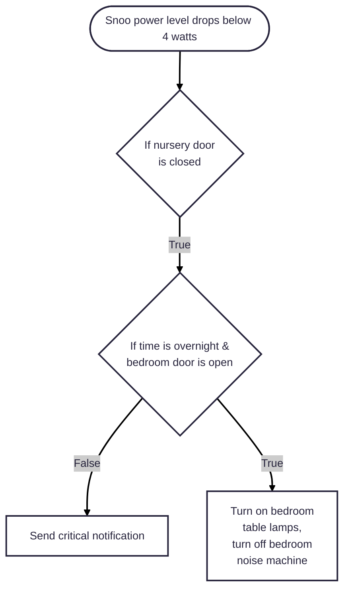

_**TL;DR:** Use a power monitoring outlet to trigger Snoo notifications independent from the cloud._

A couple of months ago, part of Amazon Web Services was down for a good chunk of a Monday, including the cloud backend for the Happiest Baby Snoo, a truly wonderful piece of baby-rearing technology that we've used with both of our kids.

Unfortunately, the backend outage broke notifications for the device, including those triggered when your kiddo needs attention. The notifications served as a backstop in case we didn't hear our little guy fussing on the monitor or down the hallway. They also happened to be non-critical, meaning they wouldn't break through focus modes on our Apple devices. I set out to fix all these issues and ended up creating a more useful integration than the existing implementation.

The foundational change I made was using a power monitoring outlet (I like the Third Reality Zigbee ones that are ~$10) that provides a real-time power usage sensor. I plugged the Snoo in and was relieved to see the following power data over 24 hours:

The data clearly shows when the device is turned on or not. As the Snoo powers down when your kid needs attention, this was all the information I needed to build out my automations without any dependence on the cloud. Here is what I ended up with:

Unlike the built-in Snoo notification, my local-only implementation is a critical alert, meaning it will always notify me regardless of my focus mode. Having the notification implementation under my control allowed me to also have it turn off the white noise machine in our bedroom and turn on our table lamps, making sure we didn’t sleep through the sound of the baby needing our attention! The automation only runs when the nursery door is closed, as we turn the Snoo off manually when we wake him up.

## Conclusion

When I got into using Home Assistant, I didn't appreciate the strong feelings folks had about using local-only integrations whenever possible, but now I get it. Between backend, internet, and power outages, cloud-based integrations are simply not reliable. Thankfully, Home Assistant gives us the tools to build our own automations without the need for cloud services.