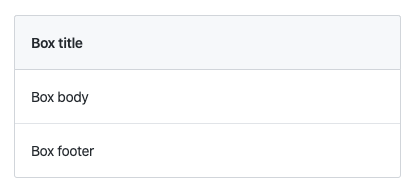
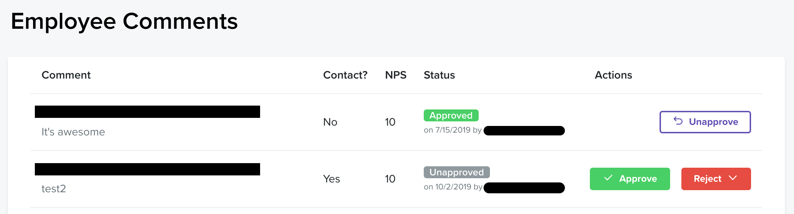
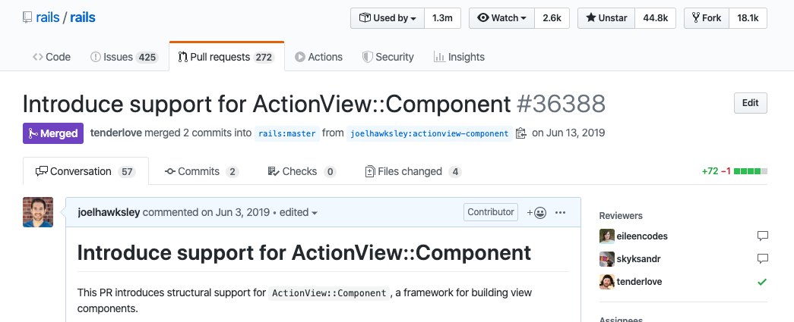

slidenumbers: true
footer: RailsConf 2020.2 Couch Edition - Encapsulating Views
autoscale: true


^ Lots of pauses in hook/intro/thankfulness

^ Servants' mindset

^ YOU GOT THIS


# _GitHub - Day of learning March 2020_<br>Encapsulating Views


[.footer: @joelhawksley]

---

## Hi

^ introduce myself

^ name

---


^ engineer at on Design Systems team

---

[.hide-footer]


^ We are responsible for the Primer design system used throughout GitHub

^ today

^ talk about project

^ working on for the past year

---

## ViewComponent

^ called ViewComponent

---

## Why

^ Why we built it

---

## How

^ how we're using it

---

## Lessons

^ lessons learned

---

## Future

^ how you can get involved

---

^ PAUSE

^ but a little bit about me first

---

[.slidenumbers: false]
[.hide-footer]


^ south of boulder

---

[.slidenumbers: false]
[.hide-footer]


^ recovering photographer

---

[.slidenumbers: false]
[.hide-footer]


^ traveled the country

---

[.slidenumbers: false]
[.hide-footer]


^ portraits

---

[.slidenumbers: false]
[.hide-footer]


^ every sport you can imagine

---

[.slidenumbers: false]
[.hide-footer]


^ worked at newspapers

^ daily life

---

[.slidenumbers: false]
[.hide-footer]


^ breaking news

---

[.slidenumbers: false]
[.hide-footer]


^ out biking

^ got a call

^ photo editor, laid off

^ aspired to have her job

^ saw the future of career vanish

^ called Aaron

^ asked for advice

^ gave me better than advice

^ apprenticeship offer

---

[.slidenumbers: false]
[.hide-footer]


^ moved to rhode island

^ couple of months

^ how to be a professional engineer

^ wouldn't be be here if it wasn't for him

^ enough about me

---

^ PAUSE

---

## Thanks

^ stressful times

^ while working on this talk

^ therapist encourages focusing on gratitude

^ this presentation has some constructive criticism

^ but let's start our with some gratitude

^ PAUSE

---

## Rails

^ I'm thankful for rails

^ around a long time

^ think about how much Rails has enabled us all to accomplish

^ that's something to be thankful for

---

## Value

^ value Rails has brought to the world

^ Rails has enabled us to focus on the needs of the people who use our products

^ value comes from what we don't have to worry about any more

---

## Rails @ GitHub

^ Rails is a big part of GitHub's success

---

## >800 contributers

^ More than 800 contributors last year

---

## Scale

^ Rails has scaled with GitHub

^ App is vanilla Rails

^ Just a lot of Rails

----

## **>**700 models

^ Over 700 models

---

## **>**600 controllers

^ Over 600 controllers

---

## **>**4,200 views

^ Over 4,200 views

^ and it's this part of our scale that I'm going to focus on

^ PAUSE

---

## Scaling views

^ As Rails applications scale

^ We often turn to view abstractions not provided by rails

^ here are a few examples of what they've looked like

---

## Decorators

^ One abstraction is decorators

^ First job, a consultancy

^ After working on a couple Rails projects

^ Landed on a bigger app

^ First time I saw a Rails folder that didn't belong

^ Felt weird

^ Didn't know whether I should be OK with it

^ Model-specific view logic

---

[.code-highlight: 1-9]
[.code-highlight: 11-15]

```ruby
class UserDecorator < Draper::Decorator
  def status
    if active?
      "Last active at #{last_active_at}"
    else
      "Inactive"
    end
  end
end

class UserDecoratorTest < Minitest::Test
  def test_status
    assert_equal UserDecorator.new(@inactive_user).status, "Inactive"
  end
end
```

^ S Looked like this

^ talk through code

^ place to put view-related logic for a specific model

^ really just another place to hide methods

^ S unit tested like models

^ explain code

---

## react_rails

^ Second example

^ Using React to build UI

^ Could have server rendered

^ But used react because of unit tests

---

[.code-highlight: 0]
[.code-highlight: 2]
[.code-highlight: 3]

`# app/assets/javascripts/tests/button_component_test.js`

```jsx
it('should render the button', function() {
  expect(shallow(<Button props={{ label: "Open" }} />).
  contains(<div className="Button">Open</div>)).toBe(true);
});
```

^ tests were simple

^ S rendered the component

^ S and asserted against HTML result

^ super fast

---

## Presenters

^ A third example

^ Folder called presenters

^ also called view models

^ View-specific logic

^ Extracted to Ruby objects

---

[.code-highlight: 1-5]
[.code-highlight: 7-17]

```ruby
class RepositoryIndexView < ViewModel
  def status
    repository.locked? ? "Disabled" : "Enabled"
  end
end

class RepositoryIndexViewTest < Minitest::Test
  context "#status" do
    test "enabled for unlocked repository" do
      file_view = RepositoryIndexView.new(repository: create(:repository))

      assert_equal file_view.status, "Enabled"
    end

    # ...
  end
end
```

^ looked like this

^ coupled to a specific view

^ easier to test

^ S describe test

^ distraction, not really testing the view

---

## Logic-filled partials

^ Fourth example

^ app that had lots of logic in partials

^ simplified logic - in one place

^ but was hard to test

---

[.code-highlight: 0]
[.code-highlight: 1]
[.code-highlight: 3]

```erb
<% status = repository.locked? ? "Disabled" : "Enabled" %>

<h2><%= status %></h2>
```

^ taking the previous view model example, it looks like this

^ S assigning the result of a ternary to status

^ S rendering status inside an h2 tag

^ in practice though,

^ we end up with view files with ruby blocks dozens of lines long

---

`# app/views/billing_settings/_github_packages_section.html.erb`

```erb
<%
usage = Usage.new(view.account)
unit_cost = ::Product::UNIT_COST
included_usage = [usage.paid, usage.bandwidth].min
usage_cost = view.pricing.downloads_cost
transfer_group = OpenStruct.new(
  transfer_type: "Data transfer out",
  breakdown: [
    OpenStruct.new(
      name: "Data transfer out (rounded)",
    )
  ]
)
%>
```

^ Here's one example

^ drastically simplified from dozens of lines

^ not tested directly, since we don't have unit tests for views

---

^ PAUSE

^ that's what I've seen

^ was wondering whether my experience was a reflection of the greater Rails ecosystem

---

## Ecosystem Survey

^ So I took a survey

^ local ruby group of around 50 people to share app folders

^ here's what I found

---


^ sometimes decorators

---


^ sometimes presenters

---


^ sometimes more than once!

---

## **>**50%

^ More than half of the responses

^ had view related abstractions

^ not provided by Rails

^ every big app I've worked in has used one

^ can also see the trend in the rails ecosystem

---

## Gems

^ Some popular gems for these patterns

---

## Draper & Cells

^ Draper and Cells have millions of downloads

^ PAUSE

---

## Something's missing.

^ It's clear

^ Something is missing here

---

## Why?

^ why do we turn to these abstractions?

^ Why are we breaking from rails convention?

^ in talking with many of you

---

## Testing views

^ comes down to testing

---
[.background-color: #FFFFFF]


^ Martin fowler's test pyramid

^ illustrates it best

^ explain chart levels

^ Rails provides

^ UI tests (system)

^ controller tests (service)

^ But not unit tests...

---
[.background-color: #FFFFFF]


^ Limiting us to

^ Slowest and most expensive options

^ As our apps grow

---

## View objects

^ Turn to view objects

^ Can be unit tested

^ enabling thorough coverage

^ without high cost of controller or system tests

---

^ PAUSE

^ Even if our views could be unit tested

^ My exploration of the space pointed to a bigger issue:

---

## Encapsulation

^ Encapsulation

^ What is it?

^ according to the fountain of knowledge wikipedia

---

> "In object-oriented programming, encapsulation refers to the **bundling of data with methods** that operate on that data, or the **restricting of direct access** to some of an object's components."
-- wikipedia.org/wiki/Encapsulation\_(computer_programming)

^ read quote

^ bundling of data

^ restricting of access

^ encapsulation is a fundamental aspect of OO

---

## Encapsulation in Rails

^ rails does provide encapsulation

^ some of the time

---

## Models

^ models are encapsulated

---

[.code-highlight: 1]
[.code-highlight: 1, 4-6]
[.code-highlight: 1,2, 8-12]

```ruby
class User < ApplicationRecord
  after_create :send_welcome_email

  def name
    "#{first_name} #{last_name}"
  end

  private

  def send_welcome_email
    UserMailer.welcome(self)
  end
end
```

^ user model

^ S name method is bundling

^ S welcome email callback is private

^ restricted from direct access

---

`# test/models/user_test.rb`

```ruby
assert_equal(user.name, "Rylan Bowers")
```

^ Test against public interface

^ but not against private methods

---

## Controllers

^ rails controllers are also encapsulated

---

[.code-highlight: 1]
[.code-highlight: 1, 2-4]
[.code-highlight: 1, 6-10]

```ruby
class UsersController < ApplicationController
  def show
    render("users/show", current_user: current_user)
  end

  private

  def current_user
    User.find(params[:id])
  end
end
```

^ users controller

^ S show method is bundling

^ S private current user method

^ restricted from direct access

---

`# test/controllers/users_controller_test.rb`

```ruby
get :show

assert_includes response.body "Rylan Bowers"
```

^ slightly less direct, but interfaces with show

^ does not test current_user method directly

---

## Views

^ what about views?

---

```erb
<% status = repository.locked? ? "Disabled" : "Enabled" %>

<h2><%= status %></h2>
```

^ closest thing to encapsulation is local variable assignment

^ as for testing

---

## ~~interface~~

^ no public interface for views

^ we can't really unit test them

^ rails doesn't give us a away

^ PAUSE

---

^ To see why encapsulation of views is an issue

^ we need to understand how they work

^ PAUSE

---

## What **are** views?

^ what are views?

---

## ~~Objects~~

^ Unlike models and controllers

^ they aren't objects

^ PAUSE

^ So let's look at an example

---

[.code-highlight: 0]
[.code-highlight: 1-3]
[.code-highlight: 5-6]

```erb
# app/views/demo/index.html.erb
<% @message = "Hello World" %>
<%= render("message") %>

# app/views/demo/_message.html.erb
<h1><%= @message %></h1>
```

^ Deep dive

^ Explicit render of a partial from another file

^ Example code

^ Two views

^ S first view

^ S Second view

^ What's interesting is that when we render this example

---

[.hide-footer]
[.background-color: #FFFFFF]


^ The second view is able to access the instance variable from the first!

---

```erb
<%= render(...) %>
```

^ What happens when that method is called

^ A lot happens

^ More interesting part

---

`# ActionView::Template`

[.code-highlight: 1]
[.code-highlight: 3]


```ruby
def render(view, locals, buffer = ActionView::OutputBuffer.new, &block)
  instrument_render_template do
    compile!(view)
    view._run(method_name, self, locals, buffer, &block)
  end
rescue => e
  handle_render_error(view, e)
end
```

^ Arguments

^ S compile step

---

[.code-highlight: 0]
[.code-highlight: 1-3]
[.code-highlight: 18]
[.code-highlight: 15, 18]

`# ActionView::Template`

```ruby
# Compile a template. This method ensures a template is compiled
# just once and removes the source after it is compiled.
def compile!(view)
  return if @compiled

  # Templates can be used concurrently in threaded environments
  # so compilation and any instance variable modification must
  # be synchronized
  @compile_mutex.synchronize do
    # Any thread holding this lock will be compiling the template needed
    # by the threads waiting. So re-check the @compiled flag to avoid
    # re-compilation
    return if @compiled

    mod = view.compiled_method_container

    instrument("!compile_template") do
      compile(mod)
    end

    @compiled = true
  end
end
```

^ blank

^ S comment

^ S compile

^ S method container

^ method container is the ActionView::Base class

^ PAUSE

---

[.code-highlight: 1]
[.code-highlight: 3]

`# ActionView::Template`

```ruby
def compile(mod)
  source = encode!
  code = @handler.call(self, source)

  source = +<<-end_src
    def #{method_name}(local_assigns, output_buffer)
      @virtual_path = #{@virtual_path.inspect};#{locals_code};#{code}
    end
  end_src

  mod.module_eval(source, identifier, 0)
end
```

^ Non bang compile method

^ S interesting line is handler.call

---

[.code-highlight: 0]
[.code-highlight: 1]
[.code-highlight: 1, 3-4]
[.code-highlight: 1, 6-7]
[.code-highlight: 1, 9-10]
[.code-highlight: 1, 12-14]

`# ActionView::Template`

```ruby
code = @handler.call(self, source)

irb> @handler
=> #<ActionView::Template::Handlers::ERB:0x00007fb57e348740>

irb> self
=> #<ActionView::Template app/views/demo/_message.html.erb locals=[]>

irb> source
=> "<h1><%= @message %></h1>"

irb> @handler.call(self, source)
=> "@output_buffer.safe_append='<h1>'.freeze;@output_buffer.append=( @message );
   @output_buffer.safe_append='</h1>'.freeze;\n@output_buffer.to_s"
```

^ go through steps

^ output is ruby code

---

`# @handler.call`

```ruby
@output_buffer.safe_append='<h1>'.freeze;
@output_buffer.append=( @message );
@output_buffer.safe_append='</h1>'.freeze;
@output_buffer.to_s
```

<br />

`# _message.html.erb`

```erb
<h1><%= @message %></h1>
```

^ turned ERB into Ruby

---

[.code-highlight: 0]
[.code-highlight: 3]
[.code-highlight: 5-9]

`# ActionView::Template`

```ruby
def compile(mod)
  source = encode!
  code = @handler.call(self, source)

  source = +<<-end_src
    def #{method_name}(local_assigns, output_buffer)
      @virtual_path = #{@virtual_path.inspect};#{locals_code};#{code}
    end
  end_src

  mod.module_eval(source, identifier, 0)
end
```

^ so back in actionview template

^ S we've compiled our template into ruby code

^ S and now let's use it to define a method

---

[.code-highlight: 1-5]
[.code-highlight: 1-5, 7-8]
[.code-highlight: 1-5, 10-11]
[.code-highlight: 1-5, 13-15]

`# ActionView::Template`

```ruby
source = +<<-end_src
  def #{method_name}(local_assigns, output_buffer)
    @virtual_path = #{@virtual_path.inspect};#{locals_code};#{code}
  end
end_src

irb> method_name
=> "_app_views_demo__message_html_erb__3147936528918386365_70191870416280"

irb> @virtual_path.inspect
=> "demo/_message"

irb> code
=> "@output_buffer.safe_append='<h1>'.freeze;@output_buffer.append=( @message );
   @output_buffer.safe_append='</h1>'.freeze;\n@output_buffer.to_s"
```

^ inspect current state

^ generating this ruby:

---

[.code-highlight: 1]
[.code-highlight: 1-7]

```ruby
def _app_views_demo__message_html_erb__3026934259175371146_70158375537500(local_assigns, output_buffer)
  @virtual_path = "demo/_message"
  @output_buffer.safe_append='<h1>'.freeze
  @output_buffer.append=( @message )
  @output_buffer.safe_append='</h1>'.freeze
  @output_buffer.to_s
end
```

^ This method

^ generated name

^ body generated by the handler

---

[.code-highlight: all]
[.code-highlight: 11]

`# ActionView::Template`

```ruby
def compile(mod)
  source = encode!
  code = @handler.call(self, source)

  source = +<<-end_src
    def #{method_name}(local_assigns, output_buffer)
      @virtual_path = #{@virtual_path.inspect};#{locals_code};#{code}
    end
  end_src

  mod.module_eval(source, identifier, 0)
end
```

^ blank

^ S attach to compiled method container

---

```ruby
=> [
  :_app_views_demo_index_html_erb__1824471460578655455_70348614451620
  :_app_views_demo__message_html_erb__1856726472418298868_70348613288120,
  :_app_views_layouts_application_html_erb__3293958388228102565_70348615263920,
]
```

^ Container contents

---

[.code-highlight: 0]
[.code-highlight: 3]
[.code-highlight: 4]
[.code-highlight: 1,4]
[.code-highlight: 1,4, 10,11]
[.code-highlight: 1,4, 13,14]
[.code-highlight: 1,4, 16,17]

`# ActionView::Template`

```ruby
def render(view, locals, buffer = ActionView::OutputBuffer.new, &block)
  instrument_render_template do
    compile!(view)
    view._run(method_name, self, locals, buffer, &block)
  end
rescue => e
  handle_render_error(view, e)
end

irb> method_name
=> "_app_views_demo__message_html_erb___1878705374794196717_70220992442400"

irb> self
=> #<ActionView::Template app/views/demo/_message.html.erb locals=[]>

irb> buffer.class
=> ActionView::OutputBuffer
```

^ end of the road

^ S Compiled

^ S all that's left is to run

^ Closer look at state

^ S method_name

^ S self

^ S output buffer

---

[.code-highlight: 0]
[.code-highlight: 1-3]
[.code-highlight: 4]

`# ActionView::Base`

```ruby
def _run(method, template, locals, buffer, &block)
  @current_template = template
  @output_buffer = buffer
  send(method, locals, buffer, &block)
end
```

^ S set the template and buffer

^ S then call the compiled method we defined above

---

[.code-highlight: 4]

`# ActionView::Base`

```ruby
def _run(method, template, locals, buffer, &block)
  @current_template = template
  @output_buffer = buffer
  _app_views_demo__message_html_erb__3026934259175371146_70158375537500(locals, buffer, &block)
end
```

^ So effectively we end up with this

^ And that's what happens when rendering a view in Rails, at runtime

^ PAUSE

---

^ What does this all mean?

^ What are the implications?

^ What does this have to do with encapsulation?

---

## Views **are** methods

^ Views are methods

---

## In the **same** context

^ that execute in the same context

---

`# index.html.erb`

```erb
<% @message = "Hello World" %>
<%= render("message") %>
```

<br />
`# _message.html.erb`

```erb
<h1><%= @message %></h1>
```

^ Look at templates

^ run through compilation

---

[.code-highlight: 1,2,7, 9, 15, 16]
[.code-highlight: 2]
[.code-highlight: 2,4]
[.code-highlight: 2,4-5]
[.code-highlight: 9]
[.code-highlight: 9, 12]

```ruby
class ActionView::Base
  def _app_views_demo_index_html_erb___42169053093465020_70319914664120
    @virtual_path = "demo/index"
    @message = "Hello World"
    @output_buffer.append=( _app_views_demo__message_html_erb___154141396804859982_70319911264400 )
    @output_buffer.to_s
  end

  def _app_views_demo__message_html_erb___154141396804859982_70319911264400
    @virtual_path = "demo/_message"
    @output_buffer.safe_append='<h1>'.freeze
    @output_buffer.append=( @message )
    @output_buffer.safe_append='</h1>'.freeze
    @output_buffer.to_s
  end
end
```

^ Rails sees this

^ Sibling methods

^ Instance variables across views

^ On ActionView::Base

^ S render index

^ S set message to "Hello world"

^ S then render the "message" partial

^ S calls the generated method for the partial

^ S which has access to the message instance variable

---

## Global scope

^ Global scope explosion

^ All views

^ All helpers

^ Same context

^ Can all share state

---

## Encapsulation

^ not much encapsulation

^ All 4,200-odd views exist in the same scope

^ making it really hard to reason about their execution behavior

---

## ~~Unit Testing~~

^ which means unit testing them is very difficult

^ as they can't really be isolated

^ this is a problem

^ because:

---

## Views are valuable

^ views have a very high business values

^ views are what we ultimately ship to users

^ and yet because of these problems

^ they're often a blind spot in our architecture

---

^ PAUSE

^ given all of this, I had to wonder:

^ What might encapsulated views look like?

---

## Decorators, Presenters, Components

^ Many of us have solutions to make them easier to test

---

## 2019

^ Spent most of the past year

^ Incorporating those ideas

^ Into a vision for how Rails could address these issues

---

## ViewComponent

^ called ViewComponent

---

## Encapsulation

^ First and foremost

^ ViewComponents are encapsulated

---

## one context for **all** views

^ instead of one context with all views

---

## one context **per** view

^ one context *per* view

---

`# app/components/message_component.rb`

```ruby
class MessageComponent < ViewComponent::Base
  def initialize(message:)
    @message = message
  end
end
```

`# app/components/message_component.html.erb`

```erb
<h1><%= @message %><h1>
```

`# app/views/demo/index.html.erb`

```erb
<%= render(MessageComponent.new(message: "Hello, World!")) %>
```

^ Take this example

^ two files side by side

^ in app/components...

^ (talk through code)

---

`# app/views/demo/index.html.erb`

```erb
<%= render(MessageComponent.new(message: "Hello, World!")) %>
```

^ Looking at render call

^ component referenced directly

^ no ambiguity

^ if we wanted to see every place it's used

^ we can just search our codebase for the MessageComponent class name

^ PAUSE

---

`# app/components/message_component.rb`

```ruby
class MessageComponent < ViewComponent::Base
  def initialize(message:)
    @message = message
  end
end
```

`# message_component.html.erb`

```erb
<h1><%= @message %><h1>
```

^ looking back at component

^ Follow a similar compilation process

---

`# app/components/message_component.rb`

```ruby
class MessageComponent < ViewComponent::Base
  def initialize(message:)
    @message = message
  end

  def call
    @output_buffer.safe_append='<h1>'.freeze
    @output_buffer.append=( @message )
    @output_buffer.safe_append='</h1>'.freeze
    @output_buffer.to_s
  end
end
```

^ But instead attach compiled view to component object

^ No access to state from other views

^ No instance variable leakage

^

---

[.code-highlight: all]
[.code-highlight: 10]
[.code-highlight: 2]

`# app/components/message_component.rb`

```ruby
class MessageComponent < ViewComponent::Base
  include IconHelper

  def initialize(message:)
    @message = message
  end
end
```

`# app/components/message_component.html.erb`

```erb
<h1><%= @message %><h1>
<%= star_icon %>
```

^ Also encapsulate access to helpers

^ S can be included in component class, or:

---

[.code-highlight: 16]

`# app/components/message_component.rb`

```ruby
class MessageComponent < ViewComponent::Base
  include IconHelper

  def initialize(message:)
    @message = message
  end
end
```

`# app/components/message_component.html.erb`

```erb
<h1><%= @message %><h1>
<%= helpers.star_icon %>
```

^ or via helpers. method escape hatch similar to controllers

---

## Unit testing

[.code-highlight: all]
[.code-highlight: 2]
[.code-highlight: 2, 4]

```ruby
test "renders message" do
  render_inline(MessageComponent.new(message: "Hello, World!"))

  assert_text "Hello, World!"
end
```

^ Unit testing components is simple

^ S Render component inline

^ S assert against rendered result using Capybara matchers, the same used by Rails system tests

^ but without using a browser

^ PAUSE

---

## `gem "view_component"`

^ Published in august

^ extraction from GitHub

^ My first open source project

^ blown away by support

^ shipped 39 releases

---

## v2.0.0

^ including our second major release in late March

---

## Contributors

^ most work has come from the community

^ over three dozen contributors

^ all over the world

^ Some cool contributions include:

---

> `rails g component Example`
-- Vinicius Stock, Toronto

^ Simple things like

^ Adding generator support

^ Vinicius Stock from Shopify

---

> `ViewComponent::Preview`
-- Juan Manuel Ramallo, Argentina

^ More complex feature

^ Component previews

^ Similar to mailer previews

^ Juan Manuel Ramallo from Argentina

---

[.code-highlight: 1,2]
[.code-highlight: 1,2-5]
[.code-highlight: 1,2, 7-9]

```ruby
module Issues
  class StateComponentPreview < ViewComponent::Preview
    def open
      render(Issues::StateComponent.new(state: :open))
    end

    def closed
      render(Issues::StateComponent.new(state: :closed))
    end
  end
end
```

^ Just like with mailers

^ Inherits from preview class

^ Method for each preview

^ S Open

^ S Closed

---

[.hide-footer]
[.background-color: #FFFFFF]


^ simple UI

^ when you click

---

[.hide-footer]
[.background-color: #FFFFFF]


^ renders the component by itself

---

> `with_content_areas`
-- Jon Palmer, Boston

^ feature by Jon Palmer from Boston

---
[.hide-footer]
[.background-color: #FFFFFF]


^ box component

^ from design system

---

[.code-highlight: all]
[.code-highlight: 2]
[.code-highlight: 3]
[.code-highlight: 4]

```html
<div class="Box">
  <div class="Box-header"><h3 class="Box-title">Box title</h3></div>
  <div class="Box-body">Box body</div>
  <div class="Box-footer">Box footer</div>
</div>
```

^ here is the html

^ S header

^ S body

^ S footer

---

```erb
<div class="Box">
  <div class="Box-header"><h3 class="Box-title">Box title</h3></div>
  <div class="Box-body">Box body</div>
  <div class="Box-footer">Box footer</div>
</div>
```

^ Go back to example HTML

^ rewrite as ViewComponent

---

`# app/components/box_component.rb`

```ruby
class BoxComponent < ViewComponent::Base
  def initialize
  end
end
```

`# app/components/box_component.html.erb`

```erb
<div class="Box">
  <div class="Box-header"><h3 class="Box-title">Box title</h3></div>
  <div class="Box-body">Box body</div>
  <div class="Box-footer">Box footer</div>
</div>
```

`# app/views/demo/index.html.erb`

```erb
<%= render(BoxComponent.new) %>
```

^ start with a component that renders our example code

^ explain code

---

`# app/components/box_component.rb`

```ruby
class BoxComponent < ViewComponent::Base
  def initialize
  end
end
```

`# app/components/box_component.html.erb`

```erb
<div class="Box">
  <%= content %>
</div>
```

`# app/views/demo/index.html.erb`

```erb
<%= render(BoxComponent.new) do %>
  <%= render(BoxHeaderComponent.new) do %>Box title<% end %>
  <%= render(BoxBodyComponent.new) do %>Box body<% end %>
  <%= render(BoxFooterComponent.new) do %>Box footer<% end %>
<% end %>
```

^ skipping a few steps, we might end up with components

^ for header, body and footer

^ order of elements matters

^ enforce header is first?

^ enforce footer is last?

^ doesn't prevent misuse of the design system

^ this is where with_content_areas comes in

---

`# app/components/box_component.rb`

```ruby
class BoxComponent < ViewComponent::Base
  def initialize
  end
end
```

^ back in component

---

[.code-highlight: 2]

`# app/components/box_component.rb`

```ruby
class BoxComponent < ViewComponent::Base
  with_content_areas :header, :body, :footer

  def initialize
  end
end
```

^ we can declare a content area for the header, body, and footer

---

[.code-highlight: 1-5]
[.code-highlight: 7-11]

`# app/views/demo/index.html.erb`

```erb
<%= render(BoxComponent.new) do %>
  <%= render(BoxHeaderComponent.new) do %>Box title<% end %>
  <%= render(BoxBodyComponent.new) do %>Box body<% end %>
  <%= render(BoxFooterComponent.new) do %>Box footer<% end %>
<% end %>

<%= render(BoxComponent.new) do |component| %>
  <% component.with(:header) do %>Box title<% end %>
  <% component.with(:body) do %>Box body<% end %>
  <% component.with(:footer) do %>Box footer<% end %>
<% end %>
```

^ In template that renders component

^ refactor it

^ S to use named blocks instead of separate components

^ PAUSE

---

[.code-highlight: 2]
[.code-highlight: 2-3]
[.code-highlight: 2-4]
[.code-highlight: 1-5]

`# app/components/box_component.html.erb`

```erb
<div class="Box">
  <div class="Box-header"><h3 class="Box-title"><%= header %></h3></div>
  <div class="Box-body"><%= body %></div>
  <div class="Box-footer"><%= footer %></div>
</div>
```

^ then, in the component template, we can

^ render the

^ S title

^ S body

^ S and footer

^ S inside wrapping div

^ PAUSE

---

`# app/components/box_component.rb`

```ruby
class BoxComponent < ViewComponent::Base
  with_content_areas :header, :body, :footer

  def initialize
  end
end
```

`# app/components/box_component.html.erb`

```erb
<div class="Box">
  <div class="Box-header"><h3 class="Box-title"><%= title %></h3></div>
  <div class="Box-body"><%= body %></div>
  <div class="Box-footer"><%= footer %></div>
</div>
```

^ ended up with a codification of the design system

^ helping developers use it properly

^ PAUSE

---

## component gems

^ another cool thing

^ since components are ruby classes

^ we can extract them into gems

^ we haven't done this yet

^ know of some who have

---

[.hide-footer]
[.background-color: #F5F7F8]


^ financial services

^ half dozen apps using a single gem

^ PAUSE

---

[.hide-footer]
[.background-color: #FFFFFF]


^ Most exciting

^ landed PRs in rails to add native support for 3rd-party component frameworks

^ will be shipping in Rails 6.1

^ PAUSE

---

## Performance

^ so what about performance?

---

## Caching

^ leads to less than optimal caching behavior

^ views are compiled into methods at runtime

^ after forking servers like Unicorn and Puma

^ One part of cold first request render times being slow

^ at our scale, thousands of processes

^ each time process serves a view it hasn't seen before

^ has to compile the view first

^ PAUSE

^ Except this isn't the case

^ Internal code in our app with a more extreme optimization

^ Enabled by having linters:

---

## `render("users/index")`

^ Linter to enforce full path

---

```ruby
class RepositoriesController
  def show
    render("repostiories/show")
  end
end
```

^ Linter to enforce explicit render calls with full paths

^ even in controllers where it's common to not have a render call at all

^

---

[.build-lists: true]

`# lib/github/fast_render_enhancer.rb`

1. Scan all templates for render calls
2. Compile unique templates

^ S Scan

^ S Compile each template

^ before ernicorn spawns workers

^ fortunately components are easier to optimize

---

[.code-highlight: 1]
[.code-highlight: 6-11]

`# app/components/message_component.rb`

```ruby
class MessageComponent < ViewComponent::Base
  def initialize(message:)
    @message = message
  end

  def call
    @output_buffer.safe_append='<h1>'.freeze
    @output_buffer.append=( @message )
    @output_buffer.safe_append='</h1>'.freeze
    @output_buffer.to_s
  end
end
```

^ example component

^ S is compiled at boot, before worker processes are spawned

^ effectively gives us the same optimization as fast render enhancer

^ PAUSE

---

## Testing

^ big speed benefits in testing

---

[.code-highlight: 0]
[.code-highlight: 1-2]
[.code-highlight: 4-6]
[.code-highlight: 8]
[.code-highlight: 10-12]
[.code-highlight: 14]
[.code-highlight: 16]

```ruby
# test/components/issues/state_component_test.rb:41
render_inline(Issues::StateComponent.new(state: :open))

assert_text("Open")
assert_selector("span[title='Status: Open']")
assert_selector(".State--green")

=> 20ms

# test/integration/settings_controller_test.rb:21
as @user
get "/settings/profile"

assert_response 200

=> 1.46
```

^ Compare two cases

^ S fairly typical component test of issues state component

^ S a couple assertions against DOM

^ S 20 milliseconds

^ S Compared to one of the simplest controller tests I could find

^ loads user profile settings page

^ S asserts the response was a 200

^ S takes almost 1.5 seconds

^ which is a

---

## 73x

^ 73 times difference in speed

^ conservative case

^ typical component test against

^ best case controller test

^ more typical difference is around two orders of magnitude

^ PAUSE

^ so for a real world example

---

```ruby
test "does not render if invalid state is passed"
test "it passes styles to Primer::StateComponent"
test "it passes size to Primer::StateComponent"
test "it set the octicon height based on size"
test "it renders the closed state"
test "it renders the open state"
```

^ These are the test cases for the Issues State Component

---

## 9 seconds

^ take 9 seconds as controller tests

---

## 120 milliseconds

^ take 120 millisconds as unit tests

^ PAUSE

---

## Levels of abstraction

^ perhaps more importantly

^ we can write tests at a more appropriate level of abstraction

---

[.hide-footer]
[.background-color: #FFFFFF]


^ looking back at our testing pyramid

^ we had to test our views at the controller layer

^ which means that for partials we reuse across the app

^ we ended testing them in each place we used them

---

```
# views/comments/_title.html.erb:106
# views/comments/_title.html.erb:131
# views/issues/events/_connection.html.erb:124
# views/issues/events/_cross_reference.html.erb:102
```

^ In the case of the issue badge component

^ we use it four times in three files

^ Which means that without unit tests

^ we'd likely end up testing it in mulitple controller tests

^ further increasing the performance impact

---
[.hide-footer]
[.background-color: #FFFFFF]


^ instead, by using components with unit tests

---
[.hide-footer]
[.background-color: #FFFFFF]


^ we can test our view layer permutations thoroughly at the unit level

^ without duplication

^ leaving controller tests for happy path assertions

^ PAUSE

---

## Lessons

^ we've learned a lot

^ In the past year experimenting with this pattern

---

## Validations

^ Perhaps the biggest mistake we've made with this architecture

^ was using validations

---

[.code-highlight: 1-2]
[.code-highlight: 3]
[.code-highlight: 3-4]
[.code-highlight: 6]

`# app/components/shared/avatar_component.rb`

```ruby
module Shared
  class AvatarComponent < ApplicationComponent
    DEFAULT_SIZE = 20
    ALLOWED_SIZES = [DEFAULT_SIZE, 32]

    validates :size, inclusion: { in: ALLOWED_SIZES }

    # ...
  end
end
```

^ For example

^ Avatar component

^ S default size of 20

^ S allowed sizes including default and 32

^ in order to help developers use the component correctly

^ S used activemodel validations to check that size was valid

^ this also let us write code that expected size to be one of the allowed values

^ this was all well and good

^ but it came at a price

---
[.hide-footer]
[.background-color: #FFFFFF]


^ unfortunately, we paid that price in production

^ canary deploy

^ presence validation error not caught by tests

^ only affected a couple users

^ quickly rolled back

^ but we knew we needed to rethink this approach

^ what we came up with was a simple helper

^ called fetch or fallback

---

[.code-highlight: 1]
[.code-highlight: 2]
[.code-highlight: 3]
[.code-highlight: 7]
[.code-highlight: 5]
[.code-highlight: all]

`# lib/github/fetch_or_fallback_helper.rb`

```ruby
def fetch_or_fallback(allowed_values, given_value, fallback)
  if allowed_values.include?(given_value)
    given_value
  else
    raise ArgumentError, ... if Rails.development?

    fallback
  end
end
```

^ read args

^ S if allow values include given value

^ S return it otherwise

^ S otherwise, return fallback

^ However, if in development

^ S we raise an error

^ S this gives us the feedback we wanted from validations

^ and the safety knowing that we are working with a value we expect

^ without raising exceptions in production

---

[.code-highlight: 9]

`# app/components/shared/avatar_component.rb`

```ruby
module Shared
  class AvatarComponent < ApplicationComponent
    DEFAULT_SIZE = 20
    ALLOWED_SIZES = [DEFAULT_SIZE, 32]

    def initialize(actor:, viewer: nil, size: DEFAULT_SIZE, **args)
      @actor, @viewer, @args = actor, viewer, args

      @size = fetch_or_fallback(ALLOWED_SIZES, size, DEFAULT_SIZE)
    end
  end
end
```

^ Looking back at the avatar component

^ instead of using a validation on the size attribute

^ we use fetch or fallback to safely guarantee

^ size is a value we expect

^ PAUSE

---

## Resiliency

^ lesson learned here is ultimately one of

^ designing for resiliency

^ we hadn't fully understood the downstream risks of using validations

^ more broadly, designing error cases out of our systems is

^ of utmost importance

^ PAUSE

---

## Exposing complexity

^ another thing we've learned refactoring existing code to use components

^ has been that they expose complexity

---

## `views/shared/_details_dialog.html.erb`

^ one of the most complex examples has been the details dialog partial

^ 220 uses in 148 files

---

`# views/shared/_details_dialog.html.erb`

```erb
<details
  class="details-reset details-overlay details-overlay-dark lh-default text-gray-dark <%= locals[:details_class] %>"
  <% if locals[:id] %>id="<%= locals[:id] %>"<% end %>>
  <summary
      class="<%= locals[:button_class] %>"
      <%= locals[:safe_toggle_button_data_attributes] %>
      <% if locals[:button_aria_label] %>aria-label="<%= locals[:button_aria_label] %>"<% end %>
      <% if locals[:ga_click] %>data-ga-click="<%= locals[:ga_click] %>"<% end %>
      <% if locals[:sudo_required] %>data-sudo-required="<%= locals[:sudo_required] %>"<% end %>
      <% if locals[:button_role].present? %>
        role="<%= locals[:button_role] %>"
        <% if ["menuitemradio", "menuitemcheckbox"].include?(locals[:button_role]) %>aria-checked="<%= locals[:is_checked] %>"<% end %>
      <% end %>
      <% if locals[:hidden] %>hidden<% end %>>
    <%= octicon locals[:button_icon] if locals[:button_icon] %>
    <%= locals[:button_text] %>
  </summary>
  <details-dialog
    aria-label="<%= title %>"
    class="Box Box--overlay d-flex flex-column anim-fade-in fast <%= locals[:dialog_class] %>"
    <% if locals[:deferred_loading_url] %>src="<%= locals[:deferred_loading_url] %>"<% end %>
    <% if locals[:preload] %>preload<% end %>>
    <div class="Box-header">
      <button class="Box-btn-octicon btn-octicon float-right" type="button" aria-label="Close dialog" data-close-dialog>
        <%= octicon "x" %>
      </button>
      <h3 class="Box-title <%= locals[:title_class] %>"><%= locals[:title] %></h3>
    </div>
    <%= yield %>
  </details-dialog>
</details>
```

^ It's massive, handling a lot of complexity and use cases

^ 17 different local variables

^ Refactored into a component, this complexity is even more visible.

---

`# lib/github/details_component.rb`

```ruby
module GitHub
  class DetailsComponent < ApplicationComponent
    def initialize(button_text:,
                   title:,
                   button_class: DEFAULT_BUTTON_CLASS,
                   details_class: DEFAULT_DETAILS_CLASS,
                   preload: DEFAULT_PRELOAD,
                   is_checked: DEFAULT_IS_CHECKED,
                   hidden: DEFAULT_HIDDEN,
                   button_icon: nil,
                   dialog_class: nil,
                   ga_click: nil,
                   sudo_required: nil,
                   id: nil,
                   button_role: nil,
                   deferred_loading_url: nil,
                   button_aria_label: nil,
                   title_class: nil,
                   button_data: nil)
    end
  end
end
```

^ The initializer takes 17 possible arguments.

^ Even more so than the view, this forces us to reckon with the complexity

^ But it also allows us some safety

---

`# test/lib/github/details_component_test.rb`

```ruby
class GitHubDetailsComponentTest < Minitest::Test
  test "requires button and title to be present"
  test "displays provided title and button text"
  test "assigns custom button class"
  test "assigns custom details class"
  test "does not assign preload attribute by default"
  test "assigns preload attribute if enabled"
  test "renders button icon if provided"
  test "renders dialog class if provided"
  test "renders ga click if provided"
  test "does not render sudo required if nil"
  test "renders sudo required if provided"
  test "raises an error if sudo required is not one of the allowed values"
  test "assigns ID if provided"
  test "sets button role if provided"
  test "sets button aria-checked if provided for radio button"
  test "raises error if aria-checked is passed with an invalid button role"
  test "sets src if deferred loading url is provided"
  test "sets button aria-label if provided for button"
  test "sets title_class if provided"
end
```

^ As we can at least unit test the component thoroughly

^ Our existing test has 20 cases, and could probably use more

^ but because we can write unit tests, we can refactor!

^ and that's just what's happening.

^ we're refactoring the component to be drastically simpler

^ PAUSE

---

## Consistency

^ Another lesson from working with components has been

^ the power of consistency

---

[.hide-footer]
[.background-color: #FFFFFF]


^ one example of this was building the PR state component

^ render it nine different places in the app

^ when we went to implement the component

^ the existing view code was more or less copy-pasted for each usage

^ as we refactored to use the component

^ we realized that several of the cases had never been updated to handle draft PRs

^ so by using a component, we were able to ensure a consistent experience for our users

^ PAUSE

^ another benefit this component exposed is how we can benefit from composition

---

`# app/components/pull_requests/state_component.html.erb`

```erb
<%= render(
  Primer::StateComponent.new({
    title: "Status: #{label}",
    color: STATES[@state][:color],
    size: @size }.merge(@args)
  )
) do %>
  <%= octicon(STATES[@state][:octicon_name], height: octicon_height) %> <%= label %>
<% end %>
```

^ As it is itself a wrapper of a component from our design system!

^ explain code

^ this is an common patten

^ application-specific component wrapping one or more components from design system

^ PAUSE

---

[.hide-footer]
[.background-color: #FFFFFF]


^ Another cool example is the primer layout component

^ built by jonrohan

^ used to render main content body and sidebar

^ in action on PR pages

---

[.code-highlight: 0]
[.code-highlight: 8]
[.code-highlight: 4-8]
[.code-highlight: 4-8, 11]
[.code-highlight: 3]

`# lib/primer/layout_component.rb`

```ruby
module Primer
  class LayoutComponent < Primer::Component
    with_content_areas :main, :sidebar

    DEFAULT_SIDE = :right
    ALLOWED_SIDES = [DEFAULT_SIDE, :left]

    def initialize(responsive: false, side: DEFAULT_SIDE, **args)
      @responsive, @args = responsive, args

      @side = fetch_or_fallback(ALLOWED_SIDES, side, DEFAULT_SIDE)
    end
  end
end
```

^ here's what it looks like

^ S arguments

^ S side constants

^ S use fetch of fallback to make sure side is one of those values

^ S this component leverages multiple content areas

^ to accept a main content body and sidebar

^ and render them side by side with proper responsive support

---

[.code-highlight: 0]
[.code-highlight: 14-16]
[.code-highlight: 8-12, 14-16]
[.code-highlight: 14-16,18-22]

`# lib/primer/layout_component.html.erb`

```erb
<%= render(
  Primer::FlexComponent.new(
    {
      class_names: "gutter-condensed gutter-lg",
      direction: (@responsive ? [:column, nil, :row] : nil)
    }.merge(@args)
 )) do %>
  <% if @side == :left %>
    <%= render Primer::BaseComponent.new(as: :div, class_names: "flex-shrink-0", col: (@responsive ? [12, nil, 3] : 3), mb: (@responsive ? [5, nil, 0] : nil)) do %>
      <%= sidebar %>
    <% end %>
  <% end %>

  <%= render Primer::BaseComponent.new(as: :div, class_names: "flex-shrink-0", col: (@responsive ? [12, nil, 9] : 9), mb: (@responsive ? [5, nil, 0] : nil)) do %>
    <%= main %>
  <% end %>

  <% if @side == :right %>
    <%= render Primer::BaseComponent.new(as: :div, class_names: "flex-shrink-0", col: (@responsive ? [12, nil, 3] : 3)) do %>
      <%= sidebar %>
    <% end %>
  <% end %>
<% end %>
```

^ in the template

^ S we render the main content body

^ the side bar is rendered

^ S on either the left

^ S on either the left

^ PAUSE

^ there is a fair amount of complexity in getting the responsive behavior just right

^ we now have a single implementation of this pattern

^ used in 8 places in dotcom

^ PAUSE

---

## Future

^ What does this mean for the future of our views?

---

## ViewModels to Components

^ we're migrating our viewmodels to components

^ Linter to cap view model usage, directing to components instead

---

## Examples

^ we also have plenty of examples already

---

## app/components (70)<br />lib/primer (16)

^ 70 components in dotcom application

^ 16 primer components in lib

---

## ~300 usages in 139 views

^ around 300 usages in 139 views

---

## New views

^ What about for new views

^ While components are useful for building entire views

^ Our rule has been:

---

## "If it could be a partial, it could be a component"

^ "If it could be a partial, it could be a component"

---

## github/view_component

^ ruby library on github

^ contributions welcome, even if it's just bug reports

---

# 👋 Thanks

### @tenderlove @natashau @broccolini @seejohnrun @kytrinyx @myobie @kenyonj @nickh @blakewilliams @colinkeany @muan @dgraham @enriikke @jhawthron @jonrohan @emplums @ashygee @jonabc @joshmgross @smashwilson @itsbagpack @jonspalmer @juanmanuelramallo @vinistock @metade @asgerb @xronos-i-am @dylnclrk @kaspermeyer @rdavid1099 @kylefox @traels @rainerborene @jcoyne @elia @cesariouy @spdawson @rmacklin @michaelem @mellowfish @horacio @dukex @dark-panda @seanpdoyle
