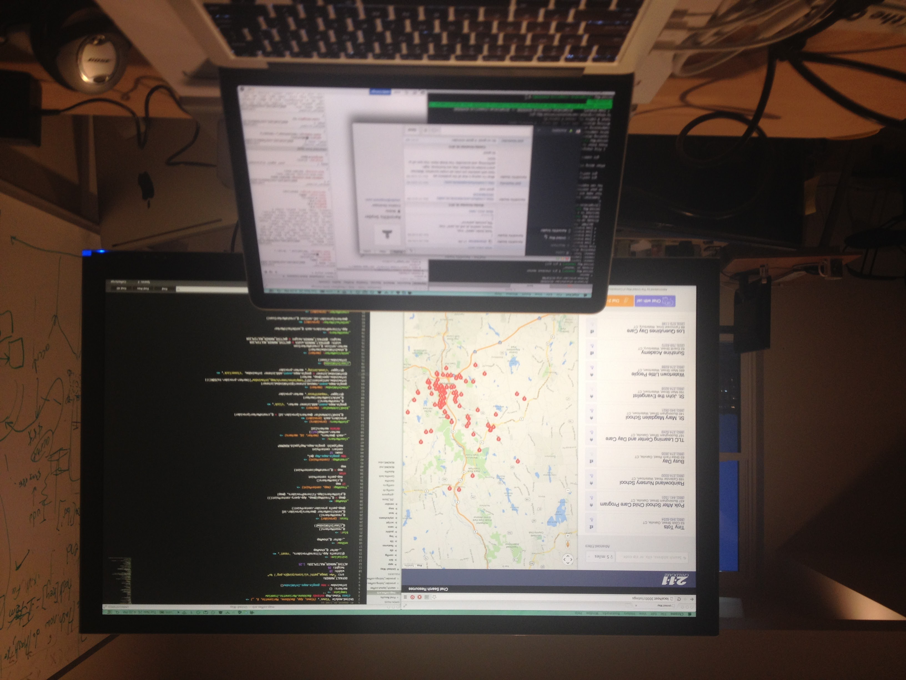
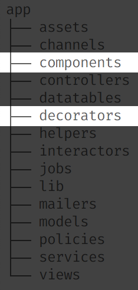
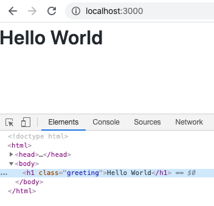

autoscale: true
slidenumbers: true
theme: Simple, 1
text: Avenir Next Medium, #24292e
text-strong: Avenir Next Bold, #24292e
header: Avenir Next Medium, #24292e
header-strong: Avenir Next Bold, #24292e
code: Menlo Regular, #6f42c1, #005cc5, #0366d6, #d73a49, #d73a49
background-color: #ffffff;

---

---

# I have a secret

^ have a secret 

---

# The future of Rails

^ future of rails

^ already here

^ already exists

---

# It's in your applications

^ in your apps

---

# It's in your gems

^ in your gems

---

^ Question for all of you

---

# Will you set it free?

^ Will you set it free?

---

^ PAUSE

---

# Rails

^ rails

^ around for a long time

---

# 2005

^ since 2005

^ eternity in internet time

---

# Relevance

^ And yet it has remained relevant

^ not by accident

---

# Evolution

^ Rails has evolved

^ through features

^ and fixes

^ extracted from other Rails applications

---

# Extraction

^ today

^ talk about extraction

^ from GitHub

^ working on for the past year

---

# ActionView::Component

^ called ActionView Component

---

# Why

^ Why we built it

---

# Lessons

^ lessons learned

---

# Future

^ vision 

^ future of rails views

---

^ PAUSE

---

# Hi

^ introduce myself

^ name

---


^ engineer at GitHub

---


---

[.background-color: #000000]


^ fully distributed

^ most engineers remote

^ south of boulder

^ work from home

---

[.background-color: #000000]


^ captain

---

[.background-color: #000000]


^ recovering photographer

---

[.background-color: #000000]


^ traveled the country

---

[.background-color: #000000]


^ portraits

---

[.background-color: #000000]


^ every sport you can imagine

---

[.background-color: #000000]


^ worked at newspapers

^ daily life

---

[.background-color: #000000]


^ breaking news

---

[.background-color: #000000]


^ breaking news

^ did for a little while

---

[.background-color: #000000]


^ until one day in 2013

^ out biking

^ friend bryce

^ got a call

^ photo editor, boss laid off

^ aspired to have her job

^ saw the future of career vanish

^ called Aaron

^ asked for advice

^ apprenticeship offer

---

[.background-color: #000000]



^ taught me git, ruby, rails, js

^ how to be a professional engineer

---

^ PAUSE

---

# Thanks

^ time of year

^ reflecting on what I'm thankful for

---

# Time

^ Thankful for your time

^ Precious resource

---

# Prakash

^ Recently lost a member of our community

^ Could have been any of us

---

# Loss

^ Prakash fifth person lost in the past year or so

^ It's been a struggle for me

^ Dark times

---

# Clarity

^ But it's also been a source of clarity in my life

^ Realize how finite our time here is

^ motivated to use time in a way that matters

---

"We’re tight-fisted with property and money, yet think too little of wasting time, the one thing about which we should all be the toughest misers."
        — SENECA, ON THE BREVITY OF LIFE, 3.1–2
        - https://zenchongproject.wordpress.com/2019/12/09/meditation-on-mortality-december-9th-spendthrifts-of-time/

---

^ PAUSE

---

# Community

^ for our community

^ over a decade

^ almost as old as rails

---

# Sponsors

^ Sponsors

^ Food

^ Drinks

^ Place to meet

^ Sandi Metz fund

---

# Organizers

^ Organizers

^ Dan, Rylan, Marty

^ Those who have helped over the years

---

# You

^ You make it special

^ You make it feel like family

---

# Thanks

^ We have something special

^ So thankful for it

---

^ PAUSE

---

# Thanks

^ also thankful

---

# Rails

^ for rails

^ around a long time

^ think about how much Rails has enabled us all to accomplish

^ that's something to be thankful for

---

# Value

^ value Rails has brought to the world

^ Rails has enabled us to focus on the needs of the people who use our products

---

# Rails @ GitHub

^ Rails is a big part of GitHub's success

---

# Monolith

^ Still a monolith

^ Moving back into monolith

---

# $7.5 Billon Monolith

^ Now $7.5 billion monolith

^ Has the best name ever

---

# github.com/github/github

---

# Scale

^ Rails has scaled with GitHub

^ App is vanilla Rails

^ Just a lot of Rails

----

# >700 models

^ Over 700 models

---

# >600 controllers

^ Over 600 controllers

---

# >4,200 views

^ Over 4,200 views

---

# 12 years old

^ Codebase is about 12 years old

---

# >800 contributers

^ More than 800 contributors last year

---

^ PAUSE

---

# Rails @ GitHub

^ often asked about working on monolith

^ different mindset

---

> If it doesn't have to do with our business, it needs to go in Rails.

^ Eileen said

^ If it doesn't have to do with our business, it needs to go in Rails.

^ In other words

---

# Upstream by default

^ our approach should be to upstream by default

^ not always this way

---

# Forks

^ On fork until 2018

^ Inventing features before Rails

^ unsustainable maintenance

^ backport security fixes

^ hard to onboard

^ Eileen led team for two years

---

# master

^ run a couple weeks behind master 

^ many benefits

^ enabled easy contribution to Rails

^ short lag in between rails and monolith

^ enabled extraction

---

> The best frameworks are in my opinion extracted, not envisioned. And the best way to extract is first to actually do.[^1]
-- DHH

[^1]: https://dhh.dk/posts/6-why-theres-no-rails-inc.html

^ DHH said in 2007

---

# Rails is an extraction

^ Rails is an extraction

^ Every extraction is one less thing to worry about when building your applications

---

^ PAUSE

---

# The extraction I couldn't ignore

^ Story

^ extraction

^ Too obvious to ignore

---

# Decorators

^ First time I saw it

^ First job

^ First time I saw a Rails folder that didn't belong

^ Felt weird

^ Didn't know whether I should be OK with it

^ Model-specific view logic

---

# react_rails

^ Second time

^ Using React to build UI

^ Could have server rendered

^ But used react because of unit tests

---

# Presenters

^ Third time

^ Folder called presenters

^ View-specific logic

^ Extracted to Ruby objects

---

# Components

^ Fourth time 

^ Rise of view components

^ Design systems

^ Open source like bootstrap

^ Internal like Primer at GitHub

---

^ PAUSE

---

# Your apps

^ asked to share your app folder

^ wanted to see if it was in your apps too

^ and it was!

---


^ sometimes decorators

---


^ sometimes presenters

---



^ sometimes more than once!

---

# >50%

^ More than half of the responses

^ had view related abstractions

^ not provided by Rails

^ every big app I've worked in has used one

---

# Gems

^ Some popular gems for these patterns

---

# Draper & Cells

^ Draper and Cells have millions of downloads

---

# View layer

^ going to guess

^ not in business of view layer innovation

---

# Something's missing.

^ Something is missing here

---

# Why?

^ why do we turn to these abstractions?

---

# Testing & Encapsulation

^ in talking with many of you

^ testing and encapsulation

---

# Testing views

^ Why aren't views easy to test?

---


^ https://martinfowler.com/bliki/TestPyramid.html

^ Martin fowler's test pyramid 

^ illustrates it best

^ Rails provides

^ controller tests (service)

^ UI tests (system)

^ But not unit tests...

---


^ Limiting us to

^ Slowest and most expensive options

---

# View objects

^ As our apps grow

^ Turn to view objects

^ Can be unit tested

---

^ PAUSE

---

# Encapsulation

^ What about encapsulation?

---

# Views

^ Talk about views

---

# What _are_ views?

---


^ Adventure

^ wallpapersafari.com

---

^ Lots of ways to render

---

`# index.html.erb`

```erb
<% @message = "Hello World" %>
<%= render("message") %>
```

<br />
`# _message.html.erb`

```erb
<h1><%= @message %></h1>
```

^ Deep dive

^ Explicit render of a partial from another file

^ Example code

^ Two views

---



^ Result

---


^ Wat

---

```erb
<%= render("message") %>
```

^ Journey

---

[.code-highlight: 0]
[.code-highlight: 1]
[.code-highlight: 15]

`# ActionView::Helpers::RenderingHelper`

```ruby
def render(options = {}, locals = {}, &block)
  case options
  when Hash
    in_rendering_context(options) do |renderer|
      if block_given?
        view_renderer.render_partial(self, options.merge(partial: options[:layout]), &block)
      else
        view_renderer.render(self, options)
      end
    end
  else
    if options.respond_to?(:render_in)
      options.render_in(self, &block)
    else
      view_renderer.render_partial(self, partial: options, locals: locals, &block)
    end
  end
end
```

^ First stop on journey

^ S Arguments

^ S End up calling

---

[.code-highlight: 1]
[.code-highlight: 1, 3-4]
[.code-highlight: 1, 6-7]
[.code-highlight: 1, 9-10]
[.code-highlight: 1, 12-13]


```ruby
view_renderer.render_partial(self, partial: options ...)

irb> view_renderer.class
=> ActionView::Renderer

irb> self.class
=> #<Class:0x00007fea31296760>

irb> self.class.object_id.to_s.last(3)
=> "920"

irb> options
=> "message"
```

^ What's going on

^ S View renderer

^ S Self is current view

^ S Object ID

^ S Options is our template name

---

`# ActionView::Renderer`

```ruby
def render_partial(context, options, &block)
  render_partial_to_object(context, options, &block).body
end
```

^ Wraps

---

`# ActionView::Renderer`

```ruby
def render_partial_to_object(context, options, &block)
  PartialRenderer.new(@lookup_context).render(context, options, block)
end
```

---

[.code-highlight: 1-3]
[.code-highlight: 1-3, 5-6]
[.code-highlight: 1-3, 8-9]
[.code-highlight: 1-3, 11-12]
[.code-highlight: 1-3, 14-15]
[.code-highlight: 1-3, 17-18]

`# ActionView::Renderer`

```ruby
def render_partial_to_object(context, options, &block)
  PartialRenderer.new(@lookup_context).render(context, options, block)
end

irb> @lookup_context.class
=> ActionView::LookupContext

irb> @lookup_context.instance_variable_get(:@details)
=> {:locale=>[:en], :formats=>[:html], :variants=>[], :handlers=>[:raw, :erb, :html, ...]}

irb> @lookup_context.instance_variable_get(:@view_paths).class
=> ActionView::PathSet

irb> context.class
=> #<Class:0x00007fa618132368>

irb> options
=> {:partial=>"message", :locals=>{}}
```

^ Wraps

---

[.code-highlight: 0]
[.code-highlight: 1]
[.code-highlight: 12]
[.code-highlight: 10,12]

`# ActionView::PartialRenderer`

```ruby
def render(context, options, block)
  as = as_variable(options)
  setup(context, options, as, block)

  if @path
    if @has_object || @collection
      @variable, @variable_counter, @variable_iteration = retrieve_variable(@path, as)
      @template_keys = retrieve_template_keys(@variable)
    else
      @template_keys = @locals.keys
    end
    template = find_template(@path, @template_keys)
    @variable ||= template.variable
  else
    if options[:cached]
      raise NotImplementedError, "render caching requires a template. Please specify a partial when rendering"
    end
    template = nil
  end

  if @collection
    render_collection(context, template)
  else
    render_partial(context, template)
  end
end
```

^ S arguments

^ Context is view

^ Options is our partial name

^ S Interesting bit is find_template

^ S based on path and keys of locals

---

[.code-highlight: 1-2]
[.code-highlight: 1-2, 4,5]
[.code-highlight: 1-2, 7,8]
[.code-highlight: 1-2, 10,11]

`# ActionView::PartialRenderer`

```ruby
@template_keys = @locals.keys
template = find_template(@path, @template_keys)

irb> @path
=> "message"

irb> @template_keys
=> []

irb> find_template(@path, @template_keys)
=> #<ActionView::Template app/views/demo/_message.html.erb locals=[]>
```

^ Look at those lines

^ S Path

^ S Template keys

^ S Template object

---

[.code-highlight: 0]
[.code-highlight: 24]

`# ActionView::PartialRenderer`

```ruby
def render(context, options, block)
  as = as_variable(options)
  setup(context, options, as, block)

  if @path
    if @has_object || @collection
      @variable, @variable_counter, @variable_iteration = retrieve_variable(@path, as)
      @template_keys = retrieve_template_keys(@variable)
    else
      @template_keys = @locals.keys
    end
    template = find_template(@path, @template_keys)
    @variable ||= template.variable
  else
    if options[:cached]
      raise NotImplementedError, "render caching requires a template. Please specify a partial when rendering"
    end
    template = nil
  end

  if @collection
    render_collection(context, template)
  else
    render_partial(context, template)
  end
end
```

^ Whole method

^ S context and template object

---

[.code-highlight: 1]
[.code-highlight: 13]

`# ActionView::PartialRenderer`

```ruby
def render_partial(view, template)
  instrument(:partial, identifier: template.identifier) do |payload|
    locals, block = @locals, @block
    object, as = @object, @variable

    if !block && (layout = @options[:layout])
      layout = find_template(layout.to_s, @template_keys)
    end

    object = locals[as] if object.nil? # Respect object when object is false
    locals[as] = object if @has_object

    content = template.render(view, locals) do |*name|
      view._layout_for(*name, &block)
    end

    content = layout.render(view, locals) { content } if layout
    payload[:cache_hit] = view.view_renderer.cache_hits[template.virtual_path]
    build_rendered_template(content, template)
  end
end
```

^ Takes arguments

^ S Renders the view inside the template

---

`# ActionView::Template`

[.code-highlight: 1]
[.code-highlight: 3]


```ruby
def render(view, locals, buffer = ActionView::OutputBuffer.new, &block)
  instrument_render_template do
    compile!(view)
    view._run(method_name, self, locals, buffer, &block)
  end
rescue => e
  handle_render_error(view, e)
end
```

^ Arguments

^ S compile step

---

[.code-highlight: 0]
[.code-highlight: 1-3]
[.code-highlight: 18]
[.code-highlight: 15, 18]

`# ActionView::Template`

```ruby
# Compile a template. This method ensures a template is compiled
# just once and removes the source after it is compiled.
def compile!(view)
  return if @compiled

  # Templates can be used concurrently in threaded environments
  # so compilation and any instance variable modification must
  # be synchronized
  @compile_mutex.synchronize do
    # Any thread holding this lock will be compiling the template needed
    # by the threads waiting. So re-check the @compiled flag to avoid
    # re-compilation
    return if @compiled

    mod = view.compiled_method_container

    instrument("!compile_template") do
      compile(mod)
    end

    @compiled = true
  end
end
```

^ blank

^ S comment

^ S compile

^ S method container

---

[.code-highlight: 0]
[.code-highlight: 1]
[.code-highlight: 3]

`# ActionView::Template`

```ruby
def compile(mod)
  source = encode!
  code = @handler.call(self, source)

  source = +<<-end_src
    def #{method_name}(local_assigns, output_buffer)
      @virtual_path = #{@virtual_path.inspect};#{locals_code};#{code}
    end
  end_src

  mod.module_eval(source, identifier, 0)
end
```

---

[.code-highlight: 0]
[.code-highlight: 1]
[.code-highlight: 1, 3-4]
[.code-highlight: 1, 6-7]
[.code-highlight: 1, 9-10]
[.code-highlight: 1, 12-14]

`# ActionView::Template`

```ruby
code = @handler.call(self, source)

irb> @handler
=> #<ActionView::Template::Handlers::ERB:0x00007fb57e348740>

irb> self
=> #<ActionView::Template app/views/demo/_message.html.erb locals=[]>

irb> source
=> "<h1><%= @message %></h1>"

irb> @handler.call(self, source)
=> "@output_buffer.safe_append='<h1>'.freeze;@output_buffer.append=( @message );
   @output_buffer.safe_append='</h1>'.freeze;\n@output_buffer.to_s"
```

---

`# @handler.call`

```ruby
@output_buffer.safe_append='<h1>'.freeze;
@output_buffer.append=( @message );
@output_buffer.safe_append='</h1>'.freeze;
@output_buffer.to_s
```

<br />

`# _message.html.erb`

```erb
<h1><%= @message %></h1>
```

---

[.code-highlight: 0]
[.code-highlight: 3]
[.code-highlight: 5-9]

`# ActionView::Template`

```ruby
def compile(mod)
  source = encode!
  code = @handler.call(self, source)

  source = +<<-end_src
    def #{method_name}(local_assigns, output_buffer)
      @virtual_path = #{@virtual_path.inspect};#{locals_code};#{code}
    end
  end_src

  mod.module_eval(source, identifier, 0)
end
```

---

[.code-highlight: 1-5]
[.code-highlight: 1-5, 7-8]
[.code-highlight: 1-5, 10-11]
[.code-highlight: 1-5, 13-14]

`# ActionView::Template`

```ruby
source = +<<-end_src
  def #{method_name}(local_assigns, output_buffer)
    @virtual_path = #{@virtual_path.inspect};#{locals_code};#{code}
  end
end_src

irb> method_name
=> "_app_views_demo_test_html_erb__3147936528918386365_70191870416280"

irb> @virtual_path.inspect
=> "\"demo/test\""

irb> code
=> " @message = \"Hello World\" \n@output_buffer.append=( render(\"message\") );\n@output_buffer.to_s"
```

---

```ruby
def _app_views_demo__message_html_erb__3026934259175371146_70158375537500(local_assigns, output_buffer)
  @virtual_path = "demo/_message"
  @output_buffer.safe_append='<h1>'.freeze
  @output_buffer.append=( @message )
  @output_buffer.safe_append='</h1>'.freeze
  @output_buffer.to_s
end
```

^ This method

---

[.code-highlight: 0]
[.code-highlight: 10]

`# ActionView::Template`

```ruby
def compile(mod)
  source = encode!
  code = @handler.call(self, source)

  source = +<<-end_src
    def #{method_name}(local_assigns, output_buffer)
      @virtual_path = #{@virtual_path.inspect};#{locals_code};#{code}
    end
  end_src

  mod.module_eval(source, identifier, 0)
end
```

^ blank

^ S attach to compiled method container

---

```ruby
irb> self.methods...
=> [
  :_app_views_demo_index_html_erb__1824471460578655455_70348614451620
  :_app_views_demo__message_html_erb__1856726472418298868_70348613288120, 
  :_app_views_layouts_application_html_erb__3293958388228102565_70348615263920, 
]
```

^ Container contents

---

`# ActionView::Template`

[.code-highlight: 0]
[.code-highlight: 3]
[.code-highlight: 4]


```ruby
def render(view, locals, buffer = ActionView::OutputBuffer.new, &block)
  instrument_render_template do
    compile!(view)
    view._run(method_name, self, locals, buffer, &block)
  end
rescue => e
  handle_render_error(view, e)
end
```

^ end of the road

^ S Compiled

^ S all that's left is to run

---

[.code-highlight: 1,4]
[.code-highlight: 1,4, 10,11]
[.code-highlight: 1,4, 13,14]
[.code-highlight: 1,4, 16,17]

`# ActionView::Template`

```ruby
def render(view, locals, buffer = ActionView::OutputBuffer.new, &block)
  instrument_render_template do
    compile!(view)
    view._run(method_name, self, locals, buffer, &block)
  end
rescue => e
  handle_render_error(view, e)
end

irb> method_name
=> "_app_views_demo__message_html_erb___1878705374794196717_70220992442400"

irb> self
=> #<ActionView::Template app/views/demo/_message.html.erb locals=[]>

irb> buffer.class
=> ActionView::OutputBuffer
```

^ Closer look

^ S method_name

^ S self

^ S output buffer

---

[.code-highlight: 0]
[.code-highlight: 1]
[.code-highlight: 1-3]
[.code-highlight: 4]

`# ActionView::Base`

```ruby
def _run(method, template, locals, buffer, &block)
  @current_template = template
  @output_buffer = buffer
  send(method, locals, buffer, &block)
end
```

^ Really, this is it

^ S args

^ S set the template and buffer

^ S then call the compiled method we defined above

---

[.code-highlight: 4]

`# ActionView::Base`

```ruby
def _run(method, template, locals, buffer, &block)
  @current_template = template
  @output_buffer = buffer
  _app_views_demo__message_html_erb__3026934259175371146_70158375537500(locals, buffer, &block)
end
```

---


^ Wat

---

^ Deep breath

^ What does this all mean?

---

# Views _are_ methods

---

# On the _same_ module

---

# Templates * locals

^ compiled based on local keys

^ Meaning Rails is dynamically generating a method for each combination of 

^ a template and the local keys passed to it

---

`# index.html.erb`

```erb
<% @message = "Hello World" %>
<%= render("message") %>
```

<br />
`# _message.html.erb`

```erb
<h1><%= @message %></h1>
```

^ Look at templates

---

[.code-highlight: 1,2,7, 9, 15, 16]
[.code-highlight: 2]
[.code-highlight: 2,4]
[.code-highlight: 2,4-5]
[.code-highlight: 9]
[.code-highlight: 9, 12]

```ruby
class MyViews
  def _app_views_demo_index_html_erb___42169053093465020_70319914664120(local_assigns, output_buffer)
    @virtual_path = "demo/index"
    @message = "Hello World"
    @output_buffer.append=( render("message") )
    @output_buffer.to_s
  end

  def _app_views_demo__message_html_erb___154141396804859982_70319911264400(local_assigns, output_buffer)
    @virtual_path = "demo/_message"
    @output_buffer.safe_append='<h1>'.freeze
    @output_buffer.append=( @message )
    @output_buffer.safe_append='</h1>'.freeze
    @output_buffer.to_s
  end
end
```

^ Rails sees this

^ Sibling methods

^ Instance variables across views

^ S render index

^ S set message to "Hello world"

^ S then render the "message" partial

^ S calls the generated method for the partial

^ S which has access to the message instance variable

---

^ Global scope explosion

^ All views

^ All helpers

---

# Encapsulation

^ There is no encapsulation

^ All 4,200-odd views exist in the same scope

^ They aren't going anywhere

---

^ PAUSE

^ 

---

