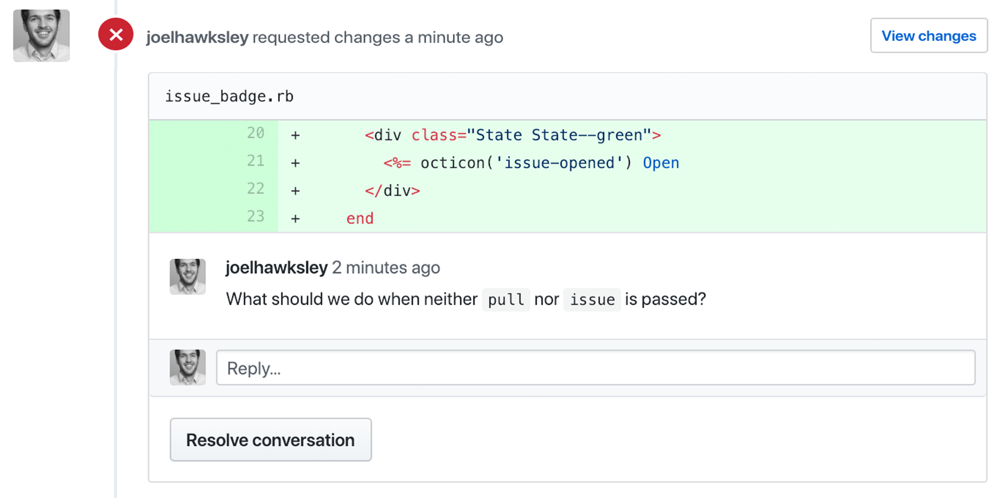

autoscale: true
slidenumbers: true
slidecount: true
footer: hawksley.org/components

# [fit] Rethinking the View Layer <br> with Components

^
Thanks to the RailsConf organizers
Excited to be giving first conference talk

---

# Joel Hawksley
## hawksley.org

^ Name is Joel

^ I live in Colorado

---


^
Engineer at GitHub

---

^
Learning new languages and frameworks
Give us a new way of thinking about the world

---


^ Especially true for me with React

^ Changed the way I look at Rails

^ Going to talk about that change in perspective

^ How we took a template in the GitHub app

---

```erb
<% if pull && pull.merged? %>
  <div class="State State--purple">
    <%= octicon('git-merge') %> Merged
  </div>
<% elsif pull && pull.closed? %>
  <div class="State State--red">
    <%= octicon('git-pull-request') %> Closed
  </div>
<% elsif pull && pull.draft? %>
  <div class="State">
  <%= octicon('git-pull-request') %> Draft
  </div>
<% elsif pull %>
  <div class="State State--green">
    <%= octicon('git-pull-request') %> Open
  </div>
<% elsif issue && issue.closed? %>
  <div class="State State--red">
    <%= octicon('issue-closed') %> Closed
  </div>
<% elsif issue %>
  <div class="State State--green">
    <%= octicon('issue-opened') %> Open
  </div>
<% end %>
```

^
- Is hard to test efficiently
- Is impossible to measure with code coverage tools
- Overfetches ActiveRecord objects
- Fails basic Ruby code standards
- And refactored it into a new, experimental addition to ActionView

---

```erb
<%= render Issues::State, state: :open %>
<%= render PullRequests::State, state: :merged %>
```

^
- That allows us to test our views efficiently, in isolation
- Use code coverage tools
- Only receive the data they need
- Follow the code standards of the Ruby language
- And perhaps most importantly

---

# [fit] >200x

^ Are over 200x faster to test

---

# [fit] Views

^
- What even is a view?
- Helpful to have a definition

---

# [fit] Data -> HTML

^
- Views are programs
- They input (data), and return an output, HTML.
- Rails over the years?

---

# [fit] 2004 **ERB 1.0**
# [fit] 2005 **Rails 1.0**
# [fit] 2012 **Turbolinks**
# [fit] 2016 **API Mode**

^
- Things haven’t changed much
- Rails still using embedded ruby templates
- Rails 4 partial page reloads with Turbolinks
- And Rails 5 API mode

---

> "Rails is not only a great choice when you want to build a full-stack application that uses server-side rendering of HTML templates, but also a great companion for the new crop of client-side JavaScript or native applications that just needs the backend to speak JSON."
-- DHH

^
DHH said in the announcement of Rails 5

---

# [fit] 2004 **ERB 1.0**
# [fit] 2005 **Rails 1.0**
# [fit] 2012 **Turbolinks**
# [fit] 2016 **API Mode**

^
- The history of the Rails view layer is one of most of us moving away from it

---

^ So what does the view layer look like at GitHub?

---

# [fit] ERB

^
- Still using embedded ruby
- Why isn’t GitHub a single page app like everything else these days?

---

# [fit] Progressive <br> Enhancement

^
- Progressive enhancement.
- We like to say that we write our Javascript like it's 2005. It makes the site more pleasant to use, but at its core, most workflows work with it turned off.
- While most of us here at RailsConf are lucky enough to be using modern, powerful devices
- A lot of our new users are in developing countries
- Low powered netbooks, chrome books, or tablets, which buckle under heavy Javascript.
- At our scale, even a small percentage of users is a large number of people
- For those using GitHub in the enterprise, there might be users on older browsers, and we don't want to abandon them either
- Allows graceful fallback support for older browsers

---

[.code-highlight: all]
[.code-highlight: 3-6]
[.code-highlight: 2-6]
[.code-highlight: 8]
[.code-highlight: all]

```erb
<% if supported_browser? %>
  <%= javascript_bundle 'polyfills' if compatibility_browser? %>
  <%= javascript_bundle 'frameworks' %>
  <%= javascript_bundle 'github', async: true %>
  <%= yield :scripts %>
  <%= controller_javascript_bundles %>
<% else %>
  <%= javascript_bundle 'unsupported' %>
<% end %>
```

^
- How do we do it?
- Couple tiers of Javascript bundles
- Fully supported browsers -> normal bundles.
- Polyfills to second tier that need it.
- Unsupported -> ONLY smaller set of polyfills
- Deprecate browsers -> tiers of support
- Because we can afford to only serve JS to the most modern browsers, we can be really strict about compatibility

---

# [fit] Server <br> Rendering

^
All rendering on the server

---

[.hide-footer]


^
- New issue comment
- JS intercepts click

---

[.hide-footer]


^
- AJAX request returns DOM nodes for sidebar, comment form, timeline
- Inject results into page
- Using PJAX, like Turbolinks
- Javascript turned off -> normal page request and reload
- PAUSE

---

^ Let’s talk about building views at GitHub

---

[.hide-footer]
[.slidenumbers: false]
[.slidecount: false]


^
- Project paper cuts
- Make GitHub better through incorporating community feedback
- Over a hundred releases in the past year
- Recently shipped sticky headers

---


^
- This is the issue badge
- Display the status of Issues and PRs

---

# [fit] Issue
# [fit] belongs_to:
# [fit] PullRequest

^
- In GitHub data model
- PR is just an issue with an associated PullRequest object.

---

```erb
<% if pull && pull.merged? %>
  <div class="State State--purple">
    <%= octicon('git-merge') %> Merged
  </div>
<% elsif pull && pull.closed? %>
  <div class="State State--red">
    <%= octicon('git-pull-request') %> Closed
  </div>
<% elsif pull && pull.draft? %>
  <div class="State">
  <%= octicon('git-pull-request') %> Draft
  </div>
<% elsif pull %>
  <div class="State State--green">
    <%= octicon('git-pull-request') %> Open
  </div>
<% elsif issue && issue.closed? %>
  <div class="State State--red">
    <%= octicon('issue-closed') %> Closed
  </div>
<% elsif issue %>
  <div class="State State--green">
    <%= octicon('issue-opened') %> Open
  </div>
<% end %>
```

^
- Shared issue badge partial
- Renders icon, label, color
- State of issue or PR
- PAUSE
- Reuse for sticky headers
- Deleted the contents of the view, pushed to CI, nothing failed
- Not so simple at GitHub

---

# [fit] Rails 5.2

^ 10-year-old Rails monolith

^ Currently running on the latest version

---

```bash

$ ls -1 app/models | wc -l
556

```

^ We have almost 600 models
^ (And and additional 1500 or so concerns)

---

```bash
$ ls -1 app/controllers | wc -l
209
```

^ Over 200 controllers, not including our API

---

```bash
$ find app/views -print | wc -l
3718
```

^ And over 3700 views!

^ PAUSE

^ Affect how we test our views?

---

# [fit] 6s
### [fit] GET + assert

^
- Six seconds for single controller test
- One minute for ten test cases just to get feedback

---

^
- So you know when you’re at an event and they have a minute of silence?
- Imagine that, every time you make a change.
- DRAMATIC PAUSE
- Ok, you get the point
- When your view tests take six seconds per test case, that might make you write less tests
- That's not good for anyone

---

# [fit] ?

^
- So why isn’t testing our views thoroughly a more common practice?
- LONG PAUSE

---

# [fit] Flaws

^
- Believe symptom of several flaw in Rails view layer

---

# [fit] Unit <br> Testing

^
- Unit testing views isn’t common practice
- Never seen it done in any of the Rails apps I’ve worked on before GitHub
- Nearly all of our view tests are those six-second controller tests
- These costs discourage you from writing as many tests as you might otherwise write

---

```erb
<% if pull && pull.merged? %>
  <div class="State State--purple">
    <%= octicon('git-merge') %> Merged
  </div>
<% elsif pull && pull.closed? %>
  <div class="State State--red">
    <%= octicon('git-pull-request') %> Closed
  </div>
<% elsif pull && pull.draft? %>
  <div class="State">
  <%= octicon('git-pull-request') %> Draft
  </div>
<% elsif pull %>
  <div class="State State--green">
    <%= octicon('git-pull-request') %> Open
  </div>
<% elsif issue && issue.closed? %>
  <div class="State State--red">
    <%= octicon('issue-closed') %> Closed
  </div>
<% elsif issue %>
  <div class="State State--green">
    <%= octicon('issue-opened') %> Open
  </div>
<% end %>
```

^
- Partials often end up being tested for each of the views they are included in
- Leads to duplication of tests
- Cheapens benefit of reusing the partial in the first place

---

# [fit] Code <br> Coverage

^
- Another problem is measuring code coverage

---

# [fit] ~~SimpleCov <br> Coveralls~~

^
- Neither SimpleCov nor Coveralls support view code
- Combined with testing friction puts views in blind spot

---

# [fit] Implicit <br> Arguments

^
- Another weakness is the lack of a method signature
- Unlike a method declaration on an object, views do not expose the values they are expected to receive

---

```erb
<% if pull && pull.merged? %>
  <div class="State State--purple">
    <%= octicon('git-merge') %> Merged
  </div>
<% elsif pull && pull.closed? %>
  <div class="State State--red">
    <%= octicon('git-pull-request') %> Closed
  </div>
<% elsif pull && pull.draft? %>
  <div class="State">
  <%= octicon('git-pull-request') %> Draft
  </div>
<% elsif pull %>
  <div class="State State--green">
    <%= octicon('git-pull-request') %> Open
  </div>
<% elsif issue && issue.closed? %>
  <div class="State State--red">
    <%= octicon('issue-closed') %> Closed
  </div>
<% elsif issue %>
  <div class="State State--green">
    <%= octicon('issue-opened') %> Open
  </div>
<% end %>
```

^ Let’s go back to our example code.

^ What data does this view need to render?

^ A “pull”?

^ An “issue”?

^ Should I be able to pass in both? Neither?

^ Are these values passed in as locals, or do they come from a helper?

---

# [fit] View Models

^ So what if we used a view model?

---

```ruby
module Issues
  class BadgeView
    def initialize(issue, pull)
      @issue = issue
      @pull = pull
    end

    def state_class; end
    def octicon_name; end
    def label; end
  end
end
```

^ We might write a class that looks something like this

---

```erb
<div class="State #{view.state_class}">
  <%= octicon(view.octicon_name) %>
  <%= view.label %>
</div>
```

^ And a template that looks like this.

---

# [fit] View Models

^
- That’s much better, right?
- I’ve seen a couple problems with this approach:
- We end up with two files that are more or less interlocked. One can’t exist without the other.
- Testing the view model makes us feel like we’re testing the view, when we’re not.

---

# [fit] Overfetching

^ Another problem comes from using Activerecord: overfetching.

---

```erb
<% if pull && pull.merged? %>
  <div class="State State--purple">
    <%= octicon('git-merge') %> Merged
  </div>
<% elsif pull && pull.closed? %>
  <div class="State State--red">
    <%= octicon('git-pull-request') %> Closed
  </div>
<% elsif pull && pull.draft? %>
  <div class="State">
  <%= octicon('git-pull-request') %> Draft
  </div>
<% elsif pull %>
  <div class="State State--green">
    <%= octicon('git-pull-request') %> Open
  </div>
<% elsif issue && issue.closed? %>
  <div class="State State--red">
    <%= octicon('issue-closed') %> Closed
  </div>
<% elsif issue %>
  <div class="State State--green">
    <%= octicon('issue-opened') %> Open
  </div>
<% end %>
```

^ For “pull” and “issue” in this example, what attributes do we need from each object?

^ If these are active record objects, we’d be fetching their entire set of attributes, when we may in fact only need one or two for each object.

^ This makes our requests unnecessarily slower.

^ On our objects, some fields are backed by Git storage, so we have to be careful with what we fetch.

---

# [fit] Standards

^ The reality is that our views regularly fail even the most basic standards of code quality we expect out of our Ruby classes.

---

```erb
<% if pull && pull.merged? %>
  <div class="State State--purple">
    <%= octicon('git-merge') %> Merged
  </div>
<% elsif pull && pull.closed? %>
  <div class="State State--red">
    <%= octicon('git-pull-request') %> Closed
  </div>
<% elsif pull && pull.draft? %>
  <div class="State">
  <%= octicon('git-pull-request') %> Draft
  </div>
<% elsif pull %>
  <div class="State State--green">
    <%= octicon('git-pull-request') %> Open
  </div>
<% elsif issue && issue.closed? %>
  <div class="State State--red">
    <%= octicon('issue-closed') %> Closed
  </div>
<% elsif issue %>
  <div class="State State--green">
    <%= octicon('issue-opened') %> Open
  </div>
<% end %>
```

^ Let’s go back to our example.

---

[.hide-footer]
[.slidenumbers: false]
[.slidecount: false]


^
- If this was a method on a class, what aspects might we object to in a code review?
- PAUSE - Ask audience
- Besides it being super long, I can think of a couple:

---

[.hide-footer]
[.slidenumbers: false]
[.slidecount: false]


^ Where is octicon defined?

---

[.hide-footer]
[.slidenumbers: false]
[.slidecount: false]


^ Where does this class attribute value come from? This feels like a magic string.

---

[.hide-footer]
[.slidenumbers: false]
[.slidecount: false]


^ Where are pull and issue coming from?

---

[.hide-footer]
[.slidenumbers: false]
[.slidecount: false]


^ What should we do when neither pull nor issue is passed?

^ PAUSE

---

# [fit] Standards

^ The reality is that we regularly do things in our templates that we’d never do in a Ruby class

^ PAUSE

---

# [fit] Testing

^ So to recap,

^ Rails views are difficult to test, putting our views in a bit of blind spot.

---

# [fit] Code <br> Coverage

^ Can’t be measured with code coverage tooling,

---

# [fit] Implicit <br> Arguments

^ Have implicit method signatures

---

# [fit] View Models

^ Don’t improve much with the use of view models

---

# [fit] Overfetching

^ Make it easy to over fetch data

---

# [fit] Standards

^ And often fail basic Ruby code standards

---

# [fit] MvC

^ The reality is that the existing Rails view layer is a second-class citizen these days.

^ PAUSE

---

^ With all these shortcomings, perhaps it isn’t much of a surprise that a new way of building views has taken hold in the Rails community:

---

# [fit] React

^ React.

^ Let’s talk about what concepts React has made popular.

^ A small disclaimer here: there are a lot of different ways to use React, and it’s been about a year since I used it in depth.

---

# [fit] Components

^ React is all about components.

^ A component encapsulates a piece of user interface.

^ Multiple components are composed together to create a view.

---

[.code-highlight: all]
[.code-highlight: 2-4]
[.code-highlight: 7]
[.code-highlight: 3, 7]

```jsx
class Greeting extends React.Component {
  render() {
    return <div>Hello, {this.props.name}!</div>;
  }
}

React.render(<Greeting name="World" />, document.getElementById('example'));
```

^ Here's one way of writing "Hello, World" in a React component.

^ React components, at a minimum, implement a render method that returns HTML.

^ Arguments passed to a component are assigned to the `props` object, which is accessible within the component's instance methods.

---

```jsx
class IssueBadge extends React.Component {
  render() {
    return (
      <div className={ "State " + this._stateClass() }>
        <i className={this._icon()} /> {this._label()}
      </div>
    )
  }

  _icon() { ... }
  _stateClass() { ... }
  _label() { ... }
}
```

^ Here’s an example of what the issue badge might look like as a React component.

---

# [fit] Types

^ But then things get interesting. React gives us type checking!

---

[.code-highlight: all]
[.code-highlight: 2-4]
[.code-highlight: 5-8]

```javascript
IssueBadge.propTypes = {
  issue: PropTypes.exact({
    isClosed: PropTypes.bool.isRequired
  }).isRequired,
  pull: PropTypes.exact({
    isClosed: PropTypes.bool.isRequired,
    isMerged: PropTypes.bool.isRequired
  }),
};
```

^ The Prop Types library provides runtime type checking for React components.

^ This allows us to express some expectations about the data we receive. In this case, we are expecting:

^ An issue with the boolean isClosed attribute to always be provided

^ And a pull to sometimes be provided, and if so, with the boolean isClosed and isMerged attributes.

---

[.code-highlight: 10]

```jsx
class IssueBadge extends React.Component {
  render() {
    return (
      <div className={ "State " + this._stateClass() }>
        <i className={this._icon()} /> {this._label()}
      </div>
    )
  }

  _icon() { return this.props.issue.isClosed ... }
  _stateClass() { ... }
  _label() { ... }
}
```

^ When can then write code without checking for the presence of the issue object, as our type check will guarantee that it is present.

^ PAUSE

---

# [fit] Functional <br> Purity

^ Another advantage of React is how it encourages writing components as pure functions.

---

# [fit] Data -> Component

^ By passing data into views instead of rich objects, React encourages us to write functions without side-affects.

^ In reality, most architectures that split the frontend from the backend benefit from this separation.

---

# [fit] Testing

^ Another cool thing about React is how easily components can be tested in isolation.

---

```jsx
it('should render the closed issue badge', function() {
  expect(shallow(<IssueBadge props={{ issue: { isClosed: true }}} />).
  contains(<div className="State State--red">Closed</div>)).toBe(true);
});
```

^ Here’s an example test that asserts against the output of our component.

^ What’s great is that this test runs without touching the database and without spinning up a browser.

^ Which means that it's wicked fast.

---

# [fit] React

^ So React has:

---

# [fit] Components

^ Components

---

# [fit] Types
^ Types

---

# [fit] Functional purity

^ Functional purity

---

# [fit] Testing

^ And lightweight testing in isolation

---

^ While React has a lot of advantages, it’s not compatible with our progressive enhancement architecture at GitHub.

^ But I'm not so sure we should give up there.

---

# [fit] Rails

^ What might it look like to use these lessons from React to improve the Rails view layer?

^ Let's give it a shot! Perhaps we can address some of those code review comments along the way.

---

# [fit] Components

^ So what might it look like to have components in Rails?

---

```ruby
module Issues
  class Badge
  end
end
```

^ I think it would make sense to make it a class, like everything else in Ruby! Let's call it Badge, inside the Issues module.

^ And since it's part of the view layer

---

```ruby
module Issues
  class Badge < ActionView::Component
  end
end
```

^ Let's put it inside of ActionView!

---

# [fit] API

^ And how might we call it?

---

```erb
<%= render Issues::Badge %>
```

^ ActionView gives us the `render` entry point, so I think it makes sense to use that.

^ So let’s do some test driven development.

---

[.code-highlight: all]
[.code-highlight: 3]

```ruby
test "requires an issue to be passed" do
  assert_raises ArgumentError, "missing keyword: issue" do
    render_string("<%= render Issues::Badge %>")
  end
end
```

^ First, let’s require that an issue is always passed to our component.

^ To make this work, we'll first need a way of rendering a piece of a template by itself, so let's write a `render_string` helper.

---

```ruby
def render_string(string)
  html = ApplicationController.new.view_context.render(inline: string)

  Nokogiri::HTML(html)
end
```

^ Rails gives us the tools to render an inline template without too much work.

^ And returning a rich Nokogiri object gives us something to dig into in our test assertions later.

---

```erb
<%= render Issues::Badge %>
```

^ So coming back to our API sketch, we need ActionView's render method to support our new Component argument type

---

```ruby
class ActionView::Base
  module RenderMonkeyPatch
    def render(component)
      return super unless component < ActionView::Component

      component.html
    end
  end

  prepend RenderMonkeyPatch
end
```

^ Luckily we're writing Ruby, so we can monkey patch!

^ With this code, we'll call the `html` class method on a component if

---

```ruby
module Issues
  class Badge
    def initialize(issue:)
    end
  end
end
```

^ Since our view is now an object, it can have an explicit interface.

---

# [fit] ~~Implicit <br> Arguments~~

^ Which means no more implicit arguments!

---

```ruby
test "returns the merged badge for a merged PullRequest" do
  result = Issues::Badge.new(issue: @merged.issue, pull: @merged).render

  assert_includes result, "Merged"
  assert_includes result, "State--purple"
  assert_includes result, "git-merge"
end
```

^ So anyways, let’s start to work our way towards parity with the existing view.

^ Let’s start with a test for a merged pull request.

---

```ruby
module Issues
  class Badge
    include OcticonsHelper

    def initialize(issue:)
    end

    def render
      <<-html
      <div class="State State--purple">
        #{octicon('git-merge')} Merged
      </div>
      html
    end
  end
end
```

^ In order to get the test to pass, I had to include our Octicon helper explicitly.

^ This addresses the invisible dependency concern that came up during the code review.

---

```ruby
test "returns the merged badge for a merged PullRequest" do
  result = Issues::Badge.new(issue: @merged_pr.issue, pull: @merged_pr).render

  assert_includes result, "Merged"
  assert_includes result, "State--purple"
  assert_includes result, "git-merge"
end

# ...

test "returns the open badge for an open issue" do
  result = Issues::Badge.new(issue: @open_issue).render

  assert_includes result, "Open"
  assert_includes result, "State--green"
  assert_includes result, "issue-opened"
end
```

^ Next, I added tests for the rest of the five cases.

---

```ruby
def render
  if @pull&.merged?
    <<~HTML
    <div class="State State--purple">
      #{octicon('git-merge')} Merged
    </div>
    HTML

  # ...

  elsif @issue
    <<~HTML
    <div class="State State--green">
      <%= octicon('issue-opened') %> Open
    </div>
    HTML
  end
end
```

^ Here’s my first version that got the tests to pass

---

```erb
<% if pull && pull.merged? %>
  <div class="State State--purple">
    <%= octicon('git-merge') %> Merged
  </div>
<% elsif pull && pull.closed? %>
  <div class="State State--red">
    <%= octicon('git-pull-request') %> Closed
  </div>
<% elsif pull && pull.draft? %>
  <div class="State">
  <%= octicon('git-pull-request') %> Draft
  </div>
<% elsif pull %>
  <div class="State State--green">
    <%= octicon('git-pull-request') %> Open
  </div>
<% elsif issue && issue.closed? %>
  <div class="State State--red">
    <%= octicon('issue-closed') %> Closed
  </div>
<% elsif issue %>
  <div class="State State--green">
    <%= octicon('issue-opened') %> Open
  </div>
<% end %>
```

^ but more or less mimicked the branching logic from the original view.

---

# [fit] ✅ Code Coverage

^ At this point I was able to run the component through SimpleCov, returning a coverage score of 100%.

^ Which means we can refactor with confidence!

---

```ruby
def initialize(issue:, pull: nil)
  @issue = issue
  @pull = pull

  @state, @octicon, @label = state_octicon_label
end

def render
  <<~HTML
  <div class="State #{@state}">
    #{octicon(@octicon)} #{@label}
  </div>
  HTML
end

private

def state_octicon_label
  if @pull&.merged?
    return "State--purple", "git-merge",          "Merged"
  elsif @pull&.closed?
    return "State--red",    "git-pull-request",   "Closed"
  elsif @pull
    return "State--green",  "git-pull-request",   "Open"
  elsif @issue&.closed?
    return "State--red",    "issue-closed",       "Closed"
  elsif @issue
    return "State--green",  "issue-opened",       "Open"
  end
end
```

^ This first refactor is pretty naive.

^ It basically just DRYs up the repeated HEREDOC and HTML syntax

---

[.hide-footer]
[.slidenumbers: false]
[.slidecount: false]


^ So what about those "magic strings"?

---

[.code-highlight: all]
[.code-highlight: 3,5,7,9,11]

```ruby
def state_octicon_label
  if @pull&.merged?
    return "State--purple", "git-merge",          "Merged"
  elsif @pull&.closed?
    return "State--red",    "git-pull-request",   "Closed"
  elsif @pull
    return "State--green",  "git-pull-request",   "Open"
  elsif @issue&.closed?
    return "State--red",    "issue-closed",       "Closed"
  elsif @issue
    return "State--green",  "issue-opened",       "Open"
  end
end
```

^ So there are at least three sets of magic strings in our component right now:

^ CSS class names, which come from our Primer design system

^ Octicon name, which comes from our icon library

^ Label text, which is a humanized version of the current state

---

[.code-highlight: 3,5,7,9,11]
[.code-highlight: all]

```ruby
def state_octicon_label
  if @pull&.merged?
    Primer::State::PURPLE, Icons::GIT_MERGE,          @pull.state.to_s.titleize
  elsif @pull&.closed?
    Primer::State::RED,    Icons::GIT_PULL_REQUEST,   @pull.state.to_s.titleize
  elsif @pull
    Primer::State::GREEN,  Icons::GIT_PULL_REQUEST,   @pull.state.to_s.titleize
  elsif @issue&.closed?
    Primer::State::RED,    Icons::ISSUE_CLOSED,       @issue.state.to_s.titleize
  elsif @issue
    Primer::State::GREEN,  Icons::ISSUE_OPENED,       @issue.state.to_s.titleize
  end
end
```

^ Expressing these facts makes it clear what our component is coupled to.

^ So now we’ve ended up with this giant conditional statement. Let’s see what we can do about that.

---

```ruby
def state_class
  if @pull&.merged?
    Primer::State::PURPLE
  elsif @pull&.closed? || @issue.closed?
    return Primer::State::RED
  else
    return Primer::State::GREEN
  end
end

def octicon_name
  if @pull&.merged?
    Icons::GIT_MERGE
  elsif @pull
    Icons::GIT_PULL_REQUEST
  elsif @issue.closed?
    Icons::ISSUE_CLOSED
  else
    Icons::ISSUE_OPENED
  end
end

def label
  @pull ? @pull.state.to_s.titleize : @issue.state.to_s.titleize
end
```

^ That’s getting simpler!

^ But something looks off about that label method, and maybe it’s a sign of a bigger issue with our component.

^ The reality is that the consumers of this view already know whether they are passing us a PR and an Issue, or just an issue.

^ So what good are we doing handling this logic? Let’s factor it out.

---

```ruby
def initialize(issue:, label:, pull: nil)
  @issue = issue
  @pull = pull
end
```

^ So let’s make label a required argument.

---

```ruby
test "renders the label" do
  result = Issues::Badge.new(
    issue: @merged_pr.issue,
    label: "Label",
    pull: @merged_pr
  ).render

  assert_includes result, "Label"
end  
```

^ Now we need a single assertion to ensure that it is rendered

^ This allows us to remove the label assertions from the state-specific tests.

---

# [Fit] Functional <br> Purity

^ So what about functional purity?

---

```ruby
def assert_no_queries(&block)
  before = GitHub::MysqlInstrumenter.query_count
  yield
  after  = GitHub::MysqlInstrumenter.query_count

  assert_equal before, after, "Block made unexpected database queries"
end
```

^ One tool we use at GitHub to guard against unintentionally running queries is this assert_no_queries test helper.

^ We use it to wrap code we want to make sure doesn’t result in queries to the database.

---

[.code-highlight: 8]

```ruby
test "it doesn't query the database when passed a PullRequest" do
  component = Issues::Badge.new(
    issue: @merged_pr.issue,
    label: "Label",
    pull: @merged_pr
  )

  assert_no_queries { component.render }
end
```

^ Here's how we might use it in tests for our component

---

[.code-highlight: 8]

```ruby
test "it doesn't enqueue any jobs when passed a PullRequest" do
  component = Issues::Badge.new(
    issue: @merged_pr.issue,
    label: "Label",
    pull: @merged_pr
  )

  assert_no_enqueued_jobs { component.render }
end
```

^ We use a similar ActiveJob test helper to make sure jobs aren’t triggered.

^ Triggering jobs in a view? I've seen some things...

---

```ruby
def state_class
  if @pull&.merged?
    Primer::State::PURPLE
  elsif @pull&.closed? || @issue.closed?
    return Primer::State::RED
  else
    return Primer::State::GREEN
  end
end

def octicon_name
  if @pull&.merged?
    Icons::GIT_MERGE
  elsif @pull
    Icons::GIT_PULL_REQUEST
  elsif @issue.closed?
    Icons::ISSUE_CLOSED
  else
    Icons::ISSUE_OPENED
  end
end
```

^ So if we go back to the two conditional trees in our component, it seems to me like we might have two components here, not one.

^ There’s a lot of switching here around whether we’re dealing with a pull request or not.

^ So let’s try making a separate PullRequest badge and see what happens!

---

```ruby
def initialize(pull:, label:)
  @pull = pull
  @label = label
end

def render
  <<-html
  <div class="#{Primer::State::BASE} #{state_class}">
    #{octicon(octicon_name)} #{@label}
  </div>
  html
end

private

def state_class
  if @pull.merged?
    Primer::State::PURPLE
  elsif @pull.closed?
    return Primer::State::RED
  else
    return Primer::State::GREEN
  end
end

def octicon_name
  @pull.merged? ? Icons::GIT_MERGE : Icons::GIT_PULL_REQUEST
end
```

---

[.code-highlight: all]
[.code-highlight: 8-10]

^ With separate components, our conditionals are much simpler.

```ruby
def initialize(issue:, label:)
  @issue = issue
  @label = label
end

def render
  <<-html
  <div class="#{Primer::State::BASE} #{state_class}">
    #{octicon(octicon_name)} #{@label}
  </div>
  html
end

private

def state_class
  if @issue.closed?
    Primer::State::RED
  else
    Primer::State::GREEN
  end
end

def octicon_name
  if @issue.closed?
    Icons::ISSUE_CLOSED
  else
    Icons::ISSUE_OPENED
  end
end
```

^ Our issues badge ends up being even simpler!

^ But now there is some duplication. We’re still building the same element from our design system.

^ So how about we extract the shared code?

---

```ruby
module Primer
  class Badge
    include OcticonsHelper

    def self.render(octicon_name:, color:, label:)
      <<-html
      <div class="#{Primer::State::BASE} #{color}">
        #{octicon(octicon_name)} #{label}
      </div>
      html
    end
  end
end
```

^ So here’s our new component, implemented as part of our design system. It no longer has any coupling to our app’s domain at all.

^ You could imagine this being provided by the design system library, even so far as living outside of our app’s main codebase.

---

[.code-highlight: 9-13]

```ruby
module Issues
  class Badge
    def initialize(issue:, label:)
      @issue = issue
      @label = label
    end

    def render
      Primer::Badge.render(
        octicon_name: octicon_name,
        color: color,
        label: @label
      )
    end

    private

    def color; end
    def octicon_name; end
  end
end
```

^ So let’s refactor our Issue and PullRequest badges to use our Primer badge.

^ PAUSE

^ But there’s still more we can do here.

^ Let’s think about functional purity again.

---

```ruby
test "it doesn't query the database when passed a PullRequest" do
  component = Issues::Badge.new(
    issue: @merged_pr.issue,
    label: "Label",
    pull: @merged_pr
  )

  assert_no_queries do
    component.render
  end
end
```

^ We were mainly concerned with our component unintentionally querying the database.

^ But what if we could avoid passing in ActiveRecord objects at all? That would basically eliminate the risk.

---

```ruby
module Issues
  class Badge
    def color
      if @issue.closed?
        Primer::State::RED
      else
        Primer::State::GREEN
      end
    end

    def octicon_name
      if @issue.closed?
        Icons::ISSUE_CLOSED
      else
        Icons::ISSUE_OPENED
      end
    end
  end
end
```

^ Looking back at our Issue badge, it looks like we’re only depending on a single boolean attribute on Issue.

---

```ruby
module Issues
  class Badge
    def self.render(is_closed:, label:)
      if is_closed
        Primer::Badge.render(
          octicon_name: Icons::ISSUE_CLOSED,
          color: Primer::State::RED,
          label: label
        )
      else
        Primer::Badge.render(
          octicon_name: Icons::ISSUE_OPENED,
          color: Primer::State::GREEN,
          label: label
        )
      end
    end
  end
end
```

^ So let’s just pass in that single attribute instead!

---

```ruby
module PullRequests
  class Badge
    def self.render(state:, label:)
      case state
      when PullRequest::States::MERGED
        Primer::Badge.render(
          octicon_name: Icons::GIT_MERGE,
          color: Primer::State::PURPLE,
          label: label
        )
      when PullRequest::States::CLOSED
        Primer::Badge.render(
          octicon_name: Icons::GIT_PULL_REQUEST,
          color: Primer::State::RED,
          label: label
        )
      when PullRequest::States::OPEN
        Primer::Badge.render(
          octicon_name: Icons::GIT_PULL_REQUEST,
          color: Primer::State::GREEN,
          label: label
        )
      end
    end
  end
end
```

^ Looking at the PullRequest badge, it needs to know a little more about PullRequests, but not much.

^ In this case it makes sense to use an existing state value instead of passing the entire PullRequest object in.

---

```ruby
module Issues
  class Badge
    def self.render(state:, label:)
      case state
      when Issue::States::OPEN
        Primer::Badge.render(
          octicon_name: Icons::ISSUE_OPENED,
          color: Primer::State::GREEN,
          label: label
        )
      when Issue::States::CLOSED
        Primer::Badge.render(
          octicon_name: Icons::ISSUE_CLOSED,
          color: Primer::State::RED,
          label: label
        )
      end
    end
  end
end
```

^ For consistency’s sake, let’s refactor the issue badge to use the same state argument.

---

```ruby
module Issues
  class Badge
    def self.render(state:)
      case state
      when Issue::States::OPEN
        Primer::Badge.render(
          octicon_name: Icons::ISSUE_OPENED,
          color: Primer::State::GREEN,
          label: state.to_s.titleize
        )
      when Issue::States::CLOSED
        Primer::Badge.render(
          octicon_name: Icons::ISSUE_CLOSED,
          color: Primer::State::RED,
          label: state.to_s.titleize
        )
      end
    end
  end
end
```

^ And finally, we can remove the label argument, as we were just using a titleized version of the state anyways.

---

# [fit] Types

^ So what about types?

---

```ruby
module Issues
  class Badge
    def self.render(state:)
      case state
      when Issue::States::OPEN
        Primer::Badge.render(
          octicon_name: Icons::ISSUE_OPENED,
          color: Primer::State::GREEN,
          label: state.to_s.titleize
        )
      when Issue::States::CLOSED
        Primer::Badge.render(
          octicon_name: Icons::ISSUE_CLOSED,
          color: Primer::State::RED,
          label: state.to_s.titleize
        )
      end
    end
  end
end
```

^ Based on what we’ve come up with, they don’t look so necessary any more.

^ By using constants for our expected values, we make it easy for consumers of our components to pass in a value we expect.

---

# [fit] Performance

^ So let’s talk about performance.

---

# [fit] ~6s
### [fit] GET + assert

^ In our test suite, Controller tests take about six seconds for loading a page and asserting against its contents.

^ What about our new unit tests?

---

# [fit] ~25ms
### [fit] .render + assert

^ They clocked in at around 50 milliseconds each running in the same suite.

^ These measurements are independent of any setup routines.

---

# [fit] ~240x

^ That’s two-hundred and fourty times faster.

---

# [fit] .25s vs 60s

^ This means that the ten unit tests we wrote for our components that run in a quarter of a second would take a whole minute if they were controller tests.

^ PAUSE

^ So to look back

---

```erb
<% if pull && pull.merged? %>
  <div class="State State--purple">
    <%= octicon('git-merge') %> Merged
  </div>
<% elsif pull && pull.closed? %>
  <div class="State State--red">
    <%= octicon('git-pull-request') %> Closed
  </div>
<% elsif pull && pull.draft? %>
  <div class="State">
  <%= octicon('git-pull-request') %> Draft
  </div>
<% elsif pull %>
  <div class="State State--green">
    <%= octicon('git-pull-request') %> Open
  </div>
<% elsif issue && issue.closed? %>
  <div class="State State--red">
    <%= octicon('issue-closed') %> Closed
  </div>
<% elsif issue %>
  <div class="State State--green">
    <%= octicon('issue-opened') %> Open
  </div>
<% end %>
```

^ So to recap, we started with this traditional embedded ruby template that:

^ Was hard to test efficiently

^ Was impossible to measure with code coverage tools

^ Overfetched ActiveRecord objects

^ Failed basic Ruby code standards

---

```ruby
module Issues
  class Badge
    def self.render(state:)
      case state
      when Issue::States::OPEN
        Primer::Badge.render(
          octicon_name: Icons::ISSUE_OPENED,
          color: Primer::State::GREEN,
          label: state.to_s.titleize
        )
      when Issue::States::CLOSED
        Primer::Badge.render(
          octicon_name: Icons::ISSUE_CLOSED,
          color: Primer::State::RED,
          label: state.to_s.titleize
        )
      end
    end
  end
end
```

^ And ended up with this, a set of Ruby objects that:

^ Map our domain models into a standard component from our design system.

^ Are tested efficiently, in isolation

^ Are audited using code coverage tools

^ Only receive the data they need

^ Follow the code standards of the Ruby language

---

# [fit] MVC

^ This gives us higher confidence about our views, and perhaps most importantly, makes them a first class citizen in Rails.

---

# [fit] Thanks

---

# [fit] Q & A

^ Repeat questions
