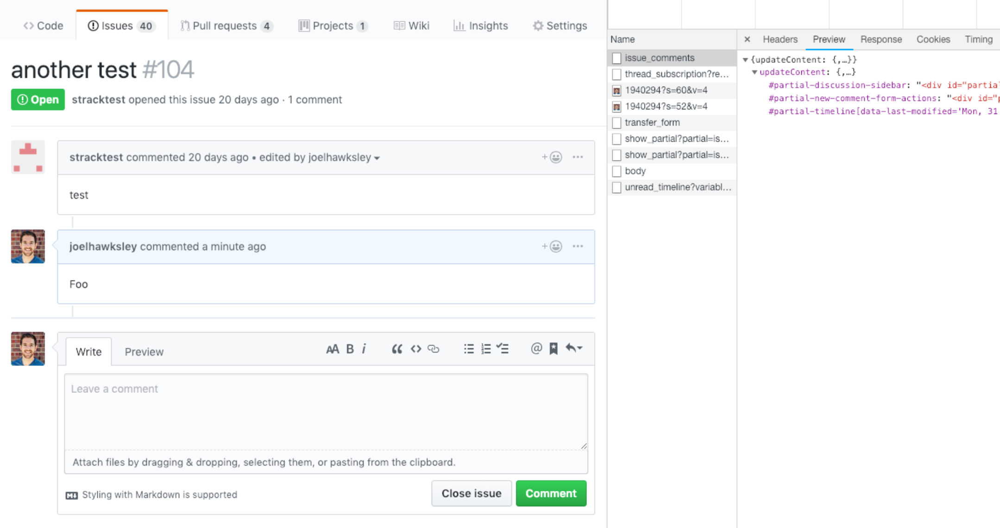

autoscale: true
slidenumbers: true
slidecount: true
footer: hawksley.org/components

# [fit] Rethinking the View Layer <br> with Components

^
Thanks to the RailsConf organizers
Excited to be giving first conference talk

---

# Joel Hawksley
## hawksley.org

^ My name is Joel.
I live in Colorado.

---


^
Engineer at GitHub

---

^
Learning new languages and frameworks
Give us a new way of thinking about the world

---


^ Especially true for me with React

---

# [fit] Rethinking the View Layer <br> with Components

^
Changed the way I look at Rails
Going to talk about that change in perspective

---

```erb
<% if pull && pull.merged? %>
  <div class="State State--purple">
    <%= octicon('git-merge') %> Merged
  </div>
<% elsif pull && pull.closed? %>
  <div class="State State--red">
    <%= octicon('git-pull-request') %> Closed
  </div>
<% elsif pull %>
  <div class="State State--green">
    <%= octicon('git-pull-request') %> Open
  </div>
<% elsif issue && issue.closed? %>
  <div class="State State--red">
    <%= octicon('issue-closed') %> Closed
  </div>
<% elsif issue %>
  <div class="State State--green">
    <%= octicon('issue-opened') %> Open
  </div>
<% end %>
```

^
- Do this through an exercise
- Take template from the GitHub app
- Is hard to test efficiently
- Is impossible to measure with code coverage tools
- Overfetches ActiveRecord objects
- Fails basic Ruby code standards

---

```erb
<%= render Issues::Badge, is_pull: true, state: :merged %>
```

^
- Refactor into Ruby classes
- Are tested efficiently, in isolation
- Are audited using code coverage tools
- Only receive the data they need
- Follow the code standards of the Ruby language
- And perhaps most importantly

---

# [fit] >100x

^
Are over 100x faster to test

---

# [fit] Views

^
- What even is a view?
- Helpful to have a definition

---

# [fit] Data -> HTML

^
- Views are programs
- They input (data), and return an output, HTML.
- Rails over the years?

---

# [fit] 2004 **ERB 1.0**
# [fit] 2005 **Rails 1.0**
# [fit] 2012 **Turbolinks**
# [fit] 2016 **API Mode**

^
- Things haven’t changed much
- Rails still using embedded ruby templates
- Rails 4 partial page reloads with Turbolinks
- And Rails 5 API mode

---

> "Rails is not only a great choice when you want to build a full-stack application that uses server-side rendering of HTML templates, but also a great companion for the new crop of client-side JavaScript or native applications that just needs the backend to speak JSON."
-- DHH

^
DHH said in the announcement of Rails 5

---

# [fit] 2004 **ERB 1.0**
# [fit] 2005 **Rails 1.0**
# [fit] 2012 **Turbolinks**
# [fit] 2016 **API Mode**

^
- The history of the Rails view layer is one of most of us moving away from it

---


^
- So what does the view layer look like at GitHub?

---

# [fit] ERB

^
- Still using embedded ruby
- Why isn’t GitHub a single page app like everything else these days?

---

# [fit] Progressive <br> Enhancement

^
- Progressive enhancement.
- GitHub is built to be usable without Javascript enabled.
- It’s easy to forget about users in developing countries
- Low powered netbooks, chrome books, or tablets, which buckle under heavy Javascript.
- Allows graceful fallback support for older browsers

---

[.code-highlight: all]
[.code-highlight: 3-6]
[.code-highlight: 2-6]
[.code-highlight: 8]
[.code-highlight: all]

```erb
<% if supported_browser? %>
  <%= javascript_bundle 'polyfills' if compatibility_browser? %>
  <%= javascript_bundle 'frameworks' %>
  <%= javascript_bundle 'github', async: true %>
  <%= yield :scripts %>
  <%= controller_javascript_bundles %>
<% else %>
  <%= javascript_bundle 'unsupported' %>
<% end %>
```

^
- How do we do it?
- Couple tiers of Javascript bundles
- Fully supported browsers -> normal bundles.
- Polyfills to second tier that need it.
- Unsupported -> ONLY smaller set of polyfills
- Deprecate browsers -> tiers of support

---

# [fit] Server <br> Rendering

^
All rendering on the server

---

[.hide-footer]



^
- New issue comment
- JS intercepts click
- AJAX request returns DOM nodes for sidebar, comment form, timeline
- Inject results into page
- Using PJAX, like Turbolinks
- Javascript turned off -> normal page request and reload
- PAUSE

---


^
- Let’s talk about building views at GitHub

---

[.hide-footer]
[.slidenumbers: false]
[.slidecount: false]


^
- Project paper cuts
- Make GitHub better through incorporating community feedback
- Over a hundred releases in the past year
- Recently shipped sticky headers

---


^
- This is the issue badge
- Display the status of Issues and PRs

---

# [fit] Issue
# [fit] belongs_to:
# [fit] PullRequest

^
- In GitHub data model
- PR is just an issue with an associated PullRequest object.

---

```erb
<% if pull && pull.merged? %>
  <div class="State State--purple">
    <%= octicon('git-merge') %> Merged
  </div>
<% elsif pull && pull.closed? %>
  <div class="State State--red">
    <%= octicon('git-pull-request') %> Closed
  </div>
<% elsif pull %>
  <div class="State State--green">
    <%= octicon('git-pull-request') %> Open
  </div>
<% elsif issue && issue.closed? %>
  <div class="State State--red">
    <%= octicon('issue-closed') %> Closed
  </div>
<% elsif issue %>
  <div class="State State--green">
    <%= octicon('issue-opened') %> Open
  </div>
<% end %>
```

^
- Shared issue badge partial
- Renders icon, label, color
- State of issue or PR
- PAUSE
- Reuse for sticky headers
- Only found a single happy path controller test
- Not right

---

```bash

$ ls -1 github/app/models | wc -l
556

$ find github/app/views -print | wc -l
3718

$ ls -1 github/app/controllers | wc -l
209
```

^
- Not so simple at GitHub
- 10-year-old Rails monolith
- 500 models
- 3700 views
- 200 controllers
- Not including API
- PAUSE
- Affect approach to testing views?

---

# [fit] 6s
### (GET + assert)

^
- Six second for single controller test
- One minute for suite of ten tests just to get feedback

---

^
- So you know when you’re at an event and they have a minute of silence?
- Imagine that, every time you make a change.
- DRAMATIC PAUSE
- Ok, you get the point


---

# [fit] ?

^
- So why isn’t testing our views thoroughly a more common practice?
- PAUSE

---

# [fit] Flaws

^
- Believe symptom of several flaw in Rails view layer

---

# [fit] Unit <br> Testing

^
- Unit testing views isn’t common practice
- Didn’t even know views could be tested directly before I starting researching this talk
- Never seen it done in any of the Rails apps I’ve worked on

---

```erb
<% if pull && pull.merged? %>
  <div class="State State--purple">
    <%= octicon('git-merge') %> Merged
  </div>
<% elsif pull && pull.closed? %>
  <div class="State State--red">
    <%= octicon('git-pull-request') %> Closed
  </div>
<% elsif pull %>
  <div class="State State--green">
    <%= octicon('git-pull-request') %> Open
  </div>
<% elsif issue && issue.closed? %>
  <div class="State State--red">
    <%= octicon('issue-closed') %> Closed
  </div>
<% elsif issue %>
  <div class="State State--green">
    <%= octicon('issue-opened') %> Open
  </div>
<% end %>
```

^
- Partials often end up being tested for each of the views they are included in
- Leads to duplication of tests
- Cheapens benefit of reusing the partial in the first place

---

# [fit] Code <br> Coverage

^
- Another problem is measuring code coverage

---

# [fit] ~~SimpleCov <br> Coveralls~~

^
- Neither SimpleCov nor Coveralls support view code
- Combined with testing friction puts views in blind spot

---

# [fit] Implicit <br> Arguments

^
- Another weakness is the lack of a method signature
- Unlike a method declaration on an object, views do not expose the values they are expected to receive

---

```erb
<% if pull && pull.merged? %>
  <div class="State State--purple">
    <%= octicon('git-merge') %> Merged
  </div>
<% elsif pull && pull.closed? %>
  <div class="State State--red">
    <%= octicon('git-pull-request') %> Closed
  </div>
<% elsif pull %>
  <div class="State State--green">
    <%= octicon('git-pull-request') %> Open
  </div>
<% elsif issue && issue.closed? %>
  <div class="State State--red">
    <%= octicon('issue-closed') %> Closed
  </div>
<% elsif issue %>
  <div class="State State--green">
    <%= octicon('issue-opened') %> Open
  </div>
<% end %>
```

^ Let’s go back to our example code.

^ What data does this view need to render?

^ A “pull”?

^ An “issue”?

^ Should I be able to pass in both? Neither?

^ Are these values passed in as locals, or do they come from a helper?

---

# [fit] View Models

^ So what if we used a view model?

---

```ruby
module Issues
  class BadgeView
    def initialize(issue, pull)
      @issue = issue
      @pull = pull
    end

    def state_class
      ...
    end

    def octicon_name
      ...
    end

    def label
      ...
    end
  end
end
```

^ We might write a class that looks something like this

---

```erb
<div class="State #{view.state_class}">
  <%= octicon(view.octicon_name) %>
  <%= view.label %>
</div>
```

^ And a template that looks like this.

---

# [fit] View Models

^
- That’s much better, right?
- I’ve seen a couple problems with this approach:
- We end up with two files that are more or less interlocked. One can’t exist without the other.
- Testing the view model makes us feel like we’re testing the view, when we’re not.

---

# [fit] Overfetching

^ Another problem comes from using Activerecord: overfetching.

---

```erb
<% if pull && pull.merged? %>
  <div class="State State--purple">
    <%= octicon('git-merge') %> Merged
  </div>
<% elsif pull && pull.closed? %>
  <div class="State State--red">
    <%= octicon('git-pull-request') %> Closed
  </div>
<% elsif pull %>
  <div class="State State--green">
    <%= octicon('git-pull-request') %> Open
  </div>
<% elsif issue && issue.closed? %>
  <div class="State State--red">
    <%= octicon('issue-closed') %> Closed
  </div>
<% elsif issue %>
  <div class="State State--green">
    <%= octicon('issue-opened') %> Open
  </div>
<% end %>
```

^ For “pull” and “issue” in this example, what attributes do we need from each object?

^ If these are active record objects, we’d be fetching their entire set of attributes, when we may in fact only need one or two for each object.

^ This makes our requests unnecessarily slower.

^ On our objects, some fields are backed by Git storage, so we have to be careful with what we fetch.

---

# [fit] Standards

^ The reality is that our views regularly fail even the most basic standards of code quality we expect out of our Ruby classes.

---

```erb
<% if pull && pull.merged? %>
  <div class="State State--purple">
    <%= octicon('git-merge') %> Merged
  </div>
<% elsif pull && pull.closed? %>
  <div class="State State--red">
    <%= octicon('git-pull-request') %> Closed
  </div>
<% elsif pull %>
  <div class="State State--green">
    <%= octicon('git-pull-request') %> Open
  </div>
<% elsif issue && issue.closed? %>
  <div class="State State--red">
    <%= octicon('issue-closed') %> Closed
  </div>
<% elsif issue %>
  <div class="State State--green">
    <%= octicon('issue-opened') %> Open
  </div>
<% end %>
```

^ Let’s go back to our example.

---

[.hide-footer]
[.slidenumbers: false]
[.slidecount: false]


^
- If this was a method on a class, what aspects might we object to in a code review?
- PAUSE - Ask audience
- I can think of a couple:

---

[.hide-footer]
[.slidenumbers: false]
[.slidecount: false]


^ Where is octicon defined?

---

[.hide-footer]
[.slidenumbers: false]
[.slidecount: false]


^ Where does this class attribute value come from? This feels like a magic string.

---

[.hide-footer]
[.slidenumbers: false]
[.slidecount: false]


^ Where are pull and issue coming from?

---

[.hide-footer]
[.slidenumbers: false]
[.slidecount: false]


^ What should we do when neither pull nor issue is passed?

^ PAUSE
