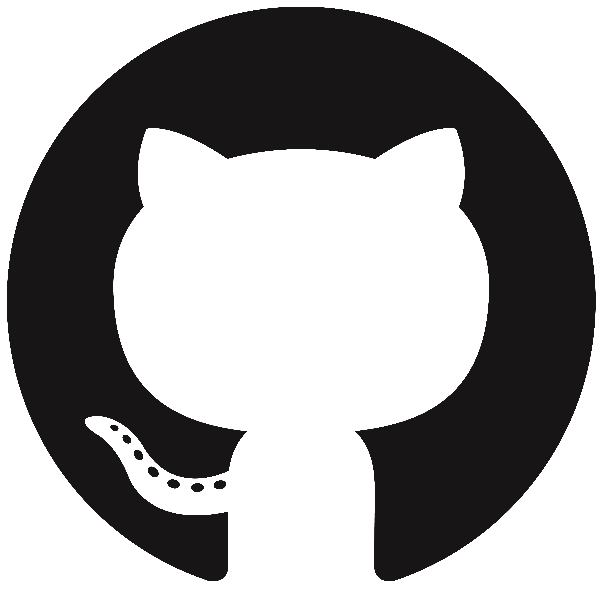
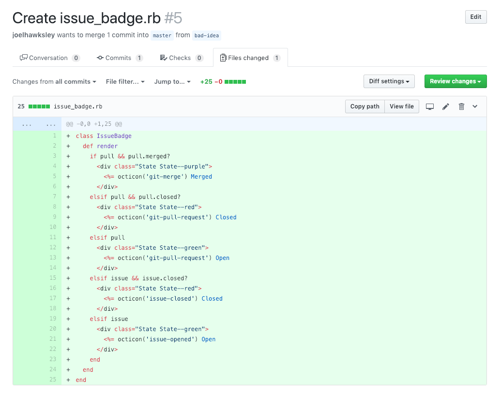
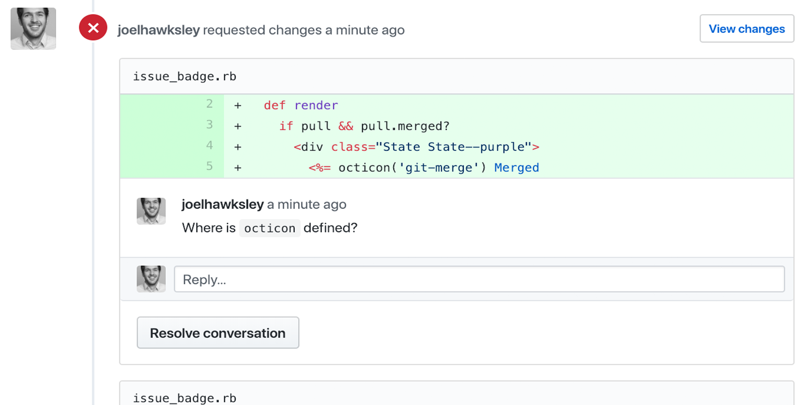
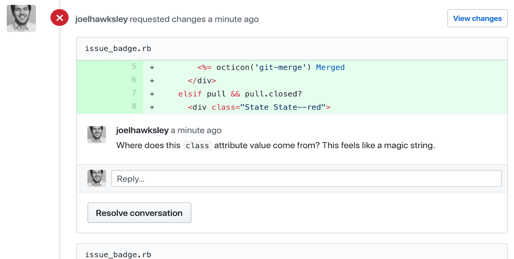
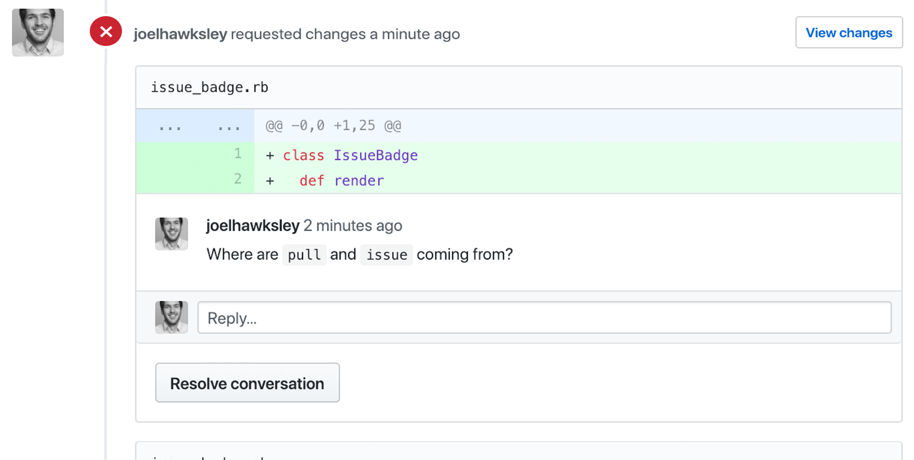
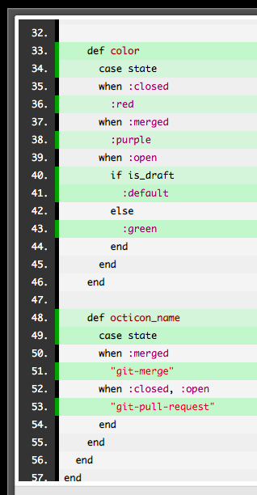

autoscale: true
theme: Simple, 1

# [fit] Rethinking the View Layer <br> with Components

^
Thanks to the RailsConf organizers
Excited to be giving first conference talk

---

# Joel Hawksley
## hawksley.org

^ Name is Joel

^ I live in Colorado

---



^ Engineer at GitHub

---

^ Learning new languages and frameworks

^ Give us a new way of thinking about the world

---


^ Especially true for me with React

^ Changed the way I look at Rails

^ Going to talk about that change in perspective

^ How I took a template in the GitHub app

---

```erb
<% if pull_request && pull_request.merged? %>
  <div class="State State--purple">
    <%= octicon('git-merge') %> Merged
  </div>
<% elsif pull_request && pull_request.closed? %>
  <div class="State State--red">
    <%= octicon('git-pull-request') %> Closed
  </div>
<% elsif pull_request && pull_request.draft? %>
  <div class="State">
  <%= octicon('git-pull-request') %> Draft
  </div>
<% elsif pull_request %>
  <div class="State State--green">
    <%= octicon('git-pull-request') %> Open
  </div>
<% elsif issue && issue.closed? %>
  <div class="State State--red">
    <%= octicon('issue-closed') %> Closed
  </div>
<% elsif issue %>
  <div class="State State--green">
    <%= octicon('issue-opened') %> Open
  </div>
<% end %>
```

^ Is hard to test efficiently

^ Is impossible to measure with code coverage tools

^ Makes it easy to query the database in a view

^ Fails basic Ruby code standards

^ And refactored it into a new, experimental addition to ActionView


---

# [fit] Testing

^ That allows us to test our views efficiently, in isolation

---

# [fit] Code <br> Coverage

^ Use code coverage tools

---

# [fit] Data Flow

^ Only receive the data they need

---

# [fit] Standards

^ Follow the code standards of the Ruby language

^ And perhaps most importantly


---

# [fit] >200x

^ Are over 200x faster to test

---

^ PAUSE

---

# [fit] Views

^ What even is a view?

^ Helpful to have a definition

---

# [fit] Data -> HTML

^ Views are functions

^ They input (data), and return an output, HTML.

^ Rails over the years?

---

# [fit] 2004 **ERB 1.0**
# [fit] 2005 **Rails 1.0**
# [fit] 2012 **Turbolinks**
# [fit] 2016 **API Mode**

^ Things haven’t changed much

^ Rails still ships with ERB

^ Rails 4 partial page reloads with Turbolinks

^ And Rails 5 API mode


---

> "Rails is not only a great choice when you want to build a full-stack application that uses server-side rendering of HTML templates, but also a great companion for the new crop of client-side JavaScript or native applications that just needs the backend to speak JSON."
-- DHH

^
DHH said in the announcement of Rails 5

---

# [fit] 2004 **ERB 1.0**
# [fit] 2005 **Rails 1.0**
# [fit] 2012 **Turbolinks**
# [fit] 2016 **API Mode**

^ The history of the Rails view layer is one of most of us moving away from it

---

^ So what does the view layer look like at GitHub?

---

# [fit] ERB

^ Still using embedded ruby

^ Why isn’t GitHub a single page app like everything else these days?

---

# [fit] Progressive <br> Enhancement

^ Progressive enhancement.

^ We like to say that we write our Javascript like it's 2005. It makes the site more pleasant to use, but at its
 core, most workflows work with it turned off.
^ While most of us here at RailsConf are lucky enough to be using modern, powerful devices

^ A lot of our new users are in developing countries

^ Low powered netbooks, chrome books, or tablets, which buckle under heavy Javascript.

^ At our scale, even a small percentage of users is a large number of people

^ For those using GitHub in the enterprise, there might be users on older browsers, and we don't want to abandon
 them either
^ Allows graceful fallback support for older browsers


---

[.code-highlight: all]
[.code-highlight: 3-6]
[.code-highlight: 2-6]
[.code-highlight: 8]
[.code-highlight: all]

```erb
<% if supported_browser? %>
  <%= javascript_bundle 'polyfills' if compatibility_browser? %>
  <%= javascript_bundle 'frameworks' %>
  <%= javascript_bundle 'github', async: true %>
  <%= yield :scripts %>
  <%= controller_javascript_bundles %>
<% else %>
  <%= javascript_bundle 'unsupported' %>
<% end %>
```

^ How do we do it?

^ Couple tiers of Javascript bundles

^ S Fully supported browsers -> normal bundles.

^ S Polyfills to second tier that need it.

^ S Unsupported -> ONLY smaller set of polyfills

^ Deprecate browsers -> tiers of support

^ Because we only serve JS to the most modern browsers, we can be really strict about compatibility


---

# [fit] Server <br> Rendering

^
All rendering on the server

---


^ New issue comment

^ JS intercepts click


---


^ AJAX request returns DOM nodes for sidebar, comment form, timeline

^ Inject results into page

^ Using PJAX, like Turbolinks

^ Javascript turned off -> normal page request and reload

^ PAUSE


---

^ Let’s talk about building views at GitHub

---


^ Project paper cuts

^ Make GitHub better through incorporating community feedback

^ Over a hundred releases in the past year

^ Recently shipped sticky headers


---


^ This is the issue badge

^ Display the status of Issues and PRs

^ We use it all over our app


---


^ It's part of our design system called Primer

---

# [fit] Issue
# [fit] belongs_to:
# [fit] PullRequest

^ In GitHub data model

^ PR is just an issue with an associated PullRequest object.

---

```erb
<% if pull_request && pull_request.merged? %>
  <div class="State State--purple">
    <%= octicon('git-merge') %> Merged
  </div>
<% elsif pull_request && pull_request.closed? %>
  <div class="State State--red">
    <%= octicon('git-pull-request') %> Closed
  </div>
<% elsif pull_request && pull_request.draft? %>
  <div class="State">
  <%= octicon('git-pull-request') %> Draft
  </div>
<% elsif pull_request %>
  <div class="State State--green">
    <%= octicon('git-pull-request') %> Open
  </div>
<% elsif issue && issue.closed? %>
  <div class="State State--red">
    <%= octicon('issue-closed') %> Closed
  </div>
<% elsif issue %>
  <div class="State State--green">
    <%= octicon('issue-opened') %> Open
  </div>
<% end %>
```

^ Shared issue badge partial

^ Renders icon, label, color

^ State of issue or PR

^ PAUSE

^ Reuse for sticky headers

^ Deleted the contents of the view, pushed to CI, nothing failed

^ Not so simple at GitHub


---

# [fit] Rails 5.2

^ GitHub is a Rails monolith that has been growing and evolving for over 10 years

---

```bash

$ ls -1 app/models | wc -l
556

```

^ We have almost 600 models
^ (And and additional 1500 or so concerns)

---

```bash
$ ls -1 app/controllers | wc -l
209
```

^ Over 200 controllers, not including our API

---

```bash
$ find app/views -print | wc -l
3718
```

^ And over 3700 views!

^ PAUSE

^ Affect how we test our views?

---

# [fit] 6s
### [fit] GET + assert

^ Six seconds for single controller test
^ One minute for ten test cases just to get feedback

---


^ So you know how long the Jeopardy theme song is?

^ It's 30 seconds.

^ So imagine listening to it twice, every time you run a set of ten tests.

^ When your view tests take six seconds per test case, that might make you write less tests

^ That's not good for anyone

---

# [fit] ?

^ So why isn’t testing our views thoroughly a more common practice?

^ LONG PAUSE

---

# [fit] Flaws

^ Believe symptom of several flaw in Rails view layer

---

# [fit] What trips you up with Rails views?

^ In a statistically insignificant survey of the Boulder Ruby group, the number one response to this question was:

---

# [fit] Queries in views

^ Queries in views, such as N+1s or just a particularly expensive lookup, were the most common response.

---

```erb
<% if pull_request && pull_request.merged? %>
  <div class="State State--purple">
    <%= octicon('git-merge') %> Merged
  </div>
<% elsif pull_request && pull_request.closed? %>
  <div class="State State--red">
    <%= octicon('git-pull-request') %> Closed
  </div>
<% elsif pull_request && pull_request.draft? %>
  <div class="State">
  <%= octicon('git-pull-request') %> Draft
  </div>
<% elsif pull_request %>
  <div class="State State--green">
    <%= octicon('git-pull-request') %> Open
  </div>
<% elsif issue && issue.closed? %>
  <div class="State State--red">
    <%= octicon('issue-closed') %> Closed
  </div>
<% elsif issue %>
  <div class="State State--green">
    <%= octicon('issue-opened') %> Open
  </div>
<% end %>
```

^ Looking at our example:

^ For “pull” and “issue”, what attributes do we need from each object?

^ If these are active record objects, we’d be fetching their entire set of attributes, when we may in fact only need one or two for each object.

^ This makes our requests unnecessarily slower.

^ At GitHub, some of our fields are backed by Git storage, so we have to be especially careful with what we fetch.

---

# [fit] Unit <br> Testing

^ Unit testing views isn’t common practice

^ Never seen it done in any of the Rails apps I’ve worked on before GitHub

^ Nearly all of our view tests are those six-second controller tests

^ These costs discourage you from writing as many tests as you might otherwise write

---

```erb
<% if pull_request && pull_request.merged? %>
  <div class="State State--purple">
    <%= octicon('git-merge') %> Merged
  </div>
<% elsif pull_request && pull_request.closed? %>
  <div class="State State--red">
    <%= octicon('git-pull-request') %> Closed
  </div>
<% elsif pull_request && pull_request.draft? %>
  <div class="State">
  <%= octicon('git-pull-request') %> Draft
  </div>
<% elsif pull_request %>
  <div class="State State--green">
    <%= octicon('git-pull-request') %> Open
  </div>
<% elsif issue && issue.closed? %>
  <div class="State State--red">
    <%= octicon('issue-closed') %> Closed
  </div>
<% elsif issue %>
  <div class="State State--green">
    <%= octicon('issue-opened') %> Open
  </div>
<% end %>
```

^ Partials often end up being tested for each of the views they are included in

^ Leads to duplication of tests

^ Cheapens benefit of reusing the partial in the first place


---

# [fit] Code <br> Coverage

^ Another problem is measuring code coverage

---

# [fit] ~~SimpleCov <br> Coveralls~~

^ Neither SimpleCov nor Coveralls support view code

^ Combined with testing friction puts views in blind spot

---

# [fit] Implicit <br> Arguments

^ Another weakness is the lack of a method signature

^ Unlike a method declaration on an object, views do not expose the values they are expected to receive

---

```erb
<% if pull_request && pull_request.merged? %>
  <div class="State State--purple">
    <%= octicon('git-merge') %> Merged
  </div>
<% elsif pull_request && pull_request.closed? %>
  <div class="State State--red">
    <%= octicon('git-pull-request') %> Closed
  </div>
<% elsif pull_request && pull_request.draft? %>
  <div class="State">
  <%= octicon('git-pull-request') %> Draft
  </div>
<% elsif pull_request %>
  <div class="State State--green">
    <%= octicon('git-pull-request') %> Open
  </div>
<% elsif issue && issue.closed? %>
  <div class="State State--red">
    <%= octicon('issue-closed') %> Closed
  </div>
<% elsif issue %>
  <div class="State State--green">
    <%= octicon('issue-opened') %> Open
  </div>
<% end %>
```

^ Let’s go back to our example code.

^ What data does this view need to render?

^ A "pull"?

^ An "issue"?

^ Should I be able to pass in both? Neither?

^ Are these values passed in as locals, or do they come from a helper?

---

# [fit] View Models

^ So what if we used a view model?

---

```ruby
module Issues
  class BadgeView
    def initialize(issue, pull)
      @issue = issue
      @pull = pull
    end

    def state_class; end
    def octicon_name; end
    def label; end
  end
end
```

^ We might write a class that looks something like this

---

```erb
<div class="State #{view.state_class}">
  <%= octicon(view.octicon_name) %>
  <%= view.label %>
</div>
```

^ And a template that looks like this.

---

# [fit] View Models

^ That’s much better, right?

^ I’ve seen a couple problems with this approach:

^ We end up with two files that are more or less interlocked. One can’t exist without the other.

^ Testing the view model makes us feel like we’re testing the view, when we’re not.

---

# [fit] Standards

^ The reality is that our views regularly fail even the most basic standards of code quality we expect out of our Ruby classes.

---

```erb
<% if pull_request && pull_request.merged? %>
  <div class="State State--purple">
    <%= octicon('git-merge') %> Merged
  </div>
<% elsif pull_request && pull_request.closed? %>
  <div class="State State--red">
    <%= octicon('git-pull-request') %> Closed
  </div>
<% elsif pull_request && pull_request.draft? %>
  <div class="State">
  <%= octicon('git-pull-request') %> Draft
  </div>
<% elsif pull_request %>
  <div class="State State--green">
    <%= octicon('git-pull-request') %> Open
  </div>
<% elsif issue && issue.closed? %>
  <div class="State State--red">
    <%= octicon('issue-closed') %> Closed
  </div>
<% elsif issue %>
  <div class="State State--green">
    <%= octicon('issue-opened') %> Open
  </div>
<% end %>
```

^ Let’s go back to our example.

---



^ If this was a method on a class, what aspects might we object to in a code review?

^ PAUSE - Ask audience

^ Besides it being a super long method, I can think of a couple:

---



^ Where is octicon defined?

---



^ Where does this class attribute value come from? This feels like a magic string.

---



^ Where are pull and issue coming from?

^ PAUSE

---

# [fit] Standards

^ The reality is that we regularly do things in our templates that we’d never do in a Ruby class

^ PAUSE

---

# [fit] Testing

^ So to recap,

^ Rails views are difficult to test, putting our views in a bit of blind spot.

---

# [fit] Queries in views

^ Make it easy to accidentally run queries in our views

---

# [fit] Code <br> Coverage

^ Can’t be measured with code coverage tooling,

---

# [fit] Implicit <br> Arguments

^ Have implicit method signatures

---

# [fit] View Models

^ Don’t improve much with the use of view models

---

# [fit] Standards

^ And often fail basic Ruby code standards

---

# [fit] M v C

^ The reality is that the existing Rails view layer is a second-class citizen these days.

^ PAUSE

---

^ With all these shortcomings, perhaps it isn’t much of a surprise that a new way of building views has taken hold in the Rails community:

---

# [fit] React

^ React.

^ Let’s talk about what concepts React has made popular.

^ A small disclaimer here: there are a lot of different ways to use React, and it’s been about a year since I used it in depth.

---

# [fit] Components

^ React is all about components.

^ A component encapsulates a piece of user interface.

^ Multiple components are composed together to create a view.

---

[.code-highlight: all]
[.code-highlight: 2-4]
[.code-highlight: 7]
[.code-highlight: 3, 7]

```jsx
class Greeting extends React.Component {
  render() {
    return <div>Hello, {this.props.name}!</div>;
  }
}

React.render(<Greeting name="World" />, document.getElementById('example'));
```

^ Here's one way of writing "Hello, World" in a React component.

^ React components, at a minimum, implement a render method that returns HTML.

^ Arguments passed to a component are assigned to the `props` object, which is accessible within the component's instance methods.

---

```jsx
class IssueBadge extends React.Component {
  render() {
    return (
      <div className={ "State " + this._stateClass() }>
        <i className={this._icon()} /> {this._label()}
      </div>
    )
  }

  _icon() { ... }
  _stateClass() { ... }
  _label() { ... }
}
```

^ Here’s an example of what the issue badge might look like as a React component.

---

# [fit] Types

^ But then things get interesting. React gives us type checking!

---

[.code-highlight: all]
[.code-highlight: 2-4]
[.code-highlight: 5-8]

```javascript
IssueBadge.propTypes = {
  issue: PropTypes.exact({
    isClosed: PropTypes.bool.isRequired
  }).isRequired,
  pullRequest: PropTypes.exact({
    isClosed: PropTypes.bool.isRequired,
    isMerged: PropTypes.bool.isRequired
  }),
};
```

^ The Prop Types library provides runtime type checking for React components.

^ This allows us to express some expectations about the data we receive. In this case, we are expecting:

^ An issue with the boolean isClosed attribute to always be provided

^ And a pull request to sometimes be provided, and if so, with the boolean isClosed and isMerged attributes.

---

[.code-highlight: 10]

```jsx
class IssueBadge extends React.Component {
  render() {
    return (
      <div className={ "State " + this._stateClass() }>
        <i className={this._icon()} /> {this._label()}
      </div>
    )
  }

  _icon() { return this.props.issue.isClosed ... }
  _stateClass() { ... }
  _label() { ... }
}
```

^ When can then write code without checking for the presence of the issue object, as our type check will guarantee that it is present.

^ PAUSE

---

# [fit] Functional <br> Purity

^ Another advantage of React is how it encourages writing components as pure functions.

---

# [fit] Data -> Component

^ By passing data into views instead of rich objects, React encourages us to write functions without side-affects.

^ In reality, most architectures that split the frontend from the backend benefit from this separation.

---

# [fit] Testing

^ Another cool thing about React is how easily components can be tested in isolation.

---

```jsx
it('should render the closed issue badge', function() {
  expect(shallow(<IssueBadge props={{ issue: { isClosed: true }}} />).
  contains(<div className="State State--red">Closed</div>)).toBe(true);
});
```

^ Here’s an example test that asserts against the output of our component.

^ What’s great is that this test runs without touching the database and without spinning up a browser.

^ Which means that it's wicked fast.

---

# [fit] React

^ So React has:

---

# [fit] Components

^ Components

---

# [fit] Types
^ Types

---

# [fit] Functional purity

^ Functional purity

---

# [fit] Testing

^ And lightweight testing in isolation

---

^ While React has a lot of advantages, it’s not compatible with our progressive enhancement architecture at GitHub.

^ But I'm not so sure we should give up there.

---

# [fit] Rails

^ What might it look like to use these lessons from React to improve the Rails view layer?

^ Let's give it a shot! Perhaps we can address some of those code review comments along the way.

---

# [fit] Components

^ So what might it look like to have components in Rails?

---

# [fit] Tests

^ Before we start refactoring, we're going to need some tests so we can make sure we aren't breaking anything.

---

[.code-highlight: all]
[.code-highlight: 2-4]
[.code-highlight: 2]
[.code-highlight: 3]

```erb
<% if pull_request && pull_request.merged? %>
  <div class="State State--purple">
    <%= octicon('git-merge') %> Merged
  </div>
<% elsif pull_request && pull_request.closed? %>
  <div class="State State--red">
    <%= octicon('git-pull-request') %> Closed
  </div>
<% elsif pull_request && pull_request.draft? %>
  <div class="State">
  <%= octicon('git-pull-request') %> Draft
  </div>
<% elsif pull_request %>
  <div class="State State--green">
    <%= octicon('git-pull-request') %> Open
  </div>
<% elsif issue && issue.closed? %>
  <div class="State State--red">
    <%= octicon('issue-closed') %> Closed
  </div>
<% elsif issue %>
  <div class="State State--green">
    <%= octicon('issue-opened') %> Open
  </div>
<% end %>
```

^ What might it look like to test the partial?

^ In each case, we're doing three things: assigning a class name, picking an icon, and setting a label.

---

[.code-highlight: all]
[.code-highlight: 6]
[.code-highlight: 7]
[.code-highlight: 8]

```ruby
it "renders the open issue badge" do
  create(:issue, :open)

  get :index

  assert_select(".State.State--green")
  assert_select(".octicon-issue-opened")
  assert_includes(response.body, "Open")
end

it "renders the closed issue badge"
it "renders the open pull request badge"
it "renders the closed pull request badge"
it "renders the merged pull request badge"
it "renders the draft pull request badge"
it "renders the closed pull request badge for a closed draft pull request"
```

^ To start, let's add some of those slow controller tests to assert these three things for each state.

^ We'll assert that we have the correct class name, icon, and label

---

[.background-color: #008000]
[.header: #ffffff]

# [fit] 7 examples, 0 failures

^ And now we have test coverage.

^ Now, like I did before, let's delete the issue badge partial.

---

[.background-color: #FF0000]
[.header: #ffffff]

# [fit] 7 examples, 7 failures

^ We have failing tests!

^ Now we can start changing things and know if we’ve broken them

---

^ So what might a component look like in the Rails world?

---

```ruby
# app/components/issues/badge.rb

module Issues
  class Badge
  end
end
```

^ I think it would make sense to make it a class, like everything else in Ruby! Let's call it badge, inside the Issues module.

---

# [fit] API

^ And how might we call it in our view?

---

```erb
<%= render partial: "issue_badge", locals: { issue: issue, pull_request: issue.pull_request } %>
```

^ Right now we're rendering the issue badge partial the traditional way,

---

```erb
<%= render Issues::Badge, issue: issue, pull_request: issue.pull_request %>
```

^ ActionView gives us the `render` entry point, so I think it makes sense to use that.

^ So let’s see if we can get our first test to pass.

---

[.code-highlight: 3-9]

```ruby
module Issues
  class Badge
    def render
      <<-erb
      <div class="State State--green">
        #{octicon('issue-opened')} Open
      </div>
      erb
    end
  end
end
```

^ Let's add a #html method to our component that returns the open issue badge from our partial.

---

[.code-highlight: all]

```ruby
it "renders the open issue badge" do
  create(:issue, :open)

  get :index

  assert_select(".State.State--green")
  assert_select(".octicon-issue-opened")
  assert_includes(response.body, "Open")
end
```

^ Let's give it a run.

---

[.background-color: #FF0000]
[.header: #ffffff]

# [fit] 'Issues::Badge' is not an ActiveModel-compatible object.

^ Interesting. It looks like ActionView#render doesn't like being passed our component.

^ So let's teach it how to handle it!

---

```ruby
class ActionView::Base
  module RenderMonkeyPatch
    def render(component, *_args)
      return super unless component == Issues::Badge

      component.new.html
    end
  end

  prepend RenderMonkeyPatch
end
```

^ Short of forking Rails and changing the original definition of ActionView#render, a monkey patch will get us unblocked for now.

^ We'll ignore all the args besides the component for now.

^ Or will it?

---

[.background-color: #FF0000]
[.header: #ffffff]

# [fit] undefined method octicon for Issues::Badge

^ This error is interesting.

---


^ Remember our code review comment about not knowing where the octicon method came from?

^ Now our component is asking the same thing.

---

[.code-highlight: 3]

```ruby
module Issues
  class Badge
    include OcticonsHelper

    def html
      <<-erb
      <div class="State State--green">
        #{octicon('issue-opened')} Open
      </div>
      erb
    end
  end
end
```

^ So let's tell it where to find it!

^ So let's run our test again.

---

[.background-color: #FF0000]
[.header: #ffffff]

# [fit] Expected element matching ".State.State--green", found 0

^ That's weird. Let's have a look at our output.

---

```html
&lt;div class=&quot;State State--green&quot;...
```

^ It looks like our output is being escaped!

^ As it turns out, there view rendering is more than just string interpolation!

^ While it might be tempting to throw an html_safe on the end and call it a day, this is a bad, bad idea.

^ But wait, what if we just used the existing Rails template pipeline?

---

[.code-highlight: 12-18]

```ruby
module Issues
  class Badge
    include OcticonsHelper

    def html
      eval(
        "output_buffer = ActionView::OutputBuffer.new;" +
        ActionView::Template::Handlers::ERB.erb_implementation.new(template, trim: true).src
      )
    end

    def template
      <<-erb
      <div class="State State--green">
        #{octicon('issue-opened')} Open
      </div>
      erb
    end
  end
end
```

^ First, let's move our template into a method called template.

^ And in our render method, we'll run our template through ActionView's ERB template handler, then call #src on the result. Evaluating the output of #src here effectively mirrors how traditional Rails templates are compiled and then executed.

^ So let's run our tests again.

---

[.background-color: #008000]
[.header: #ffffff]

# [fit] 1 example, 0 failures

^ There we go!

^ PAUSE

---

```ruby
it "renders the closed issue badge" do
  create(:issue, :closed)

  get :index

  assert_select(".State.State--red")
  assert_select(".octicon-issue-closed")
  assert_includes(response.body, "Closed")
end
```

^ Let's keep moving along.

^ The next test is for a closed issue.

---

[.code-highlight: 2-5]

```erb
# ...
<% elsif issue && issue.closed? %>
  <div class="State State--red">
    <%= octicon('issue-closed') %> Closed
  </div>
<% elsif issue %>
  <div class="State State--green">
    <%= octicon('issue-opened') %> Open
  </div>
<% end %>
```

^ If we look back at the original partial, in the case of a closed issue, we set a different CSS class, icon and label.

^ Let's give it a run.

---

[.background-color: #FF0000]
[.header: #ffffff]

# [fit] Expected element matching ".State.State--red", found 0

^ As expected, it fails, as we haven't handled this case yet.

^ Let's go back to our template that renders the component.

---

```erb
<%= render Issues::Badge, issue: issue, pull_request: issue.pull_request %>
```

^ Now we're already passing the issue into our component, but we aren't doing anything with it yet. Let's change that.

---

[.code-highlight: 3]
[.code-highlight: 6]

```ruby
class ActionView::Base
  module RenderMonkeyPatch
    def render(component, *args)
      return super unless component == Issues::Badge

      component.new(*args).html
    end
  end

  prepend RenderMonkeyPatch
end
```

^ First, we'll need to update our monkey patch to pass the arguments through to our component.

---

[.code-highlight: 5-7]

```ruby
module Issues
  class Badge
    include OcticonsHelper

    def initialize(issue:, pull_request: nil)
      @issue = issue, @pull_request = pull_request
    end

    def html; end
    def template; end
  end
end
```

^ In addition, we'll need to define an initialize method on our component.

^ We'll let pull_request be nil, as not all issues have pull requests.

---

[.code-highlight: 8-20]

```ruby
module Issues
  class Badge
    include OcticonsHelper

    def initialize; end
    def html; end

    def template
      <<-erb
      <% if @issue.closed? %>
        <div class="State State--red">
          <%= octicon('issue-closed') %> Closed
        </div>
      <% else %>
        <div class="State State--green">
          <%= octicon('issue-opened') %> Open
        </div>
      <% end %>
      erb
    end
  end
end
```

^ Now that we have an issue, we can reference it in our template!

^ So let's run our test again...

---

[.background-color: #008000]
[.header: #ffffff]

# [fit] 1 example, 0 failures

^ Phew. We're back to green.

^ But wait. Did you just see what we did there? We gave ourselves an interface!

---

# [fit] ~~Implicit <br> Arguments~~

^ Which means no more implicit arguments.

---


^ And just like that, we're making progress on our code review!

---

```ruby
def template
  <<-erb
  <% if @pull_request && @pull_request.merged? %>
    <div class="State State--purple">
      <%= octicon('git-merge') %> Merged
    </div>
  <% elsif @pull_request && @pull_request.closed? %>
    <div class="State State--red">
      <%= octicon('git-pull-request') %> Closed
    </div>
  <% elsif @pull_request && @pull_request.draft? %>
    <div class="State">
    <%= octicon('git-pull-request') %> Draft
    </div>
  <% elsif @pull_request %>
    <div class="State State--green">
      <%= octicon('git-pull-request') %> Open
    </div>
  <% elsif @issue.closed? %>
    <div class="State State--red">
      <%= octicon('issue-closed') %> Closed
    </div>
  <% else %>
    <div class="State State--green">
      <%= octicon('issue-opened') %> Open
    </div>
  <% end %>
  erb
end
```

^ Next, we can drop in the rest of the original partial into our template method.

^ Now, let's see how our tests do.

---

[.background-color: #008000]
[.header: #ffffff]

# [fit] 7 examples, 0 failures

^ We're green! Let's ship it!

^ Just kidding. This is just the start!

---

[.code-highlight: all]
[.code-highlight: 1-16]
[.code-highlight: 17-25]

```erb
<% if @pull_request && @pull_request.merged? %>
  <div class="State State--purple">
    <%= octicon('git-merge') %> Merged
  </div>
<% elsif @pull_request && @pull_request.closed? %>
  <div class="State State--red">
    <%= octicon('git-pull-request') %> Closed
  </div>
<% elsif @pull_request && @pull_request.draft? %>
  <div class="State">
  <%= octicon('git-pull-request') %> Draft
  </div>
<% elsif @pull_request %>
  <div class="State State--green">
    <%= octicon('git-pull-request') %> Open
  </div>
<% elsif @issue.closed? %>
  <div class="State State--red">
    <%= octicon('issue-closed') %> Closed
  </div>
<% else %>
  <div class="State State--green">
    <%= octicon('issue-opened') %> Open
  </div>
<% end %>
```

^ Taking another look at our template, it seems as though we really have *two* components here, not one.

^ The first two thirds handle various pull request states

^ While the last third handles issue state.

^ Now, since the view that calls our component knows whether it is dealing with a pull request or an issue, how about we split this out into two components and let it pick which one to use?

---

```ruby
module PullRequests
  class Badge
    include OcticonsHelper

    def initialize(pull_request:)
      @pull_request = pull_request
    end

    def html
      eval(
        "output_buffer = ActionView::OutputBuffer.new; " +
        ActionView::Template::Handlers::ERB.erb_implementation.new(template, trim: true).src
      )
    end

    def template
      <<-erb
      <% if @pull_request && @pull_request.merged? %>
        <div class="State State--purple">
          <%= octicon('git-merge') %> Merged
        </div>
      <% elsif @pull_request && @pull_request.closed? %>
        <div class="State State--red">
          <%= octicon('git-pull-request') %> Closed
        </div>
      <% elsif @pull_request && @pull_request.draft? %>
        <div class="State">
        <%= octicon('git-pull-request') %> Draft
        </div>
      <% else %>
        <div class="State State--green">
          <%= octicon('git-pull-request') %> Open
        </div>
      <% end %>
      erb
    end
  end
end
```

^ So let's move the pull request portion to its own component.

---

```erb
<% if issue.pull_request %>
  <%= render PullRequests::Badge, pull_request: issue.pull_request %>
<% else %>
  <%= render Issues::Badge, issue: issue %>
<% end %>
```

^ Then update our view to choose which component to render.

---

[.code-highlight: 4]

```ruby
class ActionView::Base
  module RenderMonkeyPatch
    def render(component, *args)
      return super unless [Issues::Badge, PullRequests::Badge].include?(component)

      component.new(*args).html
    end
  end

  prepend RenderMonkeyPatch
end
```

^ So let's update our monkey patch to look for our new component, then run our tests.

---

[.background-color: #008000]
[.header: #ffffff]

# [fit] 7 examples, 0 failures

^ Still green.

^ So let's go back to our code review.

---


^ Remember that comment about magic strings?

---

[.code-highlight: 2, 6]

```erb
<% if @issue.closed? %>
  <div class="State State--red">
    <%= octicon('issue-closed') %> Closed
  </div>
<% else %>
  <div class="State State--green">
    <%= octicon('issue-opened') %> Open
  </div>
<% end %>
```

^ Both our issue badge

---

[.code-highlight: 2, 6, 10, 14]

```erb
<% if @pull_request && @pull_request.merged? %>
  <div class="State State--purple">
    <%= octicon('git-merge') %> Merged
  </div>
<% elsif @pull_request && @pull_request.closed? %>
  <div class="State State--red">
    <%= octicon('git-pull-request') %> Closed
  </div>
<% elsif @pull_request && @pull_request.draft? %>
  <div class="State">
    <%= octicon('git-pull-request') %> Draft
  </div>
<% else %>
  <div class="State State--green">
    <%= octicon('git-pull-request') %> Open
  </div>
<% end %>
```

^ And our pull request badge are rendering the State component from our Primer design system.

---

^ So why not make that a component?

^ PAUSE

^ So let's think about what we might want that to look like.

---

[.code-highlight: all]
[.code-highlight: 1]

```erb
<div class="State State--green">
  <%= octicon('git-pull-request') %> Open
</div>
```

^ When we're rendering the State component,

^ We're really just picking the color.

---

[.code-highlight: all]
```erb
<%= render Primer::State, color: :green do %>
  <%= octicon('git-pull-request') %> Open
<% end %>
```

^ Expressed instead as rendering a component, that might look something like this.

^ So let's build it!

---

```ruby
module Primer
  class State
  end
end
```

^ We'll call it State, inside the Primer module, to reflect the hierarchy of our design system.

---

[.code-highlight: 1]

```ruby
# lib/primer/state.rb

module Primer
  class State
  end
end
```

^ And since the Primer system exists outside of our Rails app, let's put it in lib.

---

[.code-highlight: 4]

```ruby
class ActionView::Base
  module RenderMonkeyPatch
    def render(component, *args)
      return super unless [Issues::Badge, PullRequests::Badge, Primer::State].include?(component)

      component.new(*args).html
    end
  end

  prepend RenderMonkeyPatch
end
```

^ We'll also need to update our monkey patch to handle yet another component.

^ But wait, that doesn't feel right.

^ Perhaps we're missing an abstraction here.

^ What we're really trying to say here is: "Am I dealing with one of these newfangled components?"

^ Perhaps it's time for a parent class!

---

```ruby
module ActionView
  class Component < ActionView::Base
  end
end
```

^ Let's call it ActionView::Component.

---

[.code-highlight: 2]

```ruby
module Issues
  class Badge < ActionView::Component
  end
end
```

[.code-highlight: 2]

```ruby
module PullRequests
  class Badge < ActionView::Component
  end
end
```

[.code-highlight: 2]

```ruby
module Primer
  class State < ActionView::Component
  end
end
```

^ Then, let's update our existing components to inherit from it.

---

^ So now that we have a parent class for our components, let's try and reduce some duplication.

---

[.code-highlight: 3-8]

```ruby
module Issues
  class Badge
    def html
      eval(
        "output_buffer = ActionView::OutputBuffer.new; " +
        ActionView::Template::Handlers::ERB.erb_implementation.new(template, trim: true).src
      )
    end
  end
end
```

^ An easy candidate is our render method, which does not have any component specific logic.

---

```ruby
module ActionView
  class Component < ActionView::Base
    def html
      eval(
        "output_buffer = ActionView::OutputBuffer.new; " +
        ActionView::Template::Handlers::ERB.erb_implementation.new(template, trim: true).src
      )
    end
  end
end
```

^ So let's move that to ActionView::Component.

---

[.code-highlight: 4]

```ruby
class ActionView::Base
  module RenderMonkeyPatch
    def render(component, *args)
      return super unless component < ActionView::Component

      component.new(*args).html
    end
  end

  prepend RenderMonkeyPatch
end
```

^ And then our monkey patch can instead check to see if the argument is a child of ActionView::Component.

^ So let's run our tests again:

---

[.background-color: #008000]
[.header: #ffffff]

# [fit] 7 examples, 0 failures

^ Still green.

^ PAUSE

---

[.code-highlight: all]
[.code-highlight: 2]

```erb
<%= render Primer::State, color: :green do %>
  <%= octicon('git-pull-request') %> Open
<% end %>
```

```ruby
module Primer
  class State
  end
end
```

^ But as we start to think of how to write our template, we hit a wall:

^ How will we pass in the content of the badge?

^ Let's write a test first.

---

^ Now while we could probably just rely on the existing controller tests for this, wouldn't it be nice if we could test this new, nested component by itself?

---

[.code-highlight: 2]
[.code-highlight: 4]

```ruby
it "renders content passed to it as a block" do
  result = render_string("<%= render Primer::State do %>content<% end %>")

  assert_includes result.css(".State.State--green").text, "content"
end
```

^ In an ideal world, we'd be able to render the component directly in a test,

^ and then assert against the resulting HTML.

---

[.code-highlight: all]
[.code-highlight: 2]

```ruby
def render_string(string)
  html = ApplicationController.new.view_context.render(inline: string)

  Nokogiri::HTML(html)
end
```

^ And without too much work, we can! We can implement our render_string test helper that:

^ Renders our template in the same code path as a normal view, and then

^ Parses the result in Nokogiri for easier assertions.

^ So let's run our test now.

---

[.background-color: #FF0000]
[.header: #ffffff]

# [fit] no implicit conversion of Class into Hash

^ That's not good!

---

[.code-highlight: 3]

```ruby
class ActionView::Base
  module RenderMonkeyPatch
    def render(component, *args)
      return super unless component.is_a?(Class) && component < ActionView::Component

      component.new(*args).html
    end
  end

  prepend RenderMonkeyPatch
end
```

^ It turns out that #render can be passed a hash

^ So let's update our monkey patch's conditional to make sure we're dealing with a Class, then re-run our tests.

---

[.background-color: #FF0000]
[.header: #ffffff]

# [fit] Expected "\n      " to include "content".

^ There we go!

^ Where we were expecting our content to be rendered, we just got an empty string.

^ So let's think about how we might make this work.

---

[.code-highlight: all]
[.code-highlight: 2]
[.code-highlight: 1,3]

```erb
<%= render Issues::Badge, color: :green do %>
  <%= octicon('issue-opened') %> Open
<% end %>
```

^ When we're passing content into our component, what we're effectively saying is:

^ "render this block in the context of the current view", then

^ "Wrap it in the component"

^ So how might that look?

---

[.code-highlight: 3]

```ruby
class ActionView::Base
  module RenderMonkeyPatch
    def render(component, *args)
      return super unless component.is_a?(Class) && component < ActionView::Component

      component.new(*args).html
    end
  end

  prepend RenderMonkeyPatch
end
```

^ First, we'll need to update our monkey patch

---

[.code-highlight: 3]

```ruby
class ActionView::Base
  module RenderMonkeyPatch
    def render(component, *args, &block)
      return super unless component.is_a?(Class) && component < ActionView::Component

      component.new(*args).html
    end
  end

  prepend RenderMonkeyPatch
end
```

^ To accept a block.

---

[.code-highlight: 6]

```ruby
class ActionView::Base
  module RenderMonkeyPatch
    def render(component, *args, &block)
      return super unless component.is_a?(Class) && component < ActionView::Component

      component.new(*args).html
    end
  end

  prepend RenderMonkeyPatch
end
```

^ Then we'll need to update our render step

---

[.code-highlight: 6]
[.code-highlight: 7]
[.code-highlight: 8]

```ruby
class ActionView::Base
  module RenderMonkeyPatch
    def render(component, *args, &block)
      return super unless component.is_a?(Class) && component < ActionView::Component

      instance = component.new(*args)
      instance.content = self.capture(&block) if block_given?
      instance.html
    end
  end

  prepend RenderMonkeyPatch
end
```

^ To first instantiate the component

^ Then render the block in the context of the current view, and assign the result to an accessor on our component, if a block has been passed.

^ At that point, our component will know about the content, so we can render it.

^ So since we're expecting all components to have a content accessor,

---

```ruby
module ActionView
  class Component < ActionView::Base
    def html
      eval(
        "output_buffer = ActionView::OutputBuffer.new; " +
        ActionView::Template::Handlers::ERB.erb_implementation.new(template, trim: true).src
      )
    end
  end
end
```

^ Let's go back to ActionView::Component

---

[.code-highlight: 3]

```ruby
module ActionView
  class Component < ActionView::Base
    attr_accessor :content

    def html
      eval(
        "output_buffer = ActionView::OutputBuffer.new; " +
        ActionView::Template::Handlers::ERB.erb_implementation.new(template, trim: true).src
      )
    end
  end
end
```

^ And declare it there.

---

```ruby
module Primer
  class State < ActionView::Component
    def template
      <<-erb
      <div class="State State--green">
      </div>
      erb
    end
  end
end
```

^ Then, it's just a matter of taking our component

---

[.code-highlight: 6]

```ruby
module Primer
  class State < ActionView::Component
    def template
      <<-erb
      <div class="State State--green">
        <%= content %>
      </div>
      erb
    end
  end
end
```

^ And updating the template to reference it.

^ But let's see what our test says.

---

[.background-color: #008000]
[.header: #ffffff]

# [fit] 1 example, 0 failures

^ We're back to green!

---

```ruby
module Primer
  class State < ActionView::Component
    def template
      <<-erb
      <div class="State State--green">
        <%= content %>
      </div>
      erb
    end
  end
end
```

^ So now let's take our new component,

---

[.code-highlight: 3-5]

```ruby
module Primer
  class State < ActionView::Component
    def initialize(color:)
      @color = color
    end

    def template
      <<-erb
      <div class="State State--green">
        <%= content %>
      </div>
      erb
    end
  end
end
```

^ And update it to accept a color argument!

^ But what values should we expect here?

---


^ Let's look at the docs!

---


^ It looks like we can specify three: green, red, and purple. Otherwise, the component defaults to grey.

---

[.code-highlight: all]

```ruby
module Primer
  class State < ActionView::Component
    def initialize(color:)
      @color = color
    end

    def template
      <<-erb
      <div class="State State--green">
        <%= content %>
      </div>
      erb
    end
  end
end
```

^ So let's go back to our component

---

[.code-highlight: 3-8]

```ruby
module Primer
  class State < ActionView::Component
    COLOR_CLASS_MAPPINGS = {
      default: "",
      green: "State--green",
      red: "State--red",
      purple: "State--purple",
    }.freeze

    def initialize; end
    def template; end
  end
end
```

^ And capture those relationships in a constant.

^ So how might we make sure we're only given a valid color?

---

```ruby
it "raises an error when color is not one of valid values" do
  exception = assert_raises ActionView::Template::Error do
    render_string("<%= render Primer::State, color: :chartreuse do %>foo<% end %>")
  end

  assert_includes exception.message, "Color is not included in the list"
end
```

^ Let's start with a test.

---

[.background-color: #FF0000]
[.header: #ffffff]

# [fit] ActionView::Template::Error expected but nothing was raised.

^ And make sure it fails.

^ So how might we check that color is from a set of allowed values?

---

[.code-highlight: 10]

```ruby
module Primer
  class State < ActionView::Component
    COLOR_CLASS_MAPPINGS = {
      default: "",
      green: "State--green",
      red: "State--red",
      purple: "State--purple",
    }.freeze

    validates :color, inclusion: { in: COLOR_CLASS_MAPPINGS.keys }

    def initialize; end
    def template; end
  end
end
```

^ We're in Rails, so that's a solved problem: ActiveModel validations!

^ We can use an inclusion validation to check that color is one of the valid values.


---

[.code-highlight: 10]

```ruby
module Primer
  class State < ActionView::Component
    COLOR_CLASS_MAPPINGS = {
      default: "",
      green: "State--green",
      red: "State--red",
      purple: "State--purple",
    }.freeze

    attr_reader :color
    validates :color, inclusion: { in: COLOR_CLASS_MAPPINGS.keys }

    def initialize; end
    def template; end
  end
end
```

^ To allow the color attribute to be validated, we'll need to give it an attribute reader.

---

```ruby
module ActionView
  class Component < ActionView::Base
    attr_accessor :content

    def html
      eval(
        "output_buffer = ActionView::OutputBuffer.new; " +
        ActionView::Template::Handlers::ERB.erb_implementation.new(template, trim: true).src
      )
    end
  end
end
```

^ In ActionView::Component,

---

[.code-highlight: 3]

```ruby
module ActionView
  class Component < ActionView::Base
    include ActiveModel::Validations
    attr_accessor :content

    def html
      eval(
        "output_buffer = ActionView::OutputBuffer.new; " +
        ActionView::Template::Handlers::ERB.erb_implementation.new(template, trim: true).src
      )
    end
  end
end
```

^ We'll include ActiveModel Validations.

---

```ruby
class ActionView::Base
  module RenderMonkeyPatch
    def render(component, *args, &block)
      return super unless component.is_a?(Class) && component < ActionView::Component

      instance = component.new(*args)
      instance.content = self.capture(&block) if block_given?
      instance.render
    end
  end

  prepend RenderMonkeyPatch
end
```

^ All that's left is to go back to our monkey patch

---

[.code-highlight: 8]

```ruby
class ActionView::Base
  module RenderMonkeyPatch
    def render(component, *args, &block)
      return super unless component.is_a?(Class) && component < ActionView::Component

      instance = component.new(*args)
      instance.content = self.capture(&block) if block_given?
      instance.validate!
      instance.html
    end
  end

  prepend RenderMonkeyPatch
end
```

^ And add a step to validate our component before we render it.

^ PAUSE

^ So let's run our test again.

---

[.background-color: #008000]
[.header: #ffffff]

# [fit] 1 example, 0 failures

^ Back to green.

---

```ruby
it "assigns the correct CSS class for color" do
  result = render_string("<%= render Primer::State, color: :purple do %>content<% end %>")

  assert result.css(".State.State--purple").any?
end
```

^ So now let's make sure we're setting the right CSS class based on the color.

---

[.background-color: #FF0000]
[.header: #ffffff]

# [fit] Expected false to be truthy.

^ And that our test fails.

---

[.code-highlight: 12]

```ruby
module Primer
  class State < ActionView::Component
    COLOR_CLASS_MAPPINGS = {
      default: "",
      green: "State--green",
      red: "State--red",
      purple: "State--purple",
    }.freeze

    def template
      <<-erb
      <div class="State State--green">
        <%= content %>
      </div>
      erb
    end
  end
end
```

^ Previously, we just had the CSS class hardcoded.

^ But now that we can be sure that color is one of the keys in our hash,

---

[.code-highlight: 18-20]

```ruby
module Primer
  class State < ActionView::Component
    COLOR_CLASS_MAPPINGS = {
      default: "",
      green: "State--green",
      red: "State--red",
      purple: "State--purple",
    }.freeze

    def template
      <<-erb
      <div class="State State--green">
        <%= content %>
      </div>
      erb
    end

    def class_name
      COLOR_CLASS_MAPPINGS[color]
    end
  end
end
```

^ We can safely use the hash to look up the correct CSS class.

---

[.code-highlight: 12]

```ruby
module Primer
  class State < ActionView::Component
    COLOR_CLASS_MAPPINGS = {
      default: "",
      green: "State--green",
      red: "State--red",
      purple: "State--purple",
    }.freeze

    def template
      <<-erb
      <div class="State <%= class_name %>">
        <%= content %>
      </div>
      erb
    end

    def class_name
      COLOR_CLASS_MAPPINGS[color]
    end
  end
end
```

^ And use it in our template.

---

[.background-color: #008000]
[.header: #ffffff]

# [fit] 1 example, 0 failures

^ And we're back to green.

^ PAUSE

^ So let's take another look at our design system docs:

---


^ I think we might have missed something.

---


^ We're supposed to have a title attribute!

^ The reality is that for most of our Primer components, CSS classes are not the only interface. But this is something our original partial never accounted for.

^ So let's make sure that doesn't happen again.

---

```ruby
it "raises an error when title is not present" do
  exception = assert_raises ActionView::Template::Error do
    render_string("<%= render Primer::State, title: '' do %>foo<% end %>")
  end

  assert_includes exception.message, "Title can't be blank"
end
```

^ We'll do that with a test expecting a validation error.

---

[.background-color: #FF0000]
[.header: #ffffff]

# [fit] Expected false to be truthy.

^ And make sure it fails.

---

[.code-highlight: 3-4]

```ruby
module Primer
  class State < ActionView::Component
    attr_reader :title
    validates :title, presence: true
  end
end
```

^ Then it's just a matter of adding a presence validation to the component.

---

[.background-color: #008000]
[.header: #ffffff]

# [fit] 1 example, 0 failures

^ And we're back to green.

^ But let's see how our integration tests fare:

---

[.background-color: #FF0000]
[.header: #ffffff]

# [fit] 7 examples, 7 failures
# [fit] ArgumentError: missing keyword: title

^ Isn't unit testing views fun? We just caught a regression!

---

[.code-highlight: 6, 10]

```erb
module Issues
  class Badge < ActionView::Component
    def template
      <<-erb
      <% if @issue.closed? %>
        <%= render Primer::State, color: :red do %>
          <%= octicon('issue-closed') %> Closed
        <% end %>
      <% else %>
        <%= render Primer::State, color: :green do %>
          <%= octicon('issue-opened') %> Open
        <% end %>
      <% end %>
      erb
    end
  end
end
```

^ We never updated our consumers of Primer::State to pass in title!

---

[.code-highlight: 6, 10]

```erb
module Issues
  class Badge < ActionView::Component
    def template
      <<-erb
      <% if @issue.closed? %>
        <%= render Primer::State, color: :red, title: "Status: Closed" do %>
          <%= octicon('issue-closed') %> Closed
        <% end %>
      <% else %>
        <%= render Primer::State, color: :green, title: "Status: Open" do %>
          <%= octicon('issue-opened') %> Open
        <% end %>
      <% end %>
      erb
    end
  end
end
```

^ Luckily it's an easy fix.

---

[.background-color: #008000]
[.header: #ffffff]

# [fit] 7 examples, 0 failures

^ And we're back to green.

---

^ So looking back We were mainly concerned with our component unintentionally querying the database.

^ But what if we could avoid passing in ActiveRecord objects at all? That would basically eliminate the risk.

^ Let's see what we can do about that.

---

[.code-highlight: all]
[.code-highlight: 5-7]
[.code-highlight: 11]

```ruby
module Issues
  class Badge < ActionView::Component
    include OcticonsHelper

    def initialize(issue:)
      @issue = issue
    end

    def template
      <<-erb
      <% if @issue.closed? %>
        <%= render Primer::State, color: :red, title: "Status: Closed" do %>
          <%= octicon('issue-closed') %> Closed
        <% end %>
      <% else %>
        <%= render Primer::State, color: :green, title: "Status: Open" do %>
          <%= octicon('issue-opened') %> Open
        <% end %>
      <% end %>
      erb
    end
  end
end
```

^ Let's start with Issue::Badge.

^ Right now, we're passing in an issue, which is an ActiveRecord object.

^ But the only thing we're doing with it is calling #closed?

^ As you can probably imagine, Issue's interface is more than just this one method.

---

```ruby
class Issue < ApplicationRecord
  def closed?
    state == "closed"
  end
end
```

^ Looking at the implementation of the closed predicate method, it's just checking whether the state is "closed".

^ What might our component look like if we passed in the State value instead of the whole issue object?

---

[.code-highlight: 5-7]

```ruby
module Issues
  class Badge < ActionView::Component
    include OcticonsHelper

    def initialize(state:)
      @state = state
    end

    def template
      <<-erb
      <% if @issue.closed? %>
        <%= render Primer::State, color: :red, title: "Status: Closed" do %>
          <%= octicon('issue-closed') %> Closed
        <% end %>
      <% else %>
        <%= render Primer::State, color: :green, title: "Status: Open" do %>
          <%= octicon('issue-opened') %> Open
        <% end %>
      <% end %>
      erb
    end
  end
end
```

^ We'd have to update the initialize method

---

[.code-highlight: 5-6]

```ruby
module Issues
  class Badge < ActionView::Component
    include OcticonsHelper

    attr_reader :state
    validates :state, inclusion: { in: [:open, :closed] }

    def initialize(state:)
      @state = state
    end

    def template
      <<-erb
      <% if @issue.closed? %>
        <%= render Primer::State, color: :red, title: "Status: Closed" do %>
          <%= octicon('issue-closed') %> Closed
        <% end %>
      <% else %>
        <%= render Primer::State, color: :green, title: "Status: Open" do %>
          <%= octicon('issue-opened') %> Open
        <% end %>
      <% end %>
      erb
    end
  end
end
```

^ And add a validation.

^ But then the fun begins.

---

[.code-highlight: 3-16]

```ruby
module Issues
  class Badge < ActionView::Component
    def template
      <<-erb
      <% if @issue.closed? %>
        <%= render Primer::State, color: :red, title: "Status: Closed" do %>
          <%= octicon('issue-closed') %> Closed
        <% end %>
      <% else %>
        <%= render Primer::State, color: :green, title: "Status: Open" do %>
          <%= octicon('issue-opened') %> Open
        <% end %>
      <% end %>
      erb
    end
  end
end
```

^ Looking at our template, what if we extracted each branch to be derived from the value of state?

---

[.code-highlight: 5-16]

```ruby
module Issues
  class Badge < ActionView::Component
    include OcticonsHelper

    STATES = {
      open: {
        color: :green,
        octicon_name: "issue-opened",
        label: "Open"
      },
      closed: {
        color: :red,
        octicon_name: "issue-closed",
        label: "Closed"
      }
    }.freeze

    attr_reader :state
    validates :state, inclusion: { in: STATES.keys }

    def initialize; end
    def template; end
  end
end
```

^ We could clearly express the relationship between the stat and the combination of color, icon name, and label.

---

[.code-highlight: 3-15]

```ruby
module Issues
  class Badge < ActionView::Component
    def template
      <<-erb
      <% if @issue.closed? %>
        <%= render Primer::State, color: :red, title: "Status: Closed" do %>
          <%= octicon('issue-closed') %> Closed
        <% end %>
      <% else %>
        <%= render Primer::State, color: :green, title: "Status: Open" do %>
          <%= octicon('issue-opened') %> Open
        <% end %>
      <% end %>
      erb
    end
  end
end
```

^ Then, we can take our template,

---

[.code-highlight: 3-21]

```ruby
module Issues
  class Badge < ActionView::Component
    def template
      <<-erb
      <%= render Primer::State, color: color, title: "Status: #{label}" do %>
        <%= octicon(octicon_name) %> <%= label %>
      <% end %>
      erb
    end

    def color
      STATES[state][:color]
    end

    def octicon_name
      STATES[state][:octicon_name]
    end

    def label
      STATES[state][:label]
    end
  end
end
```

^ And reference the constant instead.

^ So let's run our tests...

---

[.background-color: #008000]
[.header: #ffffff]

# [fit] 7 examples, 0 failures

^ And we're still green.

---

^ But what about our pull request component? How might we decouple it from ActiveRecord?

---

[.code-highlight: 5-7]

```ruby
module PullRequests
  class Badge < ActionView::Component
    def template
      <<-erb
      <% if pull_request.merged? %>
      <% elsif pull_request.closed? %>
      <% elsif pull_request.draft? %>
      <% else %>
        <%= render Primer::State, color: :green, title: "Status: Open" do %>
          <%= octicon('git-pull-request') %> Open
        <% end %>
      <% end %>
      erb
    end
  end
end
```

^ Looking at the template, we're relying on three predicate methods: merged, closed and draft.

^ So can we pass in a state value like we did for the issue component?

---

[.code-highlight: all]
[.code-highlight: 2-6]
[.code-highlight: 8-11]

```ruby
class PullRequest < ApplicationRecord
  def state
    return :open     if open?
    return :merged   if merged?
    return :closed   if closed?
  end

  # Autogenerated
  def draft?
    draft?
  end
end
```

^ Looking at our model, things aren't that simple.

^ While we do have a state value,

^ Whether the pull request is a draft or not is independent of the state value.

^ Which means we'll need both of these values to render the pull request component.

^ So let's start with some tests:

---

```ruby
it "renders the draft state" do
  result = render_string("<%= render PullRequests::Badge, state: :open, is_draft: true %>")

  assert_includes result.text, "Draft"
  assert result.css("[title='Status: Draft']").any?
  assert result.css(".octicon-git-pull-request").any?
end

it "renders the closed draft state"
it "renders the merged state"
it "renders the closed state"
it "renders the open state"
```

^ Luckily for us, it's easy to write unit tests for.

^ In practice, we only want the draft state to be shown when the pull request is open.

^ Let's run them!

---

[.background-color: #FF0000]
[.header: #ffffff]

# [fit] 5 examples, 5 failures
# [fit] ArgumentError: missing keyword: pull_request

^ Time to update our component to take the new values!

---

[.code-highlight: 3-5]

```ruby
module PullRequests
  class Badge < ActionView::Component
    def initialize(pull_request:)
      @pull_request = pull_request
    end
  end
end
```

^ First, we'll need to update the initialize method

---

[.code-highlight: 3-5]

```ruby
module PullRequests
  class Badge < ActionView::Component
    def initialize(state:, is_draft:)
      @state, @is_draft = state, is_draft
    end
  end
end
```

^ To accept the state and is_draft values.

---

[.code-highlight: 3-5]

```ruby
module PullRequests
  class Badge < ActionView::Component
    attr_reader :state, :is_draft
    validates :state, inclusion: { in: [:merged, :closed, :open] }
    validates :is_draft, inclusion: { in: [true, false] }

    def initialize(state:, is_draft:)
      @state, @is_draft = state, is_draft
    end
  end
end
```

^ And we might as well add validations for those values while we're here.

---

[.code-highlight: 5-21]

```ruby
module PullRequests
  class Badge < ActionView::Component
    def template
      <<-erb
      <% if pull_request.merged? %>
        <%= render Primer::State, color: :purple, title: "Status: Merged" do %>
          <%= octicon('git-merge') %> Merged
        <% end %>
      <% elsif pull_request.closed? %>
        <%= render Primer::State, color: :red, title: "Status: Closed" do %>
          <%= octicon('git-pull-request') %> Closed
        <% end %>
      <% elsif pull_request.draft? %>
        <%= render Primer::State, color: :default, title: "Status: Draft" do %>
          <%= octicon('git-pull-request') %> Draft
        <% end %>
      <% else %>
        <%= render Primer::State, color: :green, title: "Status: Open" do %>
          <%= octicon('git-pull-request') %> Open
        <% end %>
      <% end %>
      erb
    end
  end
end
```

^ So now let's take our template

---

```ruby
module PullRequests
  class Badge < ActionView::Component
    def template
      <<~erb
      <%= render Primer::State, title: title, color: color do %>
        <%= octicon(octicon_name) %> <%= label %>
      <% end %>
      erb
    end

    def title; end
    def color; end
    def octicon_name; end
    def label; end
  end
end
```

^ And extract the title, color, octicon name, and label into methods.

---

```jsx
class IssueBadge extends React.Component {
  render() {
    return (
      <div className={ "State " + this._stateClass() }>
        <i className={this._icon()} /> {this._label()}
      </div>
    )
  }

  _icon() { ... }
  _stateClass() { ... }
  _label() { ... }
}
```

^ Looking back at our original React mockup, it's almost uncanny how similar the two are!

---

^ So let's see how our tests fare:

---

[.background-color: #008000]
[.header: #ffffff]

# [fit] 5 examples, 0 failures

^ Back to green!

---

# [fit] Functional <br> Purity

^ So remember how we saw how React encouraged functional purity, minimizing side-affects?

^ By passing values into our components instead of objects, we're seeing similar benefits.

---

# [fit] Code <br> Coverage

^ And remember how we were unable to get coverage reports for our views?


---


^ Our app now has a perfect score in SimpleCov.

---



^ Digging into the report, we can see that all of the branching logic in our pull request component is being exercised.

---

# [fit] Production?

^ So what are we waiting for, let's ship it!

^ As it turns out, we already have!

---

# [fit] :ship: Mid-March

^ The components we've written today have been running in production on GitHub for about a month and a half.

^ So what have we learned since then?

---

# [fit] Linters

^ First, we realized that we needed to encourage engineers to use the components we wrote.

---

```ruby
class ComponentUsageTest
  def test_primer_state_component_usage
    state_component_regex = /(class\=\"State|State\-)/
    expected_usage_count = 5
    view_paths = [Rails.root.join("**/*.erb").to_s]

    total_lines_count = grep(state_component_regex, paths: view_paths).lines.length

    message =
      if total_lines_count > expected_usage_count
        "\nIt looks like you're adding a usage of the Primer State component. If you can, try and use Primer::State instead of building it manually. To ignore this message, increment the counter.\n"
      else
        "\nIt looks like you're removing a usage of the Primer State component. You rock! Please decrement the counter in this test.\n"
      end

    assert_equal total_lines_count, expected_usage_count, message
  end
end
```

^ By adding a linter to our test suite, we steered those building new UI towards our components.

---

[.background-color: #FF0000]
[.header: #ffffff]

# [fit] ArgumentError: missing keyword: title

^ As we implemented these components in numerous places throughout our views, we caught several cases where we weren't setting the title attribute as we were supposed to, much like the test failure we ran into earlier.

---

# [fit] Consistency

^ As a result, we now have a single, standardized implementation for each UI pattern, giving us tight consistency across a sprawling codebase.

---

# [fit] Performance

^ So let’s talk about performance.

---

# [fit] ~6s
### [fit] GET + assert

^ In our monolith;s test suite, Controller tests take about six seconds for loading a page and asserting against its contents.

^ What about our new unit tests?

---

# [fit] ~25ms
### [fit] .render + assert

^ They clocked in at around 50 milliseconds running in the same suite.

^ These measurements are independent of any setup routines.

---

# [fit] ~240x

^ That’s two-hundred and fourty times faster.

---

# [fit] .25s vs 60s

^ This means that a suite of ten component tests that run in a quarter of a second would take a whole minute if they were controller tests.

---

```erb
<% if pull_request && pull_request.merged? %>
  <div class="State State--purple">
    <%= octicon('git-merge') %> Merged
  </div>
<% elsif pull_request && pull_request.closed? %>
  <div class="State State--red">
    <%= octicon('git-pull-request') %> Closed
  </div>
<% elsif pull_request && pull_request.draft? %>
  <div class="State">
  <%= octicon('git-pull-request') %> Draft
  </div>
<% elsif pull_request %>
  <div class="State State--green">
    <%= octicon('git-pull-request') %> Open
  </div>
<% elsif issue && issue.closed? %>
  <div class="State State--red">
    <%= octicon('issue-closed') %> Closed
  </div>
<% elsif issue %>
  <div class="State State--green">
    <%= octicon('issue-opened') %> Open
  </div>
<% end %>
```

^ So to recap, we started with this traditional embedded ruby template that:

^ Was hard to test efficiently

^ Was impossible to measure with code coverage tools

^ Made it easy to accidentally query the database

^ Failed basic Ruby code standards

---

```ruby
module Primer
  class State < ActionView::Component
    COLOR_CLASS_MAPPINGS = {
      default: "",
      green: "State--green",
      red: "State--red",
      purple: "State--purple",
    }.freeze

    attr_reader :color, :title
    validates :color, inclusion: { in: COLOR_CLASS_MAPPINGS.keys }
    validates :title, presence: true

    def initialize(color: :default, title:)
      @color, @title = color, title
    end

    def template
      <<-erb
      <div title="<%= title %>" class="State <%= class_name %>">
        <%= content %>
      </div>
      erb
    end

    def class_name
      COLOR_CLASS_MAPPINGS[color]
    end
  end
end
```

^ And ended up with a set of Ruby objects that:

---

# [fit] Testing

^ Are tested efficiently, at the right level of abstraction.

---

# [fit] Code <br> Coverage

^ Use code coverage tools

---

# [fit] Data Flow

^ Only receive the data they need

---

# [fit] Standards

^ Follow the code standards of the Ruby language

---

# [fit] M v C

^ All of these things give us higher confidence in our view layer,

---

# [fit] M V C

^ And perhaps most importantly, make it a first class citizen in Rails.

---

# [fit] Thanks

---

# [fit] Q & A

## [fit] Slides & source code: hawksley.org/components

^ Repeat questions
