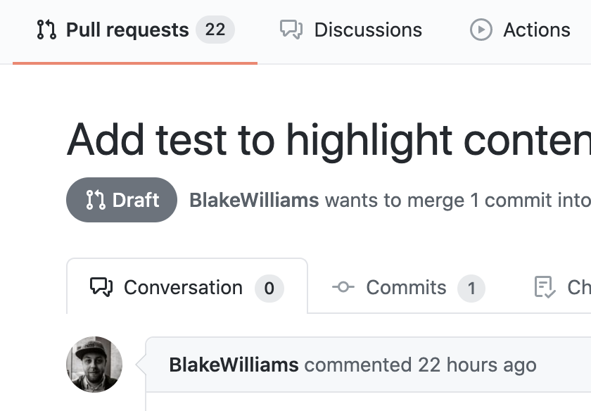

slidenumbers: true
footer: Boulder Ruby January 2020 - ViewComponents in the real world - @joelhawksley
autoscale: true

# ViewComponents <br/>in the real world


^ Hi

^ My name is joel

^ Thanks for having me

^ Thanks to Rylan, Dan, and Marty for organizing

---


^ I've been at GitHub for a couple years now

^ engineer at on Design Systems team

---

[.hide-footer]


^ responsible for the Primer design system used throughout GitHub

^ Perhaps our biggest ship just went out recently - dark mode

^ My job on the team

^ to help hundreds of engineers use our design system correctly in our monolith

^ Make building consistent, accessible, resilient UI easy

^ and to generally make building UI an enjoyable experience

^ This is a big challenge!

---

# UI at GitHub

^ Today we're going to take a peak behind the curtain

^ at how we build UI in one of the biggest

^ highest-trafficked Rails applications

^ PAUSE

^ To give you an idea of our scale,

^ here are a few stats

---

# 13 years

^ The GitHub rails app is over thirteen years old.

^ Initial development began in October 2007

---

# 10k's requests/second

^ Our app receives  tens of thousands of requests per second

---

# ~ two dozen services

^ We have around two dozen services

^ Citadel architecture

^ A lot of them are written in Go

^ extractions from the monolith

^ such as webhook delivery

^ but most of GitHub is a Rails monolith

^ and it's a big one...

---

# 580 models

# +144 YoY (33%)

^ `grep -lr "< ApplicationRecord" app/models | wc -l`

^ 580 models

---

# 4573 views

# +702 YoY (18%)

^ `find app/views -type f -name "*.html.erb" | wc -l`

^ 4573 views

---

# 766 controllers

# +206 YoY (36.8%)

^ `find app/controllers -type f -name "*_controller.rb" | wc -l`

^ 766 controllers

---

# 2015 GET routes

^ We have over two thousand screens in the application

^ All need to stay current, even if they're out of the critical path

^ We have a lot of legacy one-off designs that are difficult to maintain.

---
# >450kb of custom CSS

^ Which means almost half a megabyte of custom CSS.

^ This scale makes for some interesting problems.

^ Things that might be a small annoyance in smaller applications can

^ become serious roadblocks at our scale.

^ PAUSE

---

[.slidenumbers: false]
[.footer:]


^ When you have a body of work like this

^ With thousands and thousands of examples

^ it’s possible to zoom out and see patterns emerge

^ PAUSE

---

^ one example of how I've worked to improve the developer experience

^ is template annotations

^ One issue developers had building UI at GitHub was figuring out

^ which template rendered a specific line of HTML

---

[.slidenumbers: false]
[.footer:]
[.background-color: #FFFFFF]


^ for example, when looking at a PR page, if I want to edit this PR badge,

^ how do a I find the right template?

---

[.slidenumbers: false]
[.footer:]
[.background-color: #FFFFFF]


^ I could try searching by the specific class names on the element, but with

^ the functional css approach many apps take these days, this approach is often

^ not very reliable.

^ In this case, if we search for the class names on the element, we get dozens of results.

^ PAUSE

---

^ In thinking about this problem, I wondered if it might be possible to add HTML comments

^ at the beginning and end of each template's output, with the path of the template file.

---

[.code-highlight: 0]
[.code-highlight: 3-4]
[.code-highlight: 5]
[.code-highlight: 7-9]
[.code-highlight: 14]

```ruby
# config/initializers/template_annotation.rb

class CustomHandler < ActionView::Template::Handlers::ERB
  def call(template)
    out = super.gsub("@output_buffer.to_s", "")

    "@output_buffer.safe_append='<!-- BEGIN: #{ template.short_identifier } -->\n'.freeze;" +
      out +
      "@output_buffer.safe_append='<!-- END: #{ template.short_identifier } -->\n'.freeze;@output_buffer.to_s;"
    end
  end
end

ActionView::Template.register_template_handler(:erb, CustomHandler.new) if Rails.env.development?
```

^ We did this by writing a custom ERB compiler that added the template path to the output

^ of a template.

^ S we start by defining the handler object with a call method that receives a template object

^ S get the original output of the ERB handler

^ S and wrap it in HTML comments with the template's identifier

^ S and for now, we only do this in development.

---

[.slidenumbers: false]
[.footer:]
[.background-color: #FFFFFF]


^ And it worked!

^ We now had a way to quickly figure out which template rendered a part of a page.

^ PAUSE

^ After seeing the benefits of this patch internally,

---

[.slidenumbers: false]
[.footer:]
[.background-color: #FFFFFF]


^ We extracted it into Rails!

^ It's part of Rails 6.1.

---

## `config.action_view.annotate_template_file_names`

^ You can turn it on with the configuration variable

^ And new Rails applications have it enabled by default in local development

---

[.slidenumbers: false]
[.footer:]


^ PAUSE

^ Another issue that's come up is getting the application into the right state

^ in local development so we can test visual changes

---

# Seeds

^ seeds only get us so far.

^ part of this is due to GitHub's architecture

---

# Architecture

^ As I mentioned

^ We have a main Rails monolith and about two dozen services.

^ this can make it difficult to get local development into the right state

^ but yet we manage to do it...

^ in our tests.

^ while this is great, it's not much help for making visual changes

---
# TDD

^ Unfortunately, we don't have browser-based tests

^ Which means we can't use them for verifying visual changes

^ This is mainly due to how much time it would add to our test suite

^ Which is already over 10 hours without parallelization.

^ PAUSE

^ However, we do write plenty of controller tests.

^ After numerous pairing sessions helping our designers

^ get their local development environments into the right state,

^ I had an idea- what if we could temporarily convert controller tests...

---

# Controller -> System

^ Into system tests?

^ That way, we could reuse all of the existing setup code from our controller tests

^ To preview the application in a specific state to make visual changes

^ And that's just what we did!

---

[.code-highlight: all]
[.code-highlight: 2]
[.code-highlight: 4]

```ruby
# test/integration/profiles_controller_test.rb
test "loads successfully" do
  get "/#{@user}"

  assert_response :ok
end
```

^ As a quick refresher, this is what a controller test looks like

^ S It calls `get` with a URL

^ S and then makes an assertion

^ So how can we convert this into a system test?

---

[.code-highlight: 3]
[.code-highlight: 4-9]
[.code-highlight: 11-14]
[.code-highlight: 16]
[.code-highlight: all]

```ruby
# test/test_helpers/system_test_conversion.rb

module SystemTestConversion
  def self.included(child)
    child.setup do
      ActionDispatch::SystemTestCase.driven_by(:selenium, using: :chrome)
      ActionDispatch::SystemTestCase.driver.use
    end
  end

  def get(path)
    visit(path)
    binding.irb # intentionally pause
  end

  def assert_response; end
end
```

^ We start by writing a module, called system test conversion

^ S That when it's included, registers some configuration for ActionDispatch::SystemTestCase

^ Then in this case we just need to...

^ S redefine `get` to visit the path provided, and then pause with a debugger

^ S and for `assert_response` to be a no-op

^ S PAUSE

^ From there

---

```ruby
# test/test_helper.rb

if ENV["RUN_IN_BROWSER"]
  IntegrationTestCase.send(:include, SystemTestConversion)
end
```

^ We conditionally include the module if `RUN_IN_BROWSER` is appended to a command to run a test.

---

[.slidenumbers: false]
[.footer:]
[.background-color: #FFFFFF]


^ And here's what it looks like in action...

---

^ Unlike template annotations, this hasn't made it into Rails.

^ I'm not sure it's a good idea or not, but it's served us well.

---

# Seeds vs. test setup

^ But there is something that I think we can learn here.

^ Our seeds and test setup code has a lot of overlap!

^ I'm curious to see if there's ways we could bridge the gap between these conceptual domains.

---

[.slidenumbers: false]
[.footer:]


^ PAUSE

^ While working on these projects

^ we identified another source of friction

---
# View -> route(s)

As a developer editing a view, it’s difficult to know what pages of the application will be affected by my changes.

^ When modifying a template,

^ It can be difficult to know where a view is used.

^ Not knowing where a template is used is risky, as we have a lot of template reuse.

^ Colleague John Hawthorn made a diagram of how our templates reference each other...

---

[.slidenumbers: false]
[.footer:]
[.background-color: #FFFFFF]


^ As you can see

^ Navigating our render stack might be a little tricky

^ so we turned to static analysis!

---

# Viewfinder

^ And built a tool called Viewfinder

^ Here's how it works:

---

# `bin/viewfinder app/views/wiki/show.html.erb`

^ We pass in the path to the template, in this case the wiki show page.

---

```ruby
grep(/('|")wiki/show('|")/, paths: [Rails.root.join("app/**/*")])
```

^ Then we extract the template string literal, in this case `wiki/show`

^ And search for it in the codebase.

---

```ruby
root_node = Parser::CurrentRuby.new.parse(file_contents)
```

^ Then, for each search result, we load the file with the Parser gem,

^ Which returns an Abstract Syntax Tree of the file.

^ For example, one of the matches for our search was a controller. Here's part of the syntax tree:

---

[.code-highlight: all]
[.code-highlight: 10-11]

```
s(:block,
  s(:send, nil, :respond_to),
  s(:args,
    s(:arg, :format)),
  s(:begin,
    s(:block,
      s(:send,
        s(:lvar, :format), :html),
      s(:args),
        s(:send, nil, :render,
          s(:str, "wiki/show")),
```

^ This data structure represents how Ruby interprets the code we write.

^ As an aside, the Rubocop linter works by analyzing these data structures.

^ S And you can see at the bottom that we have our render call to `wiki/show`

^ For reference, here is the equivalent Ruby code for this tree:

---

```ruby
respond_to do |format|
  format.html do
    render "wiki/show"
  end
end
```

```
s(:block,
  s(:send, nil, :respond_to),
  s(:args,
    s(:arg, :format)),
  s(:begin,
    s(:block,
      s(:send,
        s(:lvar, :format), :html),
      s(:args),
        s(:send, nil, :render,
          s(:str, "wiki/show")),
```

^ PAUSE

^ EXPLAIN CODE

^ So once we have the syntax tree, we can query it!

---

[.code-highlight: 0]
[.code-highlight: 1]
[.code-highlight: 2]
[.code-highlight: 0]

```ruby
if node.type == :send
  case node.method_name
  when :render
    ...
  when :render_to_string
    ...
  end
end
```

^ Not going to go into too much detail at this point

^ but we are able to find the calls to `render`

^ S by looking at the type of the syntax node

^ S and then the method name

^ S And we do this to confirm that the render call is referring to the template we're tracing

---

^ We continue until we reach a controller action.

^ Then, going back to the syntax tree...

---

```
s(:def, :show,
  s(:args),
```

^ We look up the tree until we find the definition of the controller method.

---

# WikiController#show

^ Which in this case is the show method on the wiki controller.

---

# `get "wiki/*path", to: "wiki#show"`

^ From there, we look up the routes that render that controller action,

^ and return the result to the console:

---

```
2 uses of wiki/show found:

ROUTE: /:user_id/:repository/wiki/*path () =>
CONTROLLER: app/controllers/wiki_controller.rb#show =>
wiki/show.html.erb

ROUTE: /:user_id/:repository/wiki (wikis) =>
CONTROLLER: app/controllers/wiki_controller.rb#index =>
wiki/show.html.erb
```

^ PAUSE

^ By itself, this tool was really useful.

^ We could see all of the routes that rendered a template!

^ But then we realized:

---

# Route -> test

^ We could use these routes to identify which controller tests

^ rendered our template!

^ We did this through a similar process to what got us to this point

---

```ruby
grep(/get ".*"/, paths: [Rails.root.join("test/integration/**/*").to_s])
```

^ We start by finding all of the `get` calls from our controller tests

---

`get "/joelhawksley/demo/wiki/"`

^ For example, here is a call that loads a wiki page.

^ So we extract the argument from this call, and pass it into...

---

[.code-highlight: 1]
[.code-highlight: 2]

```ruby
irb(main):001:0> Rails.application.routes.recognize_path("/joelhawksley/demo/wiki/")
=> {:controller=>"wiki", :action=>"index", :user_id=>"joelhawksley", :repository=>"demo"}
```

^ The Rails code path that takes a request path...

^ S and returns a route!

^ And we repeat this over and over, for every controller test

^ Building up a hash that looks something like this:

---

```ruby
"wiki#index" => ["test/integration/wiki_controller_test.rb:278", ...]
```

^ Where we have the controller action as the key

^ and the matching tests as an array of values.

^ PAUSE

^ So if we go back to our output from before...

---

[.code-highlight: 1-2]

```
ROUTE: /:user_id/:repository/wiki/*path () =>
CONTROLLER: app/controllers/wiki_controller.rb#show =>
wiki/show.html.erb
```

^ We can take the controller data we had from before,

^ and use our new lookup hash to include which tests render the view:

---

[.code-highlight: 6-7]

```
ROUTE: /:user_id/:repository/wiki/*path () =>
CONTROLLER: app/controllers/wiki_controller.rb#show =>
wiki/show.html.erb

    These tests may render this template:
    test/integration/wiki_controller_test.rb:278
    test/integration/wiki_controller_test.rb:289
    ...
```

^ We can then use these test cases with our system test conversion tool

---

`RUN_IN_BROWSER=1 bin/rails test test/integration/wiki_controller_test.rb:278`

^ To visually verify the changes to our template in a browser.

^ PAUSE

---

# Downsides

^ only works with explicit render calls

^ where a template name is passed to `render`

^ something we enforce with a linter

^ doesn't account for conditionals

^ this is an optimistic approach

^ it returns all possible routes

^ but it's proved incredibly useful for us

^ but definitely not ready for prime time

---

[.slidenumbers: false]
[.footer:]


^ PAUSE

^ But the biggest challenge has been a missing abstraction in our view layer.

---

# Rule of three

> The first time you do something, you just do it. The second time you do something similar, you wince at the duplication, but you do the duplicate thing anyway. The third time you do something similar, you refactor.

- Martin Fowler, _Refactoring, Ruby Edition_

^ A common rule of abstraction is the Rule of Three. Which Martin Fowler describes as... READ QUOTE

^ Usually when we do something over and over again, we abstract it!

^ If we don’t, our code becomes inconsistent and hard to maintain...

---
# Problem

^ And this is especially true in our view code.

^ In general, our templates are built by copy-pasting chunks of ERB from existing templates.

^ It's incredibly difficult to make sweeping changes to our view code,

^ limiting the leverage our team has with our design system.

---

# Standards

^ More generally, our Rails code often doesn't live up to the standards

^ we hold our Ruby code to.

---

# Testing

^ Views are generally tested with slow integration or system tests.

---

# 2019

^ 2019

^ Has a crazy idea

^ For using Ruby objects to render views

^ Inspired by ideas from React

^ We now call it ViewComponent:

^ A framework for building reusable, testable & encapsulated view components in Rails.

---

[.column]

```ruby
# app/components/test_component.rb

class TestComponent < ViewComponent::Base
  def initialize(title:)
    @title = title
  end
end
```

[.column]

```erb
<%# app/components/test_component.html.erb %>

<span title="<%= @title %>"><%= content %></span>
```

^ A ViewComponent is a Ruby file and a template.

^ EXPLAIN CODE

---


```erb
<%= render(TestComponent.new(title: "my title")) do %>
  Hello, World!
<% end %>
```

^ To render it, we instantiate the component and pass it to `render`

^ EXPLAIN CODE

---

```html
<span title="my title">Hello, World!</span>
```

^ Which then returns the resulting HTML.

^ PAUSE

---

[.code-highlight: 0]
[.code-highlight: 2]
[.code-highlight: 4]
[.code-highlight: all]

```ruby
def test_render_component
  render_inline(TestComponent.new(title: "my title")) { "Hello, World!" }

  assert_selector("span[title='my title']", text: "Hello, World!")
end
```

^ To test the component, we can write a unit test...

^ S That renders the component

^ S and then asserts against the output using matchers from Capybara.

^ S These tests are incredibly fast. In our code base they are around 100x faster than controller tests.

---

# 2020

^ 2020

^ I joined the Design Systems team to work on ViewComponent full time

^ And since then, we've rapidly adopted the pattern in GitHub.com

^ to go back from our stats from earlier,

^ The GitHub application grew about 25% last year.

^ Except for our ViewComponents, which...

---
# 397 ViewComponents

# +373 YoY (1554%)

^ `find app/components -type f -name "*.rb" | wc -l`

^ Grew by over 15 times!

^ and we've learned a lot in the process.

^ PAUSE

---

# Consistency

^ One of the goals of the design systems team is to help our developers build consistent UI.

^ ViewComponents have been a key tool to accomplishing this goal.

---

[.slidenumbers: false]
[.footer:]
[.background-color: #FFFFFF]


^ For example, last summer my colleague Christian built a ViewComponent for the counters we use throughout the app

^ Here they are on the repository navigation

^ We render counters in over a hundred places in the app

---

[.slidenumbers: false]
[.footer:]
[.background-color: #FFFFFF]


^ This diff from one of his PRs shows how we mixed and matched the formatting of values displayed with the counter

^ In one case using number with delimiter, and one case without.

^ This led to visual inconsistencies, but only with large numbers of commits,

^ something we'd never expect a developer think about when working on a feature.

^ Instead, we simply pass the raw count to the component, and it handles formatting the value in a consistent way.

^ PAUSE

---

# Correctness

^ One of the main lessons we've learned building view components

^ Is that they enable us to help developers use our design system correctly

---

[.slidenumbers: false]
[.background-color: #FFFFFF]
[.footer:]


^ One example of this is our Subhead component

^ Used over 450 times in the app

^ Here's what it looks like, and the correct way to build it with HTML.

^ In practice, we often ended up with cases where the `Subhead-heading` or `Subhead-description` classes were used by themselves, out of line with our design guidelines.

---

[.slidenumbers: false]
[.background-color: #FFFFFF]
[.footer:]


^ In the ViewComponent implementation, we instead accept block arguments for the heading and description,

^ Making it easy to use the design pattern correctly.

^ PAUSE

---

# Performance

^ Another benefit we've seen from ViewComponents has been in helping developers write performant code.

^ One of the most common performance issues I've seen in view code is unintentionally querying the database.

---

```erb
<% if repository.writable_by?(current_user) %>
  ... <!-- edit button, etc -->
<% end %>
```

^ For example, we often have permission checks in our views to determine whether to show certain elements or not.

^ Unfortunately, these checks trigger queries if not batched properly.

^ So to help developers understand how their view code might interact with the database...

---

[.code-highlight: none]
[.code-highlight: 1]
[.code-highlight: 2-4]
[.code-highlight: all]

```ruby
def render_inline(component, allowed_queries: 0)
  assert_query_counts(allowed_queries) do
    super(component)
  end
end
```

^ We redefined the helper used to render ViewComponent in unit tests

^ S To accept a number of allowed queries, defaulting to zero allowed

^ S We then render the component, failing the test if the actual number of queries doesn't match what was expected.

^ This helper has turned out to be quite educational.

^ It's helped us better understand the side affects of our code

^ prevented the introduction of several N+1 queries.

^ In one recent case, this saved over 100ms of overhead on a page.

---

# Complexity

^ Another advantage we've seen with ViewComponents is how they can help manage complexity.

^ One example of this has been in our mailers.

---

[.slidenumbers: false]
[.background-color: #FFFFFF]
[.footer:]


^ Building HTML emails can be tricky

^ Often requires writing 1995-level HTML

^ And it's fraught with edge cases.

---

[.code-highlight: 0]

```html
<td style="box-sizing: border-box; font-family: -apple-system,
BlinkMacSystemFont, 'Segoe UI', Helvetica, Arial, sans-serif,
'Apple Color Emoji', 'Segoe UI Emoji', 'Segoe UI Symbol';
font-size: 14px; vertical-align: top;" valign="top"></td>
<td class="container" style="box-sizing: border-box;
font-family: -apple-system, BlinkMacSystemFont, 'Segoe UI',
Helvetica, Arial, sans-serif, 'Apple Color Emoji', 'Segoe UI
Emoji', 'Segoe UI Symbol'; font-size: 14px; vertical-align:
top; display: block; margin: 0 auto !important; max-width:
580px; padding: 30px; width: 580px;" width="580" valign="top">
```

^ Most of our mailers are written with heavy-handed inline HTML

^ And it's incredibly hard to maintain, let alone change without breaking something

---

[.slidenumbers: false]
[.background-color: #FFFFFF]
[.footer:]


^ So when we looked into adding columns to a mailer for this design,

^ My colleague mike thought we could build some ViewComponents to abstract away all of the tables and inline CSS.

---

[.code-highlight: none]
[.code-highlight: 1,9]
[.code-highlight: 2-8]
[.code-highlight: all]

```erb
<%= render(Mail::RowComponent.new(classes: "text-gray")) do %>
  <%= render(Mail::ColumnComponent.new(classes: "pr-2")) do %>
    I am a column for some very interesting content. The text wraps around nicely and fits into this column.
    This sure is very useful.
  <% end %>
  <%= render(Mail::ColumnComponent.new) do %>
    I am another column that is within a row. I am also positioned correctly and wrap nicely.
  <% end %>
<% end %>
```

^ To do this, he built mailer-specific components for rows and columns,

^ Which are used together,

^ S Wrap a row, which contains

^ S multiple columns

^ S giving developers a reliable way to build column layouts in mailers.

---

# Conceptual compression

^ This is a classic example of what Rails creator DHH calls conceptual compression.

^ By simplifying the process for building mailers,

^ We've practically removed the conceptual overhead necessary to build one correctly.

^ Instead of worrying about whether you've written your inline styles in a way that works correctly in the numerous different email clients out there, you can just piece together a couple of ViewComponents and move on with your life.

---

# Abstraction

^ Just like AR simplified use of SQL

^ And controllers made it easy to write code to respond to requests

^ We use ViewComponents to make building UI correctly the default, not the exception.

^ PAUSE

---

# Storybook

^ Another thing we've experimented with is Storybook.

---

[.slidenumbers: false]
[.background-color: #FFFFFF]
[.footer:]


^ Storybook is an open source tool for developing components in isolation.

^ It's quite popular (something like almost 60k stars)

^ And thanks to the work of community member Jon Palmer...

^ It supports ViewComponents!

^ Here's an example of it in action with our Flash ViewComponent

---

[.slidenumbers: false]
[.background-color: #FFFFFF]
[.footer:]


^ Storybook provides a UI for interacting with ViewComponents.

^ Here you can see it previewing a change to the icon

^ and a change to the variant

^ PAUSE

^ This gives us a development environment for building components

^ outside of a Rails application, such as in our Primer ViewComponents library.

---

[.slidenumbers: false]
[.background-color: #FFFFFF]
[.footer:]


^ We open-sourced the library over the summer, and it now has over two dozen components.

^ We use it in a couple internal Rails apps in addition to GitHub.com

^ PAUSE

^ And we aren't the only ones open sourcing our components!

---

[.slidenumbers: false]
[.background-color: #FFFFFF]
[.footer:]


^ UK department for education has released a library

^ Of over a dozen viewcomponents for the Gov.uk design system.

---

[.slidenumbers: false]
[.footer:]


^ PAUSE

^ So one of the common questions I get about this project from folks outside of GitHub

---

# Rolling it out

^ Is how are we rolling it out?

^ It's sometimes asked in a technical context, writing new components, refactoring old views, etc

^ And organizational- how do we ensure components are use appropriately, how do we make the case for this work with non-engineering stakeholders, etc.

---

# Technical

^ So let's start with the technical

---
# Authoring

^ How do we create ViewComponents?

---

# Refactoring

^ The first way is by refactoring existing view code into components.

^ For example, before ViewComponents, we used a presenter-like pattern

^ called view models, ruby objects we instantiated and then passed into views

---

[.code-highlight: 1-5]
[.code-highlight: 7-17]
[.code-highlight: all]

```ruby
class RepositoryIndexView < ViewModel
  def status
    repository.locked? ? "Disabled" : "Enabled"
  end
end

class RepositoryIndexViewTest < Minitest::Test
  context "#status" do
    test "enabled for unlocked repository" do
      view = RepositoryIndexView.new(repository: create(:repository))

      assert_equal view.status, "Enabled"
    end
  end
end
```

^ Here's an example ViewModel - explain code

^ S and the test looks like this - explain code - asserts against the object output

^ So that's a ViewModel. We'd pass this object into a template and access values from it.

^ PAUSE

---

[.code-highlight: 1-5]
[.code-highlight: 7-17]
[.code-highlight: 10-12]
[.code-highlight: 12]
[.code-highlight: all]

```ruby
class RepositoryIndexComponent < ViewComponent::Base
  def status
    repository.locked? ? "Disabled" : "Enabled"
  end
end

class RepositoryIndexComponentTest < Minitest::Test
  context "status" do
    test "enabled for unlocked repository" do
      render_inline(RepositoryIndexView.new(repository: create(:repository))

      assert_text "Enabled"
    end
  end
end
```

^ And here's what it looks like rewritten as a ViewComponent

^ Explain code - base class has changed, ignoring the template for this example

^ S for the test, not much changes either

^ S explain code

^ But there's something fundamentally different about this test.

^ Instead of asserting against the attribute of an object

^ S We're assert against what's actually presented to a user

^ This is something we previously could only do with system and integration tests

^ And it's one of the main reasons we refactor ViewModels to be ViewComponents:

^ To gain confidence that our view code is working correctly from the perspective of our customers.

^ PAUSE

^ Convert partial to component

^ Add component

---

# Extraction

^ Properly built components are more likely to be useful outside of one app

^ We introduce components inside the monolith, then extract

^ Team post: https://team.githubapp.com/posts/34739

---

# Linters

^ https://github.com/github/github/pull/143114

^ TODO: sentinel

---

# Communication

^ https://team.githubapp.com/posts/33953

^ Weekly initiative updates

^ Sharing examples of code improved by using the pattern

^ Such as some of the examples I've share today

^ Internal posts

---

# Autogenerated docs

^ https://github.com/primer/view_components/pull/94

^ https://primer.style/view-components/

^ Lesson: Open source project updates consumed internally

^ Have to treat internal projects as open source due to scale docs test coverage etc

---

# WALL-E

^ Six people

^ Stats

^ TODO bin/rails test test/fast/linting/component_usage_test.rb

---

[.slidenumbers: false]
[.footer:]


^ SHORTCOMINGS

---

# Views + components

^ There is one problem with this approach that I can't shake:

^ It means that we now have two ways of writing views that work differently

^ I can't imagine Rails having native support for ViewComponents,

^ At least as they exist today in a separate directory.

^ TODO xkcd comic on standards

---

# What to extract?

^ But maybe we could extract some of what makes ViewComponent useful into Rails!

^ TODO One example is the pretty partial GEM

^ Could VC feel as light as views? Could we have ruby objects in the Views folder?

^ PAUSE

---

# OSS

^ The ViewComponent project has been very successful.

^ We've averaged one release a week since publishing the project in August 2019.

^ We've had contributions from over 80 developers, only a dozen of which work for GitHub.

---

# Empathy

^ This is my first time running an open source project

^ It's been a huge lesson in empathy.

^ We've been lucky to have a lot of engagement on the project.

^ And what's stuck out to me is that in every issue, PR, or discussion posted

^ There is something to be learned to improve the framework. Even the small stuff.

---

^ If someone was confused by the documentation and wrote a component incorrectly,

^ it's evidence we can use to improve our docs.

---

^ TODO insert other examples, twitter quote about us doing it right

^ Another lesson I've learned is how powerful Rails convention is.

---
# Convention

^ When writing ViewComponent

^ we aimed to conceptually align the framework with Rails as much as possible.

^ Rails conventions mean baseline expectations outside framework

^ And because of that, it's enabled others to almost instinctively know how to contribute

---

^ TODO for example, previews

^ TODO for example, caching

^ The strong conceptual foundation provided by Rails has enabled us to make good design decisions.

---

# Enabling contribution

^ Another thing we've focused on is enabling contribution.

^ We want to enable people to make high-quality contributions as easily as possible.

^ The library isn't super complicated,

^ but it has some nuance and differing behavior across Rails versions.

^ One way we've reduced the burden of this is through matrix builds

---

# Matrix builds

^ By running the test suite against over a dozen combinations

^ of Ruby and Rails, we're able to ensure every change works across all the of those combinations

^ But perhaps more importantly...

---

# Test coverage

^ TODO for both libraries

^ It's enabled us to ensure we have 100% test coverage,

^ By combining coverage data from all of the matrix builds

^ Having a confident foundation like this makes it easier to accept contributions.

^ I will note that this hasn't prevented a couple performance regressions

^ But we're working on tooling to prevent those too.

^ https://github.com/github/view_component/pull/424

---

# Mining for abstractions

^ mining existing applications for abstractions for rails

---

# Design from experience

^ Lesson: Design from real experience, not hypothesis

^ One missing feature is caching

^ We don't do view caching, so it's more difficult for us to build the framework support for it

^ I'd love some help here

^ PAUSE

---
# Innovation

^ Another thing this project has made me think about is innovation in Rails.

---

# Dilemma

^ There is a theory called the innovator's dilemma.

^ TODO innovator's dilemma cover

---

> The Innovator's Dilemma is the decision between catering to current needs, or adopting new innovations and technologies which will answer future needs.

^ READ QUOTE

^ Rails is a very mature.

---

# Dependency

^ GitHub's survival is ultimately pretty dependent on Rails' ability to stay relevant.

^ We have so much built on top of Rails

^ it's very unlikely we'd rewrite our core application.

---

# Survival

^ Which means that Rails' survival, is our survival.

^ So what does that mean for all of us?

---

# Innovate

^ We need to innovate!

^ Improving Rails is the only way we'll survive.

---

# Citizenship

^ We need to take ownership of keeping Rails relevant for the long term.

^ By being good citizens. By participating.

^ Rails was built by people just like all of you

^ And we benefit from the work they've put in

^ You can see this in GitHub's contributions to the framework

^ but we need more voices.

---

# We can't walk away.

^ Most of us can’t walk away from rails.

---

# Picking a framework is forever

^ Picking a framework is forever

^ Rewrites are rare

^ But yet the world moves on

# It's up to us.

^ Which means it's up to us to keep Rails relevant.

^ PAUSE

---

# Thanks

^ Thanks

---

# Thinking in Ruby vs. ERB

^ Views are code too!