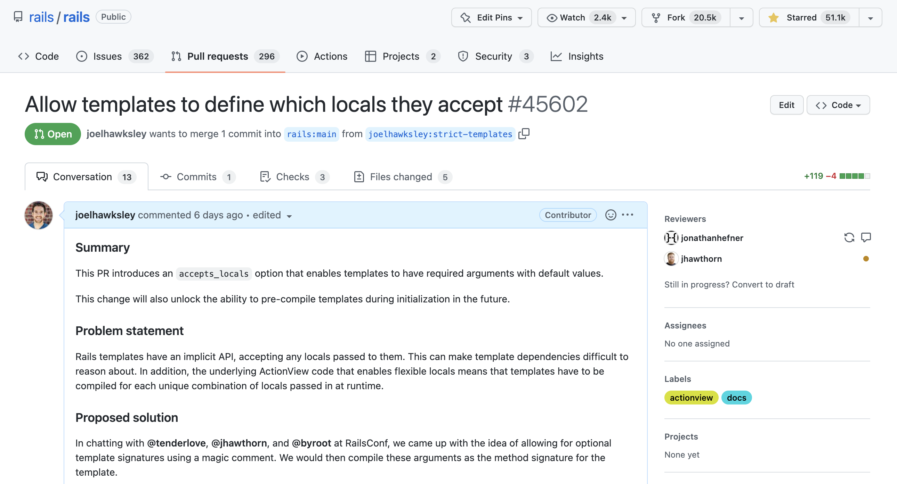

# [fit] accepts_locals

^ Good morning everyone

---

# [fit] Today

^ Today I'm going to give a quick demo of that patch I wrote to Rails that upstreams some of what we've learned building ViewComponent these past couple of years.

---

# [fit] Views

^ To explain it, I need to explain how rails views work.

---

# [fit] Data → HTML

^ Views are methods

^ They input (data), and return HTML.

---

```erb
<span><%= message %></span>
```

^ For example, this ERB template renders the value of `message` inside a span.

^ Under the hood, Rails then compiles this template into something like:

---

```erb
<span><%= message %></span>
```

```rb
def my_template
  @output_buffer << "<span>"
  @output_buffer << message
  @output_buffer << "</span>"
end
```

^ It's literally just a string operation that appends to a global output buffer variable.

^ But how does message get passed in?

^ Well, I kind of lied, this isn't all the code that Rails generates.

---

[.code-highlight: 1-2]

```rb
def my_template(local_assigns)
  message = local_assigns[:message]
  @output_buffer << "<span>"
  @output_buffer << message
  @output_buffer << "</span>"
end
```

^ The method it compiles the template to accepts an argument called local assigns

^ Which is then unpacked into our variable, `message`

^ Why does it do that?

---

```rb
render("my_template", locals: { message: "Hello, world!" })
```

^ Because Rails templates accept whatever locals you pass them!

^ EXPLAIN CODE

^ Going back to our example


---

[.code-highlight: 2]

```rb
def my_template(local_assigns)
  message = local_assigns[:message]
  @output_buffer << "<span>"
  @output_buffer << message
  @output_buffer << "</span>"
end
```

^ that local assigns line can only be generated once we know what locals are being passed to our view

^ which means that for several reasons, we can only generate this method from our template once our application is running!

---

# [fit] ~~Good~~

^ This is not good.

^ Compiling templates takes time,

^ and we have to throw the compiled templates away every time we deploy GitHub.com

^ and that's where ViewComponent came in:

---

```rb
def initialize(message:)
```

^ Since ViewComponents are Ruby objects, they can have an initializer that defines what data they accept.

^ Which means that unlike Rails templates, we can compile them!

---

# [fit] Good

^ This is a good thing.

^ PAUSE

^ So for passion week, I revisited this problem.

---


^ Two months ago, I went to Portland for RailsConf

^ And I brought up this problem with a couple folks from the Rails core team

^ and we came up with the idea of allowing templates

---

# [fit] accepts_locals

^ to declare what locals they accept.

^ Going back to our example, here's what it looks like:

---

```erb
<% accepts_locals(message:) %>
<span><%= message %></span>
```

^ We add this magic line of ruby to the top of our template

^ That is basically a method signature like we had for our ViewComponent initializer

^ Then, we take that signature

---

[.code-highlight: 1]

```rb
def my_template(message:)
  @output_buffer << "<span>"
  @output_buffer << message
  @output_buffer << "</span>"
end
```

^ And use that to compile the template instead.

^ This has a couple of nice benefits.

---

# [fit] Required and default locals

^ One is that we can now have required and default locals!

---

```erb
<% accepts_locals(message:) %>
<span><%= message %></span>
```

^ In our previous example, our template will now raise an error if no message is provided. Or...

---

```erb
<% accepts_locals(message: "Hello, world!) %>
<span><%= message %></span>
```

^ We can define a default value for message in case it isn't provided.

^ Doing these two things used to involve writing some really awkward ruby

---

# [fit] Performance

^ But the biggest benefit here is performance

^ Because we can now declare what locals our templates accept

^ We don't need to wait until runtime to compile them

^ Which is a significant performance improvement.

^ PAUSE

---



^ Anyways, I've opened a PR for this change to Rails

^ and its chances look good.

^ I look forward to seeing how we can use this change to improve our Rails view code that doesn't use ViewComponents

^ and how it will benefit the Rails ecosystem as a whole.

---

# Thanks

^ thanks!